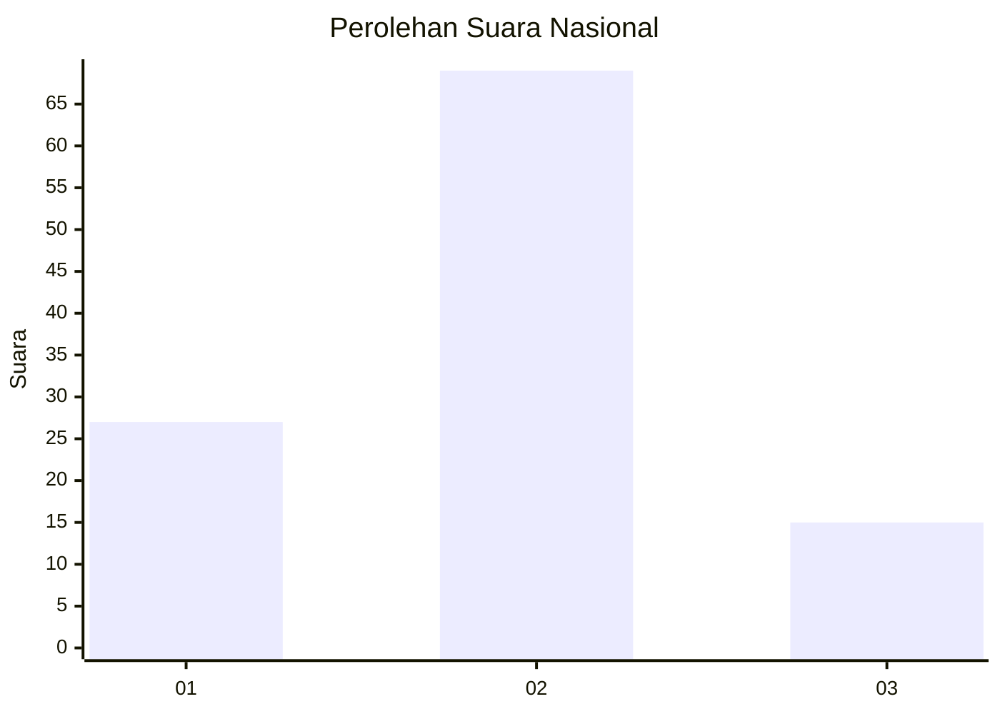
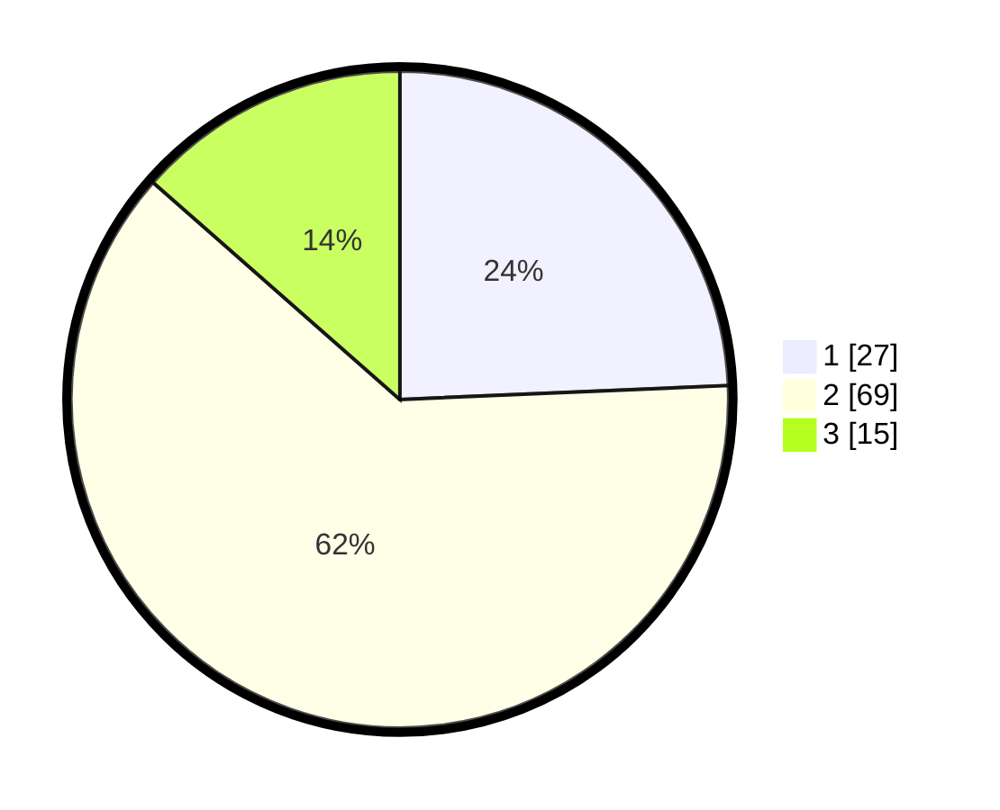

# Hasil

## Grafik

## Tabel

| No. | Nama Paslon    | Suara | Suara (raw) | Persentase |
|:--- |:-------------- | -----:| -----------:| ----------:|
| 1   | ANIES MUHAIMIN | 27    | [27][p-1]   | 24,32      |
| 2   | PRABOWO GIBRAN | 69    | [69][p-2]   | 62,16      |
| 3   | GANJAR MAHFUD  | 15    | [15][p-3]   | 13,51      |

[p-1]: https://github.com/gigit-pemilu/pemilu-2024/blob/main/pilpres/hitung-suara/sub/16-sumatera-selatan/sub/04-lahat/sub/07-kota-agung/sub/2004-gunung-liwat/sub/001-tps/sub/paslon-1.txt
[p-2]: https://github.com/gigit-pemilu/pemilu-2024/blob/main/pilpres/hitung-suara/sub/16-sumatera-selatan/sub/04-lahat/sub/07-kota-agung/sub/2004-gunung-liwat/sub/001-tps/sub/paslon-2.txt
[p-3]: https://github.com/gigit-pemilu/pemilu-2024/blob/main/pilpres/hitung-suara/sub/16-sumatera-selatan/sub/04-lahat/sub/07-kota-agung/sub/2004-gunung-liwat/sub/001-tps/sub/paslon-3.txt

## Foto C Plano

https://sirekap-obj-formc.kpu.go.id/28db/pemilu/ppwp/16/04/07/20/04/1604072004001-20240215-003603--78fc624d-5b97-45d6-853d-6fd43d066304.jpg

https://sirekap-obj-formc.kpu.go.id/28db/pemilu/ppwp/16/04/07/20/04/1604072004001-20240214-193702--a1648c5e-1c27-47f4-85ec-70218db4a343.jpg

https://sirekap-obj-formc.kpu.go.id/28db/pemilu/ppwp/16/04/07/20/04/1604072004001-20240215-004125--2db20e9f-2a0b-43e9-ad39-714127eec393.jpg

## Metadata

| Key        | Value               |
| ---------- | ------------------- |
| Time Stamp | 2024-02-15 16:30:25 |

## DATA PEMILIH TETAP

Jumlah pemilih dalam DPT: **128**.
 * L: **59**.
 * P: **69**.

## DATA PENGGUNA HAK PILIH

Jumlah pengguna hak pilih dalam DPT: **128**.
 * L: **59**.
 * P: **69**.

Jumlah pengguna hak pilih dalam DPTb: **0**.
 * L: **0**.
 * P: **0**.

Jumlah pengguna hak pilih dalam DPK: **0**.
 * L: **0**.
 * P: **0**.

Jumlah pengguna hak pilih: **128**.
 * L: **59**.
 * P: **69**.

## JUMLAH SUARA SAH DAN TIDAK SAH

JUMLAH SELURUH SUARA SAH: **111**.

JUMLAH SUARA TIDAK SAH: **2**.

JUMLAH SELURUH SUARA SAH DAN SUARA TIDAK SAH: **113**.

