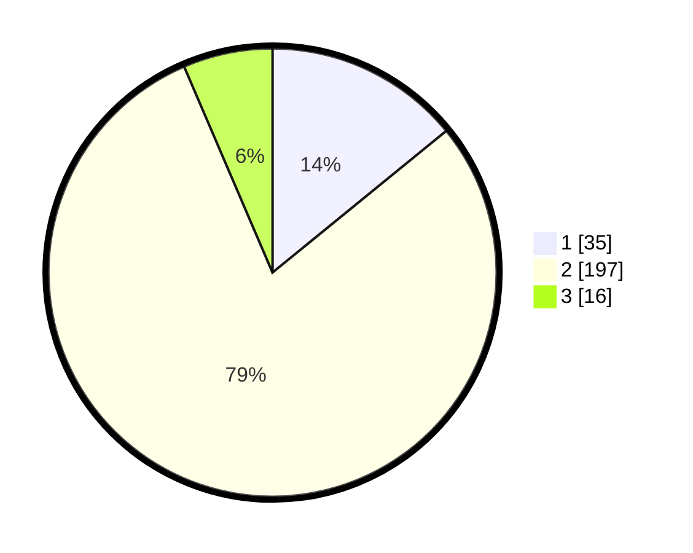

# Hasil

## Grafik

## Tabel

| No. | Nama Paslon    | Suara | Suara (raw) | Persentase |
|:--- |:-------------- | -----:| -----------:| ----------:|
| 1   | ANIES MUHAIMIN | 35    | [35][p-1]   | 14,11      |
| 2   | PRABOWO GIBRAN | 197   | [197][p-2]  | 79,44      |
| 3   | GANJAR MAHFUD  | 16    | [16][p-3]   | 6,45       |

[p-1]: https://github.com/gigit-pemilu/pemilu-2024-16-sumatera-selatan/blob/main/pilpres/hitung-suara/sub/16-sumatera-selatan/sub/04-lahat/sub/07-kota-agung/sub/2005-kebun-jati/sub/001-tps/sub/paslon-1.txt
[p-2]: https://github.com/gigit-pemilu/pemilu-2024-16-sumatera-selatan/blob/main/pilpres/hitung-suara/sub/16-sumatera-selatan/sub/04-lahat/sub/07-kota-agung/sub/2005-kebun-jati/sub/001-tps/sub/paslon-2.txt
[p-3]: https://github.com/gigit-pemilu/pemilu-2024-16-sumatera-selatan/blob/main/pilpres/hitung-suara/sub/16-sumatera-selatan/sub/04-lahat/sub/07-kota-agung/sub/2005-kebun-jati/sub/001-tps/sub/paslon-3.txt

## Foto C Plano

https://sirekap-obj-formc.kpu.go.id/afb1/pemilu/ppwp/16/04/07/20/05/1604072005001-20240214-160124--dd14b2d6-73af-4743-b40f-90975a9ae93c.jpg

https://sirekap-obj-formc.kpu.go.id/afb1/pemilu/ppwp/16/04/07/20/05/1604072005001-20240214-184509--37a7cb7f-a7e6-4d9c-8ae4-42f90f14da63.jpg

https://sirekap-obj-formc.kpu.go.id/afb1/pemilu/ppwp/16/04/07/20/05/1604072005001-20240214-184528--af3fb823-29ad-421f-8ba9-565c8a2b5efd.jpg

## Metadata

| Key        | Value               |
| ---------- | ------------------- |
| Time Stamp | 2024-02-15 12:00:28 |

