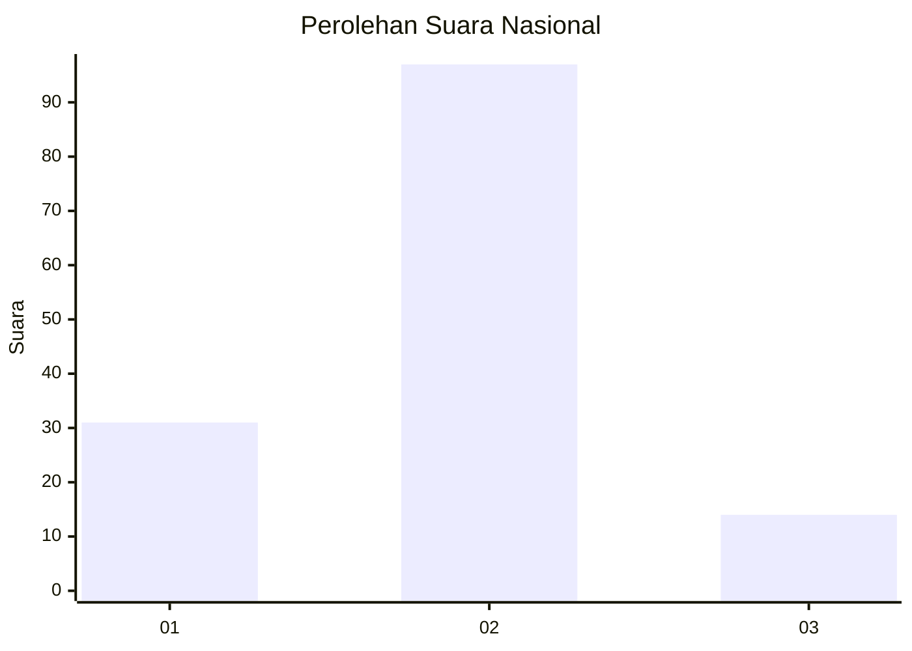

# Hasil

## Grafik

## Tabel

| No. | Nama Paslon    | Suara | Suara (raw) | Persentase |
|:--- |:-------------- | -----:| -----------:| ----------:|
| 1   | ANIES MUHAIMIN | 31    | [31][p-1]   | 21,83      |
| 2   | PRABOWO GIBRAN | 97    | [97][p-2]   | 68,31      |
| 3   | GANJAR MAHFUD  | 14    | [14][p-3]   | 9,86       |

[p-1]: https://github.com/gigit-pemilu/pemilu-2024/blob/main/pilpres/hitung-suara/sub/16-sumatera-selatan/sub/04-lahat/sub/07-kota-agung/sub/2006-bintuhan/sub/001-tps/sub/paslon-1.txt
[p-2]: https://github.com/gigit-pemilu/pemilu-2024/blob/main/pilpres/hitung-suara/sub/16-sumatera-selatan/sub/04-lahat/sub/07-kota-agung/sub/2006-bintuhan/sub/001-tps/sub/paslon-2.txt
[p-3]: https://github.com/gigit-pemilu/pemilu-2024/blob/main/pilpres/hitung-suara/sub/16-sumatera-selatan/sub/04-lahat/sub/07-kota-agung/sub/2006-bintuhan/sub/001-tps/sub/paslon-3.txt

## Foto C Plano

https://sirekap-obj-formc.kpu.go.id/dc52/pemilu/ppwp/16/04/07/20/06/1604072006001-20240214-160100--a0f5c717-54f5-4edb-8735-75b4bfa95064.jpg

https://sirekap-obj-formc.kpu.go.id/dc52/pemilu/ppwp/16/04/07/20/06/1604072006001-20240214-155927--8942264b-551d-4e82-91d0-4a8cfd4de643.jpg

https://sirekap-obj-formc.kpu.go.id/dc52/pemilu/ppwp/16/04/07/20/06/1604072006001-20240214-155908--6c677780-afb9-459d-a02f-9d1d30d057f9.jpg

## Metadata

| Key        | Value               |
| ---------- | ------------------- |
| Time Stamp | 2024-02-15 12:00:28 |

