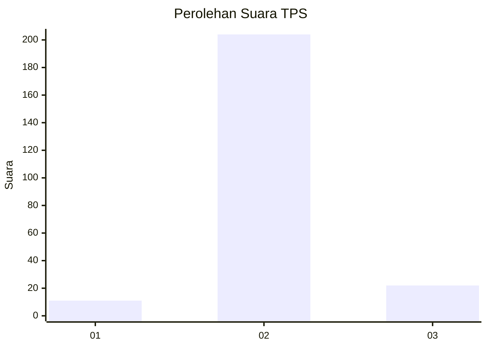
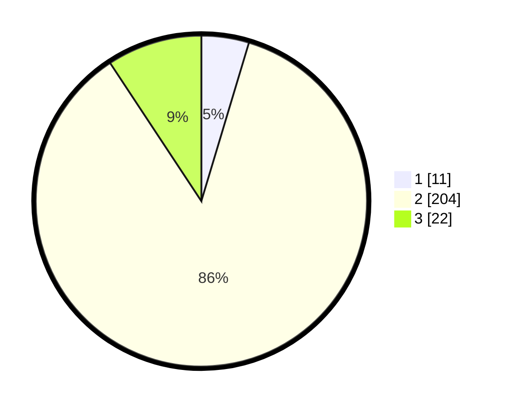

# Hasil

## Grafik

## Tabel

| No. | Nama Paslon    | Suara | Suara (raw) | Persentase |
|:--- |:-------------- | -----:| -----------:| ----------:|
| 1   | ANIES MUHAIMIN | 11    | [11][p-1]   | 4,64       |
| 2   | PRABOWO GIBRAN | 204   | [204][p-2]  | 86,08      |
| 3   | GANJAR MAHFUD  | 22    | [22][p-3]   | 9,28       |

[p-1]: https://github.com/gigit-pemilu/pemilu-2024-16-sumatera-selatan/blob/main/pilpres/hitung-suara/sub/16-sumatera-selatan/sub/04-lahat/sub/07-kota-agung/sub/2007-mutar-alam-baru/sub/001-tps/sub/paslon-1.txt
[p-2]: https://github.com/gigit-pemilu/pemilu-2024-16-sumatera-selatan/blob/main/pilpres/hitung-suara/sub/16-sumatera-selatan/sub/04-lahat/sub/07-kota-agung/sub/2007-mutar-alam-baru/sub/001-tps/sub/paslon-2.txt
[p-3]: https://github.com/gigit-pemilu/pemilu-2024-16-sumatera-selatan/blob/main/pilpres/hitung-suara/sub/16-sumatera-selatan/sub/04-lahat/sub/07-kota-agung/sub/2007-mutar-alam-baru/sub/001-tps/sub/paslon-3.txt

## Foto C Plano

https://sirekap-obj-formc.kpu.go.id/ff4e/pemilu/ppwp/16/04/07/20/07/1604072007001-20240214-155753--a6938f76-b118-4b25-b2c0-fe4a080006bb.jpg

https://sirekap-obj-formc.kpu.go.id/ff4e/pemilu/ppwp/16/04/07/20/07/1604072007001-20240215-142636--28cc5177-e19e-4bc2-9870-3ed11904ddc4.jpg

https://sirekap-obj-formc.kpu.go.id/ff4e/pemilu/ppwp/16/04/07/20/07/1604072007001-20240215-143106--bb64315f-f6f2-4102-a62b-4b707aa3f456.jpg

## Metadata

| Key        | Value               |
| ---------- | ------------------- |
| Time Stamp | 2024-02-15 16:30:25 |

