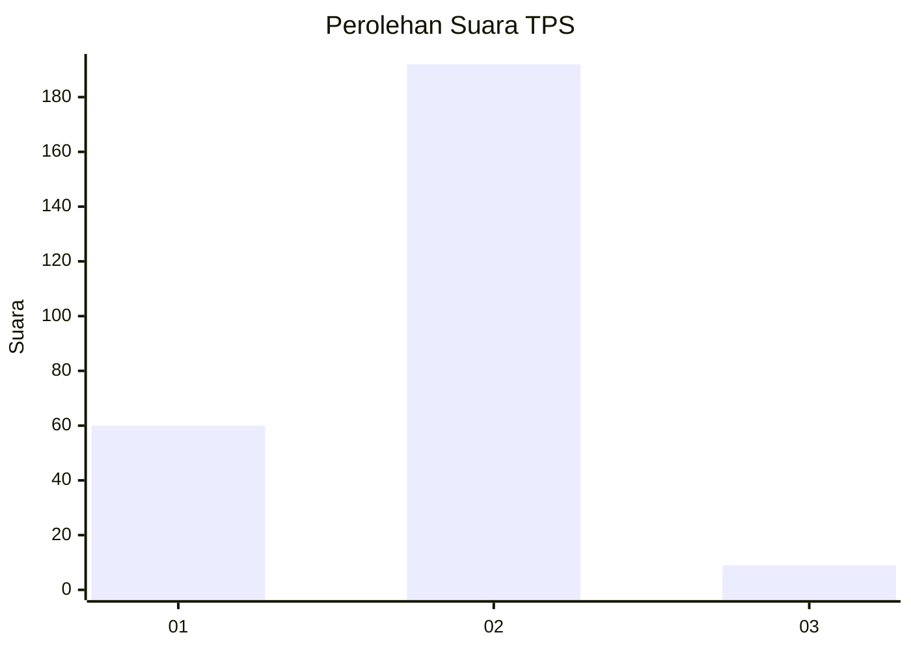

# Hasil

## Grafik

## Tabel

| No. | Nama Paslon    | Suara | Suara (raw) | Persentase |
|:--- |:-------------- | -----:| -----------:| ----------:|
| 1   | ANIES MUHAIMIN | 60    | [60][p-1]   | 22,99      |
| 2   | PRABOWO GIBRAN | 192   | [192][p-2]  | 73,56      |
| 3   | GANJAR MAHFUD  | 9     | [9][p-3]    | 3,45       |

[p-1]: https://github.com/gigit-pemilu/pemilu-2024-16-sumatera-selatan/blob/main/pilpres/hitung-suara/sub/16-sumatera-selatan/sub/04-lahat/sub/07-kota-agung/sub/2011-tunggul-bute/sub/001-tps/sub/paslon-1.txt
[p-2]: https://github.com/gigit-pemilu/pemilu-2024-16-sumatera-selatan/blob/main/pilpres/hitung-suara/sub/16-sumatera-selatan/sub/04-lahat/sub/07-kota-agung/sub/2011-tunggul-bute/sub/001-tps/sub/paslon-2.txt
[p-3]: https://github.com/gigit-pemilu/pemilu-2024-16-sumatera-selatan/blob/main/pilpres/hitung-suara/sub/16-sumatera-selatan/sub/04-lahat/sub/07-kota-agung/sub/2011-tunggul-bute/sub/001-tps/sub/paslon-3.txt

## Foto C Plano

https://sirekap-obj-formc.kpu.go.id/4278/pemilu/ppwp/16/04/07/20/11/1604072011001-20240222-105113--8cf61178-1cf3-426d-8fee-bac5dbc7fa03.jpg

https://sirekap-obj-formc.kpu.go.id/4278/pemilu/ppwp/16/04/07/20/11/1604072011001-20240222-104939--5abdc3a0-b56c-4019-b072-bfff9e3e0020.jpg

https://sirekap-obj-formc.kpu.go.id/4278/pemilu/ppwp/16/04/07/20/11/1604072011001-20240222-105005--4f928dd3-5c6d-40e8-9f57-cb8a59c9e6ae.jpg

## Metadata

| Key        | Value               |
| ---------- | ------------------- |
| Time Stamp | 2024-02-24 22:31:28 |

