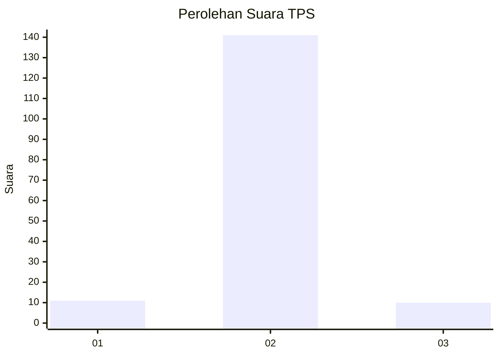
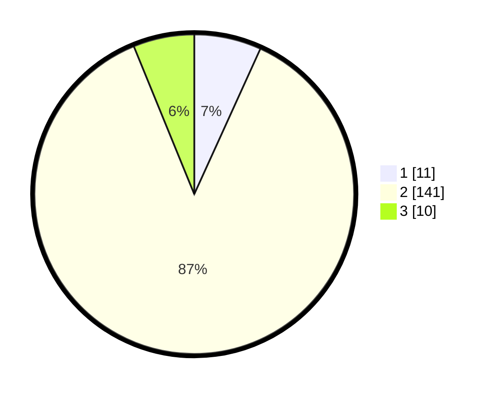

# Hasil

## Grafik

## Tabel

| No. | Nama Paslon    | Suara | Suara (raw) | Persentase |
|:--- |:-------------- | -----:| -----------:| ----------:|
| 1   | ANIES MUHAIMIN | 11    | [11][p-1]   | 6,79       |
| 2   | PRABOWO GIBRAN | 141   | [141][p-2]  | 87,04      |
| 3   | GANJAR MAHFUD  | 10    | [10][p-3]   | 6,17       |

[p-1]: https://github.com/gigit-pemilu/pemilu-2024-16-sumatera-selatan/blob/main/pilpres/hitung-suara/sub/16-sumatera-selatan/sub/04-lahat/sub/07-kota-agung/sub/2012-karang-endah/sub/001-tps/sub/paslon-1.txt
[p-2]: https://github.com/gigit-pemilu/pemilu-2024-16-sumatera-selatan/blob/main/pilpres/hitung-suara/sub/16-sumatera-selatan/sub/04-lahat/sub/07-kota-agung/sub/2012-karang-endah/sub/001-tps/sub/paslon-2.txt
[p-3]: https://github.com/gigit-pemilu/pemilu-2024-16-sumatera-selatan/blob/main/pilpres/hitung-suara/sub/16-sumatera-selatan/sub/04-lahat/sub/07-kota-agung/sub/2012-karang-endah/sub/001-tps/sub/paslon-3.txt

## Foto C Plano

https://sirekap-obj-formc.kpu.go.id/da38/pemilu/ppwp/16/04/07/20/12/1604072012001-20240220-130330--0afeacd3-b949-4d2e-b854-128b6a7b8bca.jpg

https://sirekap-obj-formc.kpu.go.id/da38/pemilu/ppwp/16/04/07/20/12/1604072012001-20240220-130344--26f9ea67-d686-4424-92ed-c7e6de198bfe.jpg

https://sirekap-obj-formc.kpu.go.id/da38/pemilu/ppwp/16/04/07/20/12/1604072012001-20240220-130732--ea45b602-8c98-4132-a289-7d8434b9cfc2.jpg

## Metadata

| Key        | Value               |
| ---------- | ------------------- |
| Time Stamp | 2024-02-20 21:00:00 |

