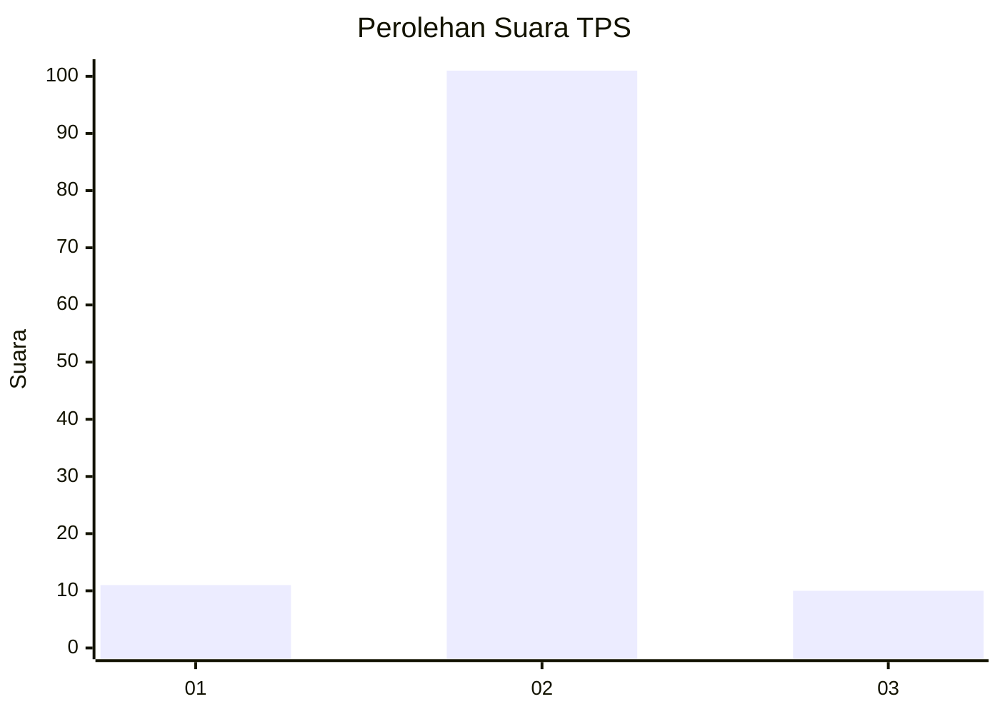
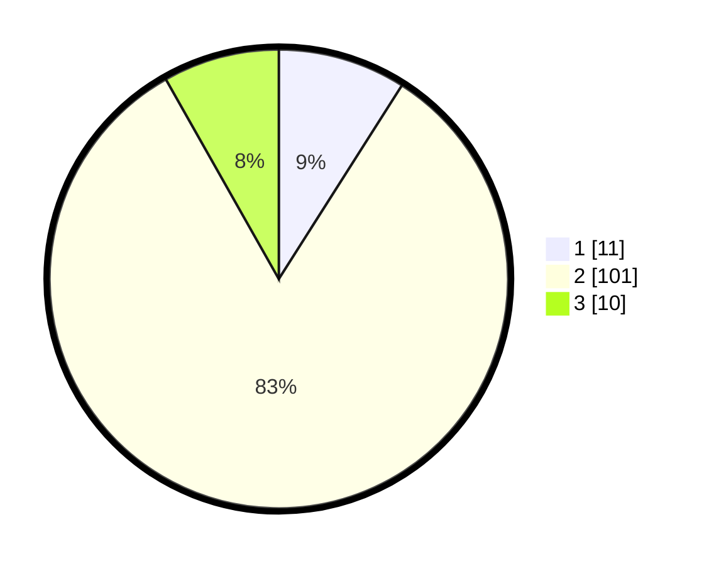

# Hasil

## Grafik

## Tabel

| No. | Nama Paslon    | Suara | Suara (raw) | Persentase |
|:--- |:-------------- | -----:| -----------:| ----------:|
| 1   | ANIES MUHAIMIN | 11    | [11][p-1]   | 9,02       |
| 2   | PRABOWO GIBRAN | 101   | [101][p-2]  | 82,79      |
| 3   | GANJAR MAHFUD  | 10    | [10][p-3]   | 8,20       |

[p-1]: https://github.com/gigit-pemilu/pemilu-2024-16-sumatera-selatan/blob/main/pilpres/hitung-suara/sub/16-sumatera-selatan/sub/04-lahat/sub/07-kota-agung/sub/2014-suka-raja/sub/001-tps/sub/paslon-1.txt
[p-2]: https://github.com/gigit-pemilu/pemilu-2024-16-sumatera-selatan/blob/main/pilpres/hitung-suara/sub/16-sumatera-selatan/sub/04-lahat/sub/07-kota-agung/sub/2014-suka-raja/sub/001-tps/sub/paslon-2.txt
[p-3]: https://github.com/gigit-pemilu/pemilu-2024-16-sumatera-selatan/blob/main/pilpres/hitung-suara/sub/16-sumatera-selatan/sub/04-lahat/sub/07-kota-agung/sub/2014-suka-raja/sub/001-tps/sub/paslon-3.txt

## Foto C Plano

https://sirekap-obj-formc.kpu.go.id/23fb/pemilu/ppwp/16/04/07/20/14/1604072014001-20240221-215924--f4ad5998-e54c-4844-bb55-e532f6efbfe8.jpg

https://sirekap-obj-formc.kpu.go.id/23fb/pemilu/ppwp/16/04/07/20/14/1604072014001-20240221-215833--eb502f58-e16d-4b1a-a297-56d922847b0a.jpg

https://sirekap-obj-formc.kpu.go.id/23fb/pemilu/ppwp/16/04/07/20/14/1604072014001-20240214-224327--a3d5aa34-0377-42c8-82a0-705bcbfc006d.jpg

## Metadata

| Key        | Value               |
| ---------- | ------------------- |
| Time Stamp | 2024-02-25 12:00:00 |

