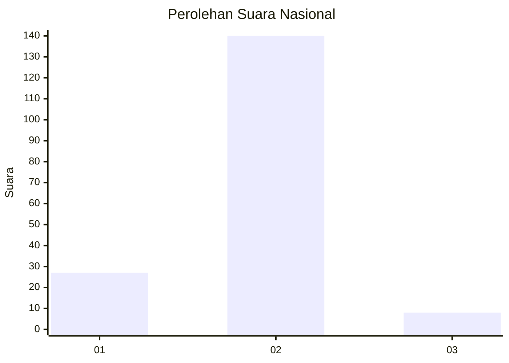
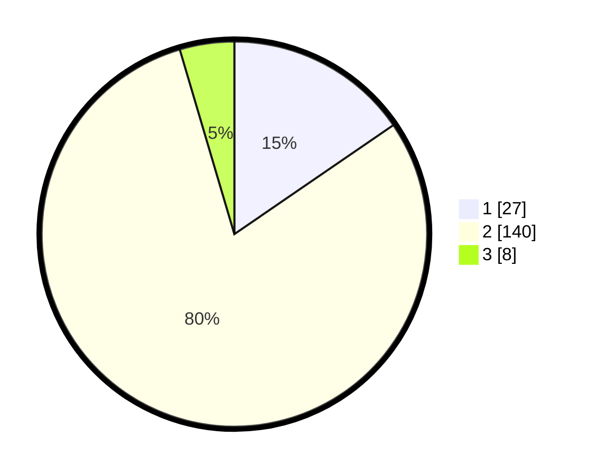

# Hasil

## Grafik

## Tabel

| No. | Nama Paslon    | Suara | Suara (raw) | Persentase |
|:--- |:-------------- | -----:| -----------:| ----------:|
| 1   | ANIES MUHAIMIN | 27    | [27][p-1]   | 15,43      |
| 2   | PRABOWO GIBRAN | 140   | [140][p-2]  | 80,00      |
| 3   | GANJAR MAHFUD  | 8     | [8][p-3]    | 4,57       |

[p-1]: https://github.com/gigit-pemilu/pemilu-2024/blob/main/pilpres/hitung-suara/sub/16-sumatera-selatan/sub/04-lahat/sub/07-kota-agung/sub/2017-lawang-agung/sub/001-tps/sub/paslon-1.txt
[p-2]: https://github.com/gigit-pemilu/pemilu-2024/blob/main/pilpres/hitung-suara/sub/16-sumatera-selatan/sub/04-lahat/sub/07-kota-agung/sub/2017-lawang-agung/sub/001-tps/sub/paslon-2.txt
[p-3]: https://github.com/gigit-pemilu/pemilu-2024/blob/main/pilpres/hitung-suara/sub/16-sumatera-selatan/sub/04-lahat/sub/07-kota-agung/sub/2017-lawang-agung/sub/001-tps/sub/paslon-3.txt

## Foto C Plano

https://sirekap-obj-formc.kpu.go.id/e696/pemilu/ppwp/16/04/07/20/17/1604072017001-20240215-171726--6ae3663c-4534-4a55-9b46-d8857ac94840.jpg

https://sirekap-obj-formc.kpu.go.id/e696/pemilu/ppwp/16/04/07/20/17/1604072017001-20240215-070649--ac3c97aa-141f-4578-ab75-b7389eb82c0e.jpg

https://sirekap-obj-formc.kpu.go.id/e696/pemilu/ppwp/16/04/07/20/17/1604072017001-20240215-070804--6866bf7a-d332-43a6-818c-593c8c0793c2.jpg

## Metadata

| Key        | Value               |
| ---------- | ------------------- |
| Time Stamp | 2024-02-15 20:00:44 |

