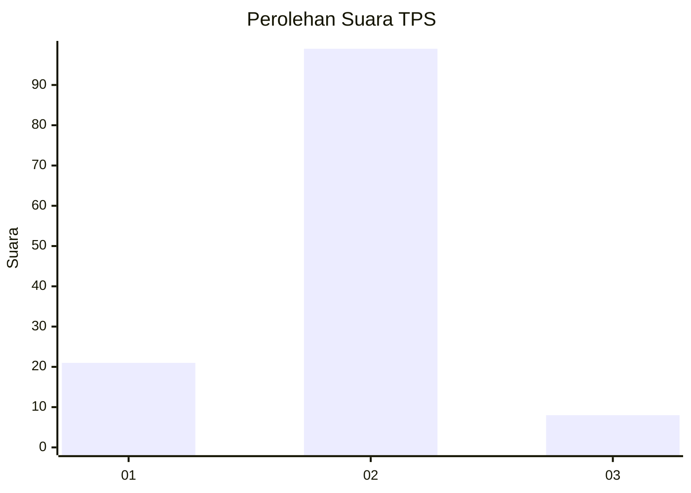
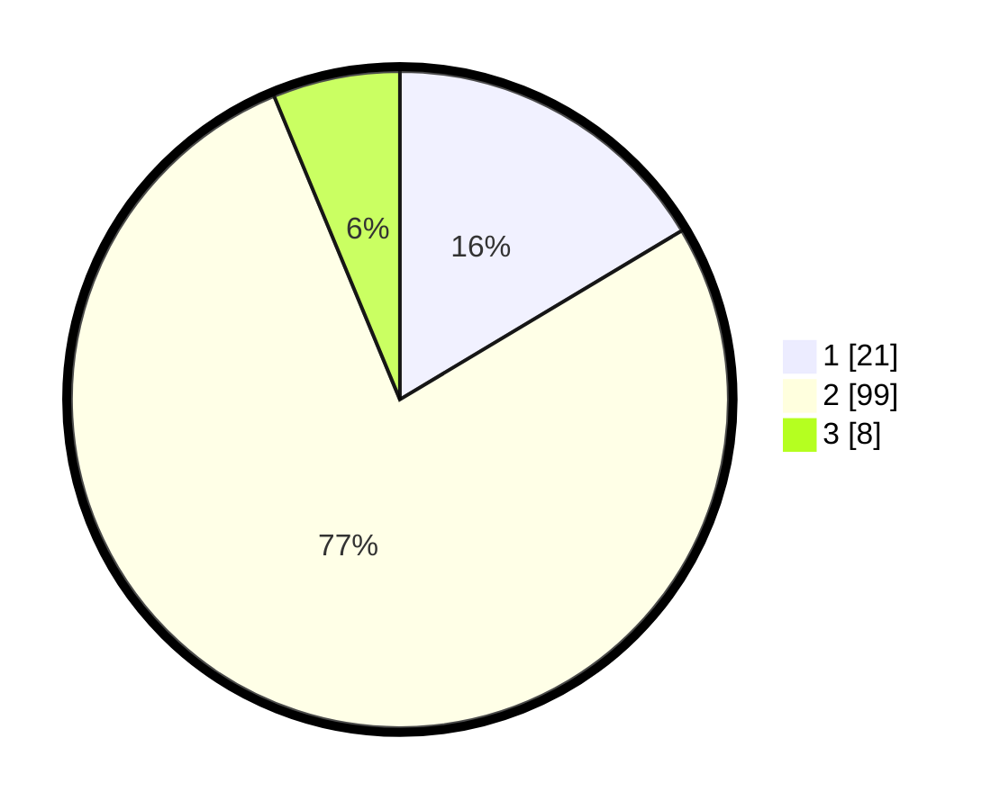

# Hasil

## Grafik

## Tabel

| No. | Nama Paslon    | Suara | Suara (raw) | Persentase |
|:--- |:-------------- | -----:| -----------:| ----------:|
| 1   | ANIES MUHAIMIN | 21    | [21][p-1]   | 16,41      |
| 2   | PRABOWO GIBRAN | 99    | [99][p-2]   | 77,34      |
| 3   | GANJAR MAHFUD  | 8     | [8][p-3]    | 6,25       |

[p-1]: https://github.com/gigit-pemilu/pemilu-2024-16-sumatera-selatan/blob/main/pilpres/hitung-suara/sub/16-sumatera-selatan/sub/04-lahat/sub/07-kota-agung/sub/2018-sukarami/sub/002-tps/sub/paslon-1.txt
[p-2]: https://github.com/gigit-pemilu/pemilu-2024-16-sumatera-selatan/blob/main/pilpres/hitung-suara/sub/16-sumatera-selatan/sub/04-lahat/sub/07-kota-agung/sub/2018-sukarami/sub/002-tps/sub/paslon-2.txt
[p-3]: https://github.com/gigit-pemilu/pemilu-2024-16-sumatera-selatan/blob/main/pilpres/hitung-suara/sub/16-sumatera-selatan/sub/04-lahat/sub/07-kota-agung/sub/2018-sukarami/sub/002-tps/sub/paslon-3.txt

## Foto C Plano

https://sirekap-obj-formc.kpu.go.id/f4a1/pemilu/ppwp/16/04/07/20/18/1604072018002-20240215-084229--a181ee07-8016-4a5c-838c-6eaba8ad80a2.jpg

https://sirekap-obj-formc.kpu.go.id/f4a1/pemilu/ppwp/16/04/07/20/18/1604072018002-20240215-084337--a9f7b001-8400-47b1-9076-8ffaa4e8db78.jpg

https://sirekap-obj-formc.kpu.go.id/f4a1/pemilu/ppwp/16/04/07/20/18/1604072018002-20240215-084541--97d0c469-74d0-49d4-b585-8724016d85f0.jpg

## Metadata

| Key        | Value               |
| ---------- | ------------------- |
| Time Stamp | 2024-02-15 16:00:26 |

