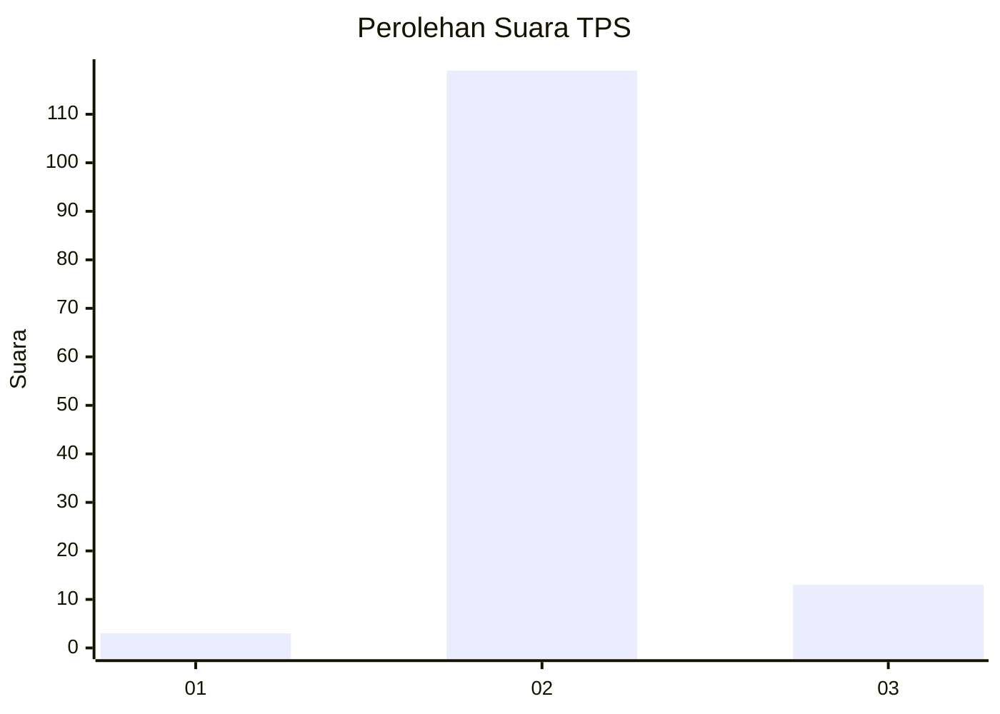
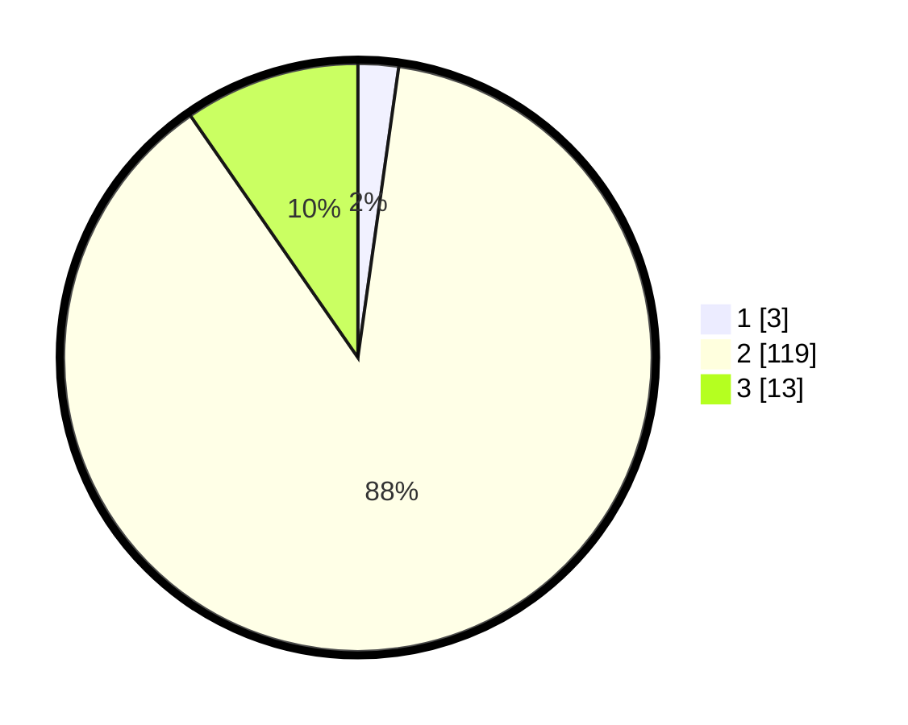

# Hasil

## Grafik

## Tabel

| No. | Nama Paslon    | Suara | Suara (raw) | Persentase |
|:--- |:-------------- | -----:| -----------:| ----------:|
| 1   | ANIES MUHAIMIN | 3     | [3][p-1]    | 2,22       |
| 2   | PRABOWO GIBRAN | 119   | [119][p-2]  | 88,15      |
| 3   | GANJAR MAHFUD  | 13    | [13][p-3]   | 9,63       |

[p-1]: https://github.com/gigit-pemilu/pemilu-2024-16-sumatera-selatan/blob/main/pilpres/hitung-suara/sub/16-sumatera-selatan/sub/04-lahat/sub/07-kota-agung/sub/2019-tanjung-beringin/sub/002-tps/sub/paslon-1.txt
[p-2]: https://github.com/gigit-pemilu/pemilu-2024-16-sumatera-selatan/blob/main/pilpres/hitung-suara/sub/16-sumatera-selatan/sub/04-lahat/sub/07-kota-agung/sub/2019-tanjung-beringin/sub/002-tps/sub/paslon-2.txt
[p-3]: https://github.com/gigit-pemilu/pemilu-2024-16-sumatera-selatan/blob/main/pilpres/hitung-suara/sub/16-sumatera-selatan/sub/04-lahat/sub/07-kota-agung/sub/2019-tanjung-beringin/sub/002-tps/sub/paslon-3.txt

## Foto C Plano

https://sirekap-obj-formc.kpu.go.id/de67/pemilu/ppwp/16/04/07/20/19/1604072019002-20240222-162533--799ea4b0-97fb-42c4-a0b8-45521170b08e.jpg

https://sirekap-obj-formc.kpu.go.id/de67/pemilu/ppwp/16/04/07/20/19/1604072019002-20240217-185827--9aaecfde-a703-4143-ab78-49c5adbf7714.jpg

https://sirekap-obj-formc.kpu.go.id/de67/pemilu/ppwp/16/04/07/20/19/1604072019002-20240217-185831--f4c591f0-0f73-403b-b896-530596c47c4d.jpg

## Metadata

| Key        | Value               |
| ---------- | ------------------- |
| Time Stamp | 2024-02-26 11:00:00 |

