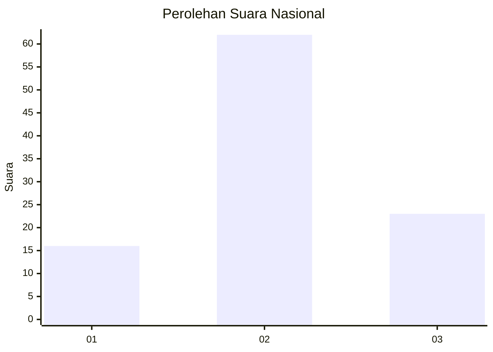
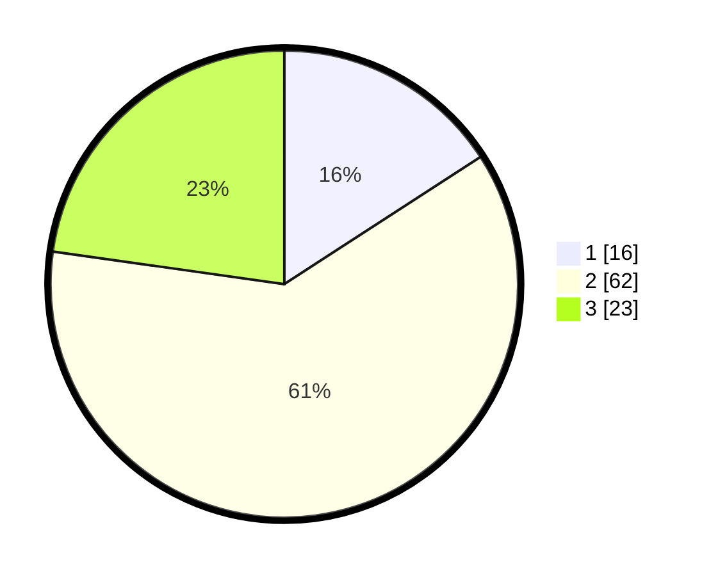

# Hasil

## Grafik

## Tabel

| No. | Nama Paslon    | Suara | Suara (raw) | Persentase |
|:--- |:-------------- | -----:| -----------:| ----------:|
| 1   | ANIES MUHAIMIN | 16    | [16][p-1]   | 15,84      |
| 2   | PRABOWO GIBRAN | 62    | [62][p-2]   | 61,39      |
| 3   | GANJAR MAHFUD  | 23    | [23][p-3]   | 22,77      |

[p-1]: https://github.com/gigit-pemilu/pemilu-2024/blob/main/pilpres/hitung-suara/sub/16-sumatera-selatan/sub/04-lahat/sub/07-kota-agung/sub/2031-muara-gula/sub/002-tps/sub/paslon-1.txt
[p-2]: https://github.com/gigit-pemilu/pemilu-2024/blob/main/pilpres/hitung-suara/sub/16-sumatera-selatan/sub/04-lahat/sub/07-kota-agung/sub/2031-muara-gula/sub/002-tps/sub/paslon-2.txt
[p-3]: https://github.com/gigit-pemilu/pemilu-2024/blob/main/pilpres/hitung-suara/sub/16-sumatera-selatan/sub/04-lahat/sub/07-kota-agung/sub/2031-muara-gula/sub/002-tps/sub/paslon-3.txt

## Foto C Plano

https://sirekap-obj-formc.kpu.go.id/46ae/pemilu/ppwp/16/04/07/20/31/1604072031002-20240215-013531--2db51612-c276-4e13-93bd-0e40bcc8f4a7.jpg

https://sirekap-obj-formc.kpu.go.id/46ae/pemilu/ppwp/16/04/07/20/31/1604072031002-20240215-012219--94306bb1-dad8-4b68-93a8-da3ff445170b.jpg

https://sirekap-obj-formc.kpu.go.id/46ae/pemilu/ppwp/16/04/07/20/31/1604072031002-20240215-013433--a8cff085-e7c9-4102-9ce5-44da7428735b.jpg

## Metadata

| Key        | Value               |
| ---------- | ------------------- |
| Time Stamp | 2024-02-15 21:01:18 |

