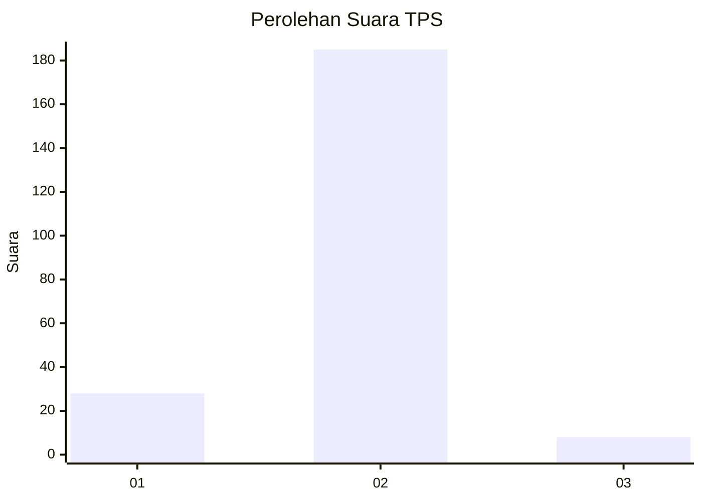
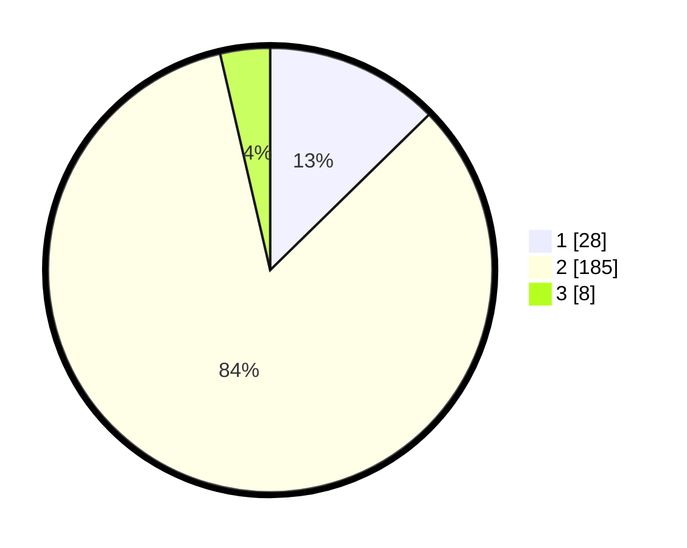

# Hasil

## Grafik

## Tabel

| No. | Nama Paslon    | Suara | Suara (raw) | Persentase |
|:--- |:-------------- | -----:| -----------:| ----------:|
| 1   | ANIES MUHAIMIN | 28    | [28][p-1]   | 12,67      |
| 2   | PRABOWO GIBRAN | 185   | [185][p-2]  | 83,71      |
| 3   | GANJAR MAHFUD  | 8     | [8][p-3]    | 3,62       |

[p-1]: https://github.com/gigit-pemilu/pemilu-2024-16-sumatera-selatan/blob/main/pilpres/hitung-suara/sub/16-sumatera-selatan/sub/04-lahat/sub/09-merapi-barat/sub/2011-gunung-agung/sub/001-tps/sub/paslon-1.txt
[p-2]: https://github.com/gigit-pemilu/pemilu-2024-16-sumatera-selatan/blob/main/pilpres/hitung-suara/sub/16-sumatera-selatan/sub/04-lahat/sub/09-merapi-barat/sub/2011-gunung-agung/sub/001-tps/sub/paslon-2.txt
[p-3]: https://github.com/gigit-pemilu/pemilu-2024-16-sumatera-selatan/blob/main/pilpres/hitung-suara/sub/16-sumatera-selatan/sub/04-lahat/sub/09-merapi-barat/sub/2011-gunung-agung/sub/001-tps/sub/paslon-3.txt

## Foto C Plano

https://sirekap-obj-formc.kpu.go.id/4549/pemilu/ppwp/16/04/09/20/11/1604092011001-20240215-125413--89c5e6ca-6058-4ee3-9c43-7cf64f84edb1.jpg

https://sirekap-obj-formc.kpu.go.id/4549/pemilu/ppwp/16/04/09/20/11/1604092011001-20240215-115415--f03586fe-61e5-4431-ab28-db3f168ebe8b.jpg

https://sirekap-obj-formc.kpu.go.id/4549/pemilu/ppwp/16/04/09/20/11/1604092011001-20240215-121044--a89a43b4-af40-4a81-bce0-abdca38c585d.jpg

## Metadata

| Key        | Value               |
| ---------- | ------------------- |
| Time Stamp | 2024-02-24 22:31:28 |

