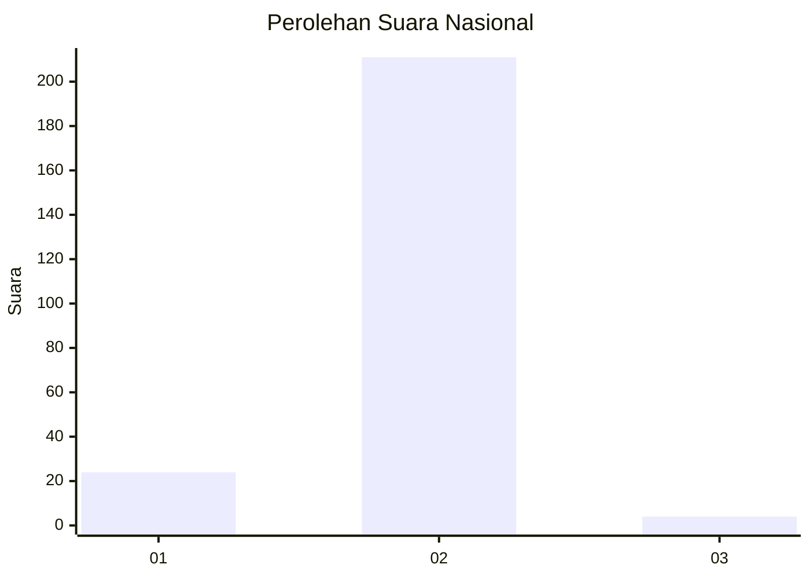
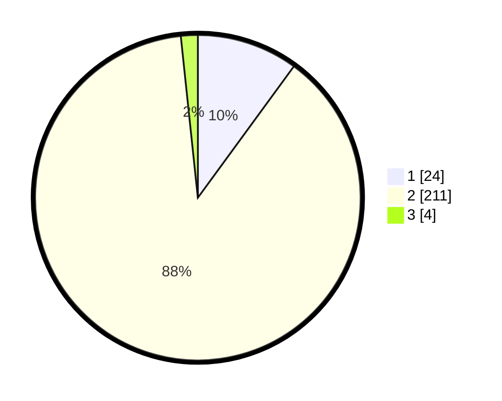

# Hasil

## Grafik

## Tabel

| No. | Nama Paslon    | Suara | Suara (raw) | Persentase |
|:--- |:-------------- | -----:| -----------:| ----------:|
| 1   | ANIES MUHAIMIN | 24    | [24][p-1]   | 10,04      |
| 2   | PRABOWO GIBRAN | 211   | [211][p-2]  | 88,28      |
| 3   | GANJAR MAHFUD  | 4     | [4][p-3]    | 1,67       |

[p-1]: https://github.com/gigit-pemilu/pemilu-2024/blob/main/pilpres/hitung-suara/sub/16-sumatera-selatan/sub/04-lahat/sub/09-merapi-barat/sub/2011-gunung-agung/sub/002-tps/sub/paslon-1.txt
[p-2]: https://github.com/gigit-pemilu/pemilu-2024/blob/main/pilpres/hitung-suara/sub/16-sumatera-selatan/sub/04-lahat/sub/09-merapi-barat/sub/2011-gunung-agung/sub/002-tps/sub/paslon-2.txt
[p-3]: https://github.com/gigit-pemilu/pemilu-2024/blob/main/pilpres/hitung-suara/sub/16-sumatera-selatan/sub/04-lahat/sub/09-merapi-barat/sub/2011-gunung-agung/sub/002-tps/sub/paslon-3.txt

## Foto C Plano

https://sirekap-obj-formc.kpu.go.id/47fe/pemilu/ppwp/16/04/09/20/11/1604092011002-20240215-120052--73004dc9-e88a-425b-b408-2f5de5ec880b.jpg

https://sirekap-obj-formc.kpu.go.id/47fe/pemilu/ppwp/16/04/09/20/11/1604092011002-20240215-120226--cd1ba704-13bc-4c04-b767-91e40dbb9570.jpg

https://sirekap-obj-formc.kpu.go.id/47fe/pemilu/ppwp/16/04/09/20/11/1604092011002-20240215-120402--a9fa5ebc-6fba-4ec8-80f4-20116e890f56.jpg

## Metadata

| Key        | Value               |
| ---------- | ------------------- |
| Time Stamp | 2024-02-15 17:00:25 |

