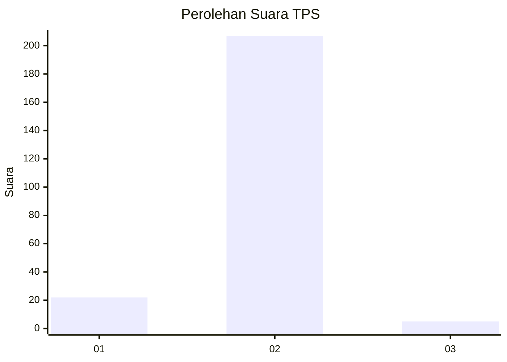
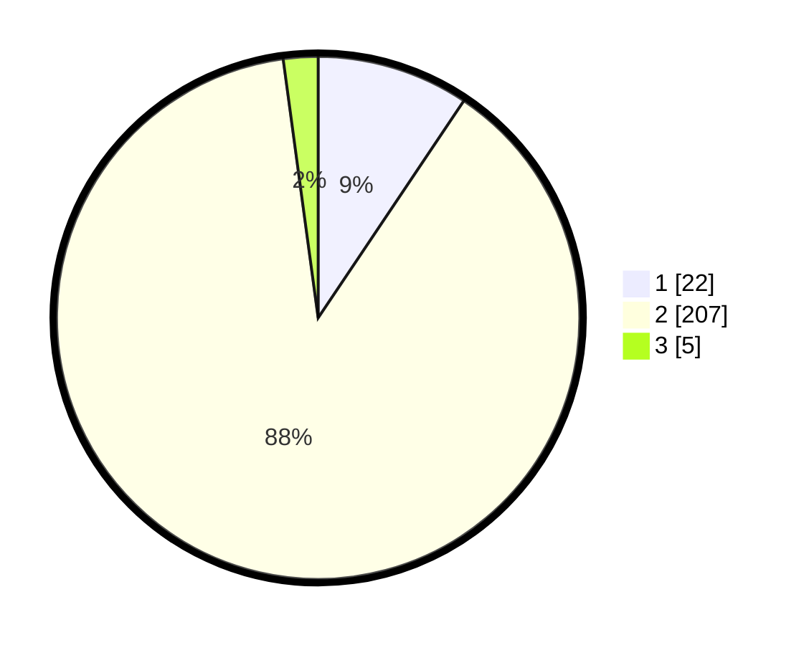

# Hasil

## Grafik

## Tabel

| No. | Nama Paslon    | Suara | Suara (raw) | Persentase |
|:--- |:-------------- | -----:| -----------:| ----------:|
| 1   | ANIES MUHAIMIN | 22    | [22][p-1]   | 9,40       |
| 2   | PRABOWO GIBRAN | 207   | [207][p-2]  | 88,46      |
| 3   | GANJAR MAHFUD  | 5     | [5][p-3]    | 2,14       |

[p-1]: https://github.com/gigit-pemilu/pemilu-2024-16-sumatera-selatan/blob/main/pilpres/hitung-suara/sub/16-sumatera-selatan/sub/04-lahat/sub/09-merapi-barat/sub/2011-gunung-agung/sub/003-tps/sub/paslon-1.txt
[p-2]: https://github.com/gigit-pemilu/pemilu-2024-16-sumatera-selatan/blob/main/pilpres/hitung-suara/sub/16-sumatera-selatan/sub/04-lahat/sub/09-merapi-barat/sub/2011-gunung-agung/sub/003-tps/sub/paslon-2.txt
[p-3]: https://github.com/gigit-pemilu/pemilu-2024-16-sumatera-selatan/blob/main/pilpres/hitung-suara/sub/16-sumatera-selatan/sub/04-lahat/sub/09-merapi-barat/sub/2011-gunung-agung/sub/003-tps/sub/paslon-3.txt

## Foto C Plano

https://sirekap-obj-formc.kpu.go.id/7ebb/pemilu/ppwp/16/04/09/20/11/1604092011003-20240215-100019--ae99bf23-0704-4c11-8eba-ae7d93d6bc4d.jpg

https://sirekap-obj-formc.kpu.go.id/7ebb/pemilu/ppwp/16/04/09/20/11/1604092011003-20240215-100025--cbac81bb-2e3d-43b5-aeb0-ab27ad590a9a.jpg

https://sirekap-obj-formc.kpu.go.id/7ebb/pemilu/ppwp/16/04/09/20/11/1604092011003-20240215-100030--ebfac298-b3ff-4d85-8999-985bb8a955c6.jpg

## Metadata

| Key        | Value               |
| ---------- | ------------------- |
| Time Stamp | 2024-02-15 22:00:27 |

