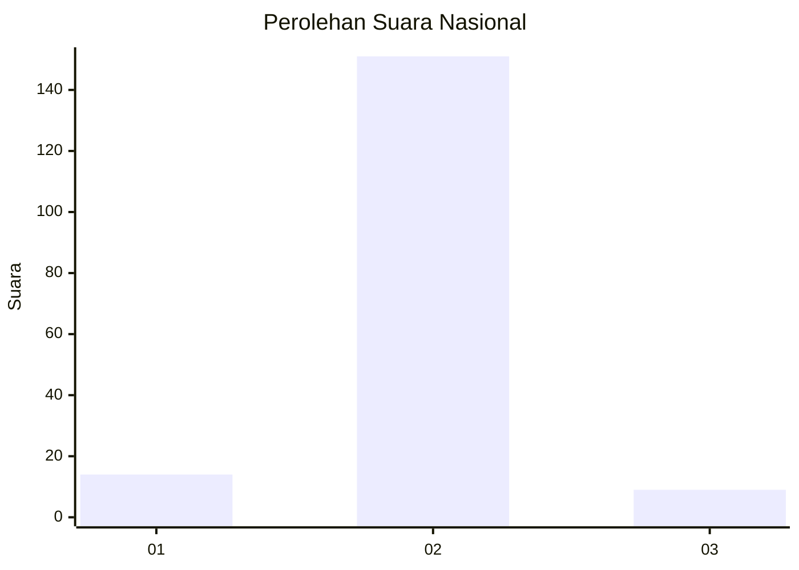
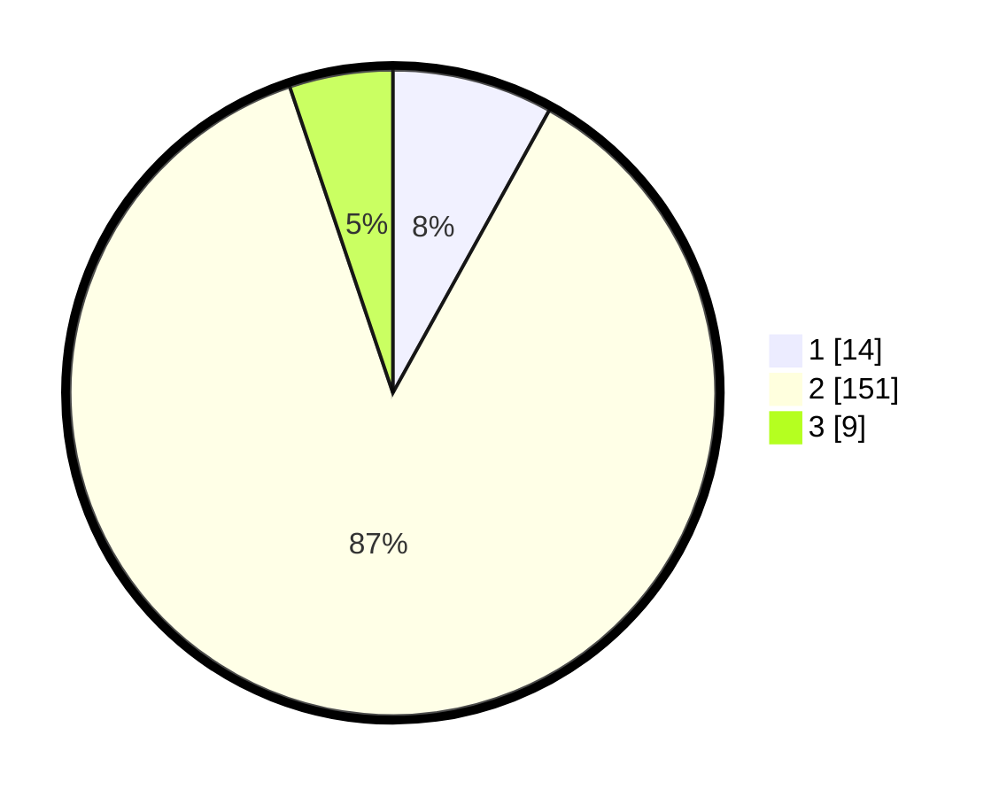

# Hasil

## Grafik

## Tabel

| No. | Nama Paslon    | Suara | Suara (raw) | Persentase |
|:--- |:-------------- | -----:| -----------:| ----------:|
| 1   | ANIES MUHAIMIN | 14    | [14][p-1]   | 8,05       |
| 2   | PRABOWO GIBRAN | 151   | [151][p-2]  | 86,78      |
| 3   | GANJAR MAHFUD  | 9     | [9][p-3]    | 5,17       |

[p-1]: https://github.com/gigit-pemilu/pemilu-2024/blob/main/pilpres/hitung-suara/sub/16-sumatera-selatan/sub/04-lahat/sub/09-merapi-barat/sub/2013-suka-marga/sub/001-tps/sub/paslon-1.txt
[p-2]: https://github.com/gigit-pemilu/pemilu-2024/blob/main/pilpres/hitung-suara/sub/16-sumatera-selatan/sub/04-lahat/sub/09-merapi-barat/sub/2013-suka-marga/sub/001-tps/sub/paslon-2.txt
[p-3]: https://github.com/gigit-pemilu/pemilu-2024/blob/main/pilpres/hitung-suara/sub/16-sumatera-selatan/sub/04-lahat/sub/09-merapi-barat/sub/2013-suka-marga/sub/001-tps/sub/paslon-3.txt

## Foto C Plano

https://sirekap-obj-formc.kpu.go.id/5f70/pemilu/ppwp/16/04/09/20/13/1604092013001-20240215-125120--883038fc-16a0-444e-9350-2ae2acdd22cb.jpg

https://sirekap-obj-formc.kpu.go.id/5f70/pemilu/ppwp/16/04/09/20/13/1604092013001-20240215-125258--e4afc1c2-c48c-4c09-b0ea-2fafa3b61142.jpg

https://sirekap-obj-formc.kpu.go.id/5f70/pemilu/ppwp/16/04/09/20/13/1604092013001-20240215-125427--c7d526c7-674c-4553-8c8a-bee5ec4f501b.jpg

## Metadata

| Key        | Value               |
| ---------- | ------------------- |
| Time Stamp | 2024-02-16 00:00:26 |

