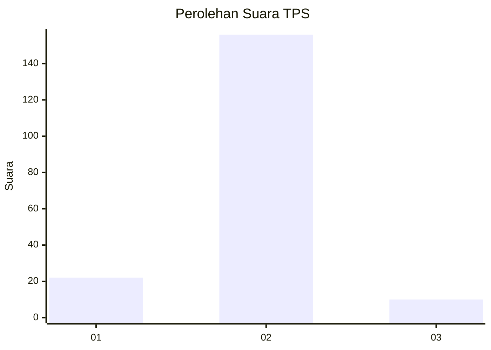
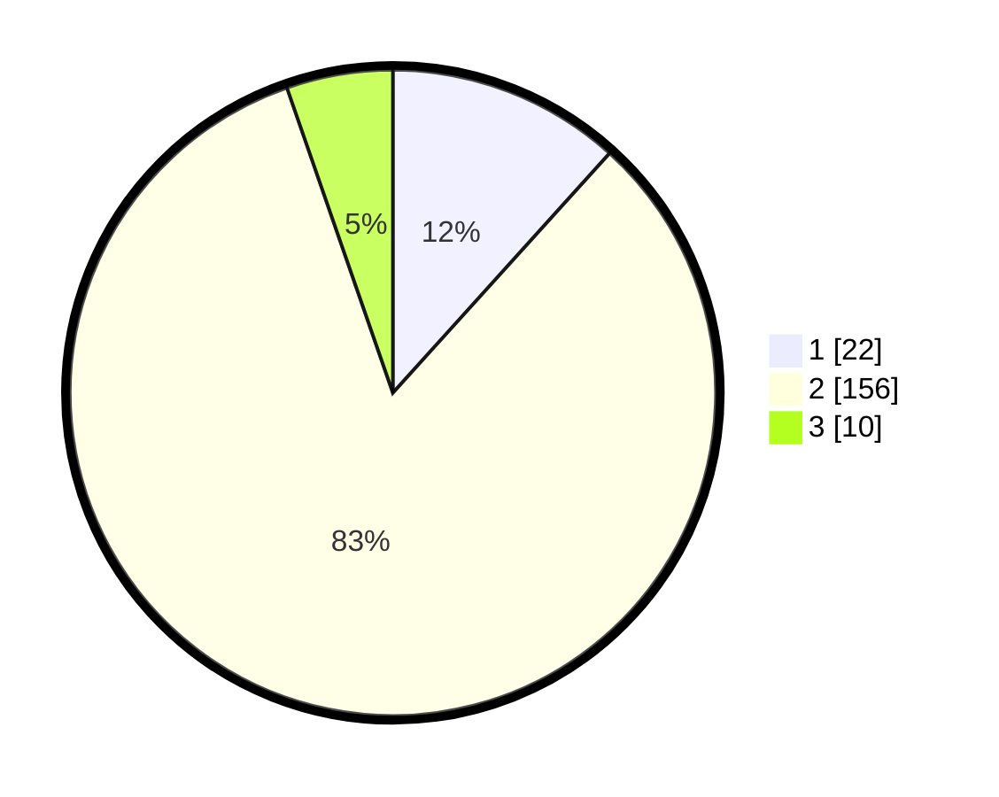

# Hasil

## Grafik

## Tabel

| No. | Nama Paslon    | Suara | Suara (raw) | Persentase |
|:--- |:-------------- | -----:| -----------:| ----------:|
| 1   | ANIES MUHAIMIN | 22    | [22][p-1]   | 11,70      |
| 2   | PRABOWO GIBRAN | 156   | [156][p-2]  | 82,98      |
| 3   | GANJAR MAHFUD  | 10    | [10][p-3]   | 5,32       |

[p-1]: https://github.com/gigit-pemilu/pemilu-2024-16-sumatera-selatan/blob/main/pilpres/hitung-suara/sub/16-sumatera-selatan/sub/04-lahat/sub/09-merapi-barat/sub/2013-suka-marga/sub/002-tps/sub/paslon-1.txt
[p-2]: https://github.com/gigit-pemilu/pemilu-2024-16-sumatera-selatan/blob/main/pilpres/hitung-suara/sub/16-sumatera-selatan/sub/04-lahat/sub/09-merapi-barat/sub/2013-suka-marga/sub/002-tps/sub/paslon-2.txt
[p-3]: https://github.com/gigit-pemilu/pemilu-2024-16-sumatera-selatan/blob/main/pilpres/hitung-suara/sub/16-sumatera-selatan/sub/04-lahat/sub/09-merapi-barat/sub/2013-suka-marga/sub/002-tps/sub/paslon-3.txt

## Foto C Plano

https://sirekap-obj-formc.kpu.go.id/6d1c/pemilu/ppwp/16/04/09/20/13/1604092013002-20240215-081643--ad7b8d05-5ab6-4e09-9208-981e6d4a0162.jpg

https://sirekap-obj-formc.kpu.go.id/6d1c/pemilu/ppwp/16/04/09/20/13/1604092013002-20240215-083453--c0c56c5b-97b2-4776-a20b-5b747d61048d.jpg

https://sirekap-obj-formc.kpu.go.id/6d1c/pemilu/ppwp/16/04/09/20/13/1604092013002-20240215-083621--6cd5d346-ab09-4bd5-a4c0-dc4d3c08f86d.jpg

## Metadata

| Key        | Value               |
| ---------- | ------------------- |
| Time Stamp | 2024-02-15 20:00:44 |

