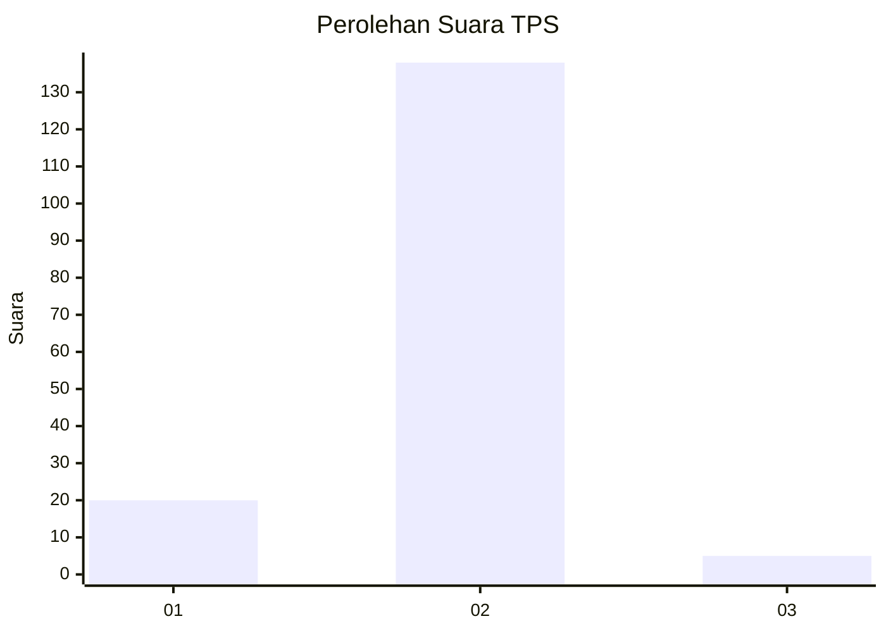
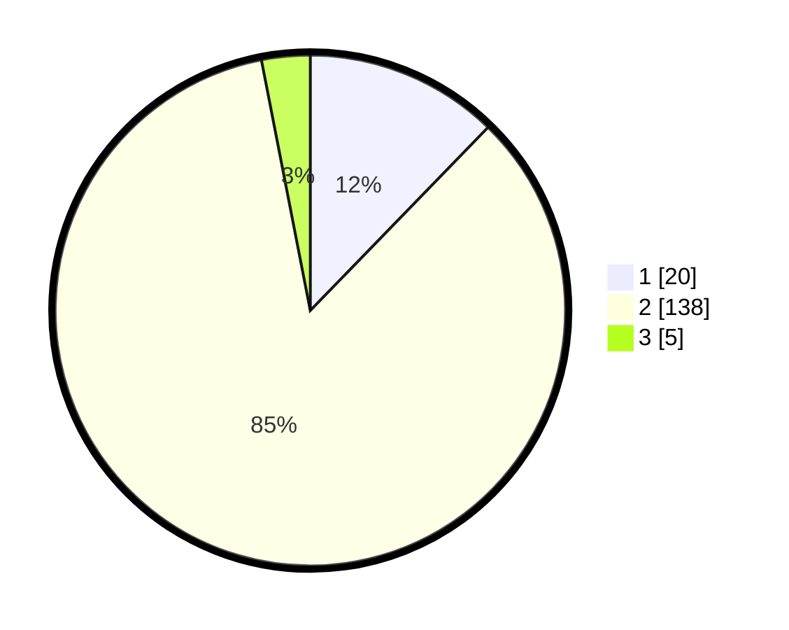

# Hasil

## Grafik

## Tabel

| No. | Nama Paslon    | Suara | Suara (raw) | Persentase |
|:--- |:-------------- | -----:| -----------:| ----------:|
| 1   | ANIES MUHAIMIN | 20    | [20][p-1]   | 12,27      |
| 2   | PRABOWO GIBRAN | 138   | [138][p-2]  | 84,66      |
| 3   | GANJAR MAHFUD  | 5     | [5][p-3]    | 3,07       |

[p-1]: https://github.com/gigit-pemilu/pemilu-2024-16-sumatera-selatan/blob/main/pilpres/hitung-suara/sub/16-sumatera-selatan/sub/04-lahat/sub/09-merapi-barat/sub/2015-karang-endah/sub/002-tps/sub/paslon-1.txt
[p-2]: https://github.com/gigit-pemilu/pemilu-2024-16-sumatera-selatan/blob/main/pilpres/hitung-suara/sub/16-sumatera-selatan/sub/04-lahat/sub/09-merapi-barat/sub/2015-karang-endah/sub/002-tps/sub/paslon-2.txt
[p-3]: https://github.com/gigit-pemilu/pemilu-2024-16-sumatera-selatan/blob/main/pilpres/hitung-suara/sub/16-sumatera-selatan/sub/04-lahat/sub/09-merapi-barat/sub/2015-karang-endah/sub/002-tps/sub/paslon-3.txt

## Foto C Plano

https://sirekap-obj-formc.kpu.go.id/d697/pemilu/ppwp/16/04/09/20/15/1604092015002-20240216-173604--6ac7619b-31b8-47a5-81ac-07acccec6b68.jpg

https://sirekap-obj-formc.kpu.go.id/d697/pemilu/ppwp/16/04/09/20/15/1604092015002-20240216-182650--49172497-4a1d-41e6-adff-9132d0e54b51.jpg

https://sirekap-obj-formc.kpu.go.id/d697/pemilu/ppwp/16/04/09/20/15/1604092015002-20240216-181022--d8014ee2-fe34-4d5e-b20c-61523f98308b.jpg

## Metadata

| Key        | Value               |
| ---------- | ------------------- |
| Time Stamp | 2024-02-25 12:00:00 |

