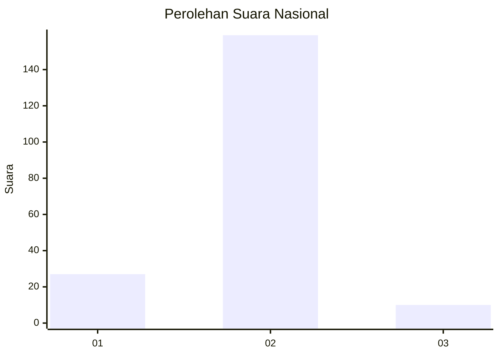
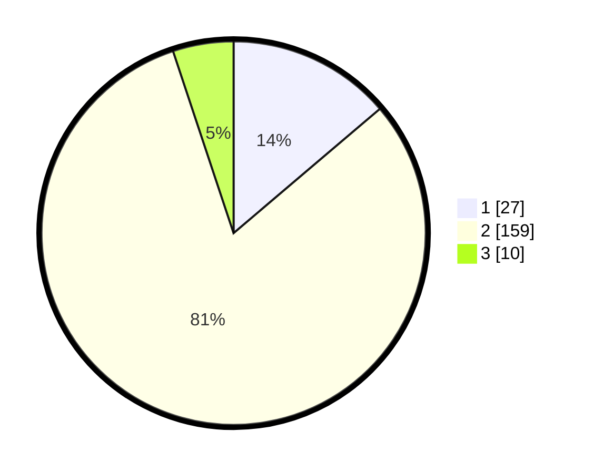

# Hasil

## Grafik

## Tabel

| No. | Nama Paslon    | Suara | Suara (raw) | Persentase |
|:--- |:-------------- | -----:| -----------:| ----------:|
| 1   | ANIES MUHAIMIN | 27    | [27][p-1]   | 13,78      |
| 2   | PRABOWO GIBRAN | 159   | [159][p-2]  | 81,12      |
| 3   | GANJAR MAHFUD  | 10    | [10][p-3]   | 5,10       |

[p-1]: https://github.com/gigit-pemilu/pemilu-2024/blob/main/pilpres/hitung-suara/sub/16-sumatera-selatan/sub/04-lahat/sub/09-merapi-barat/sub/2015-karang-endah/sub/003-tps/sub/paslon-1.txt
[p-2]: https://github.com/gigit-pemilu/pemilu-2024/blob/main/pilpres/hitung-suara/sub/16-sumatera-selatan/sub/04-lahat/sub/09-merapi-barat/sub/2015-karang-endah/sub/003-tps/sub/paslon-2.txt
[p-3]: https://github.com/gigit-pemilu/pemilu-2024/blob/main/pilpres/hitung-suara/sub/16-sumatera-selatan/sub/04-lahat/sub/09-merapi-barat/sub/2015-karang-endah/sub/003-tps/sub/paslon-3.txt

## Foto C Plano

https://sirekap-obj-formc.kpu.go.id/8c07/pemilu/ppwp/16/04/09/20/15/1604092015003-20240216-121540--c25a5d6e-b4b2-4e8b-a605-30850b9f5b8e.jpg

https://sirekap-obj-formc.kpu.go.id/8c07/pemilu/ppwp/16/04/09/20/15/1604092015003-20240216-121918--7695bd41-af38-432d-9537-3c39c66ee446.jpg

https://sirekap-obj-formc.kpu.go.id/8c07/pemilu/ppwp/16/04/09/20/15/1604092015003-20240216-122015--486d4036-412d-4c50-bcb8-1f9a8d8b3b8f.jpg

## Metadata

| Key        | Value               |
| ---------- | ------------------- |
| Time Stamp | 2024-02-16 12:51:22 |

## DATA PEMILIH TETAP

Jumlah pemilih dalam DPT: **239**.
 * L: **523**.
 * P: **497**.

## DATA PENGGUNA HAK PILIH

Jumlah pengguna hak pilih dalam DPT: **230**.
 * L: **643**.
 * P: **697**.

Jumlah pengguna hak pilih dalam DPTb: **208**.
 * L: **2**.
 * P: **226**.

Jumlah pengguna hak pilih dalam DPK: **222**.
 * L: **6**.
 * P: **22**.

Jumlah pengguna hak pilih: **333**.
 * L: **424**.
 * P: **899**.

## JUMLAH SUARA SAH DAN TIDAK SAH

JUMLAH SELURUH SUARA SAH: **206**.

JUMLAH SUARA TIDAK SAH: **2**.

JUMLAH SELURUH SUARA SAH DAN SUARA TIDAK SAH: **208**.

