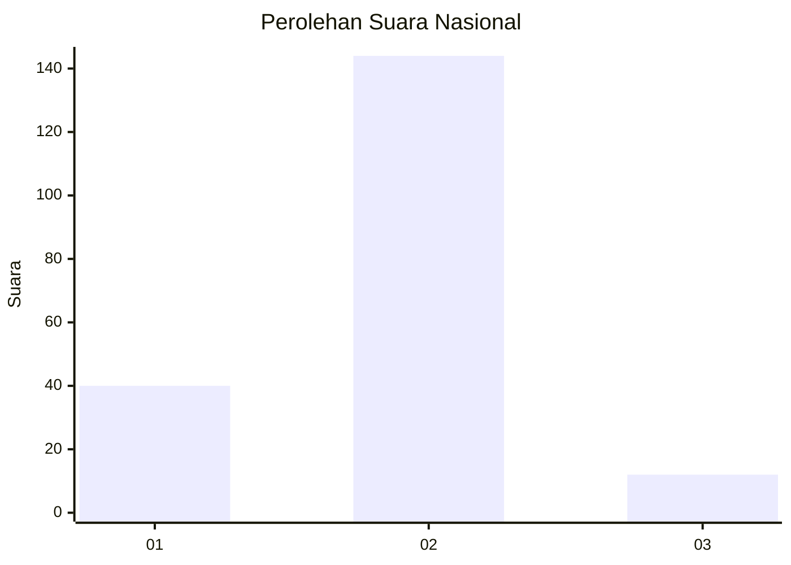

# Hasil

## Grafik

## Tabel

| No. | Nama Paslon    | Suara | Suara (raw) | Persentase |
|:--- |:-------------- | -----:| -----------:| ----------:|
| 1   | ANIES MUHAIMIN | 40    | [40][p-1]   | 20,41      |
| 2   | PRABOWO GIBRAN | 144   | [144][p-2]  | 73,47      |
| 3   | GANJAR MAHFUD  | 12    | [12][p-3]   | 6,12       |

[p-1]: https://github.com/gigit-pemilu/pemilu-2024/blob/main/pilpres/hitung-suara/sub/16-sumatera-selatan/sub/04-lahat/sub/09-merapi-barat/sub/2017-lubuk-kepayang/sub/002-tps/sub/paslon-1.txt
[p-2]: https://github.com/gigit-pemilu/pemilu-2024/blob/main/pilpres/hitung-suara/sub/16-sumatera-selatan/sub/04-lahat/sub/09-merapi-barat/sub/2017-lubuk-kepayang/sub/002-tps/sub/paslon-2.txt
[p-3]: https://github.com/gigit-pemilu/pemilu-2024/blob/main/pilpres/hitung-suara/sub/16-sumatera-selatan/sub/04-lahat/sub/09-merapi-barat/sub/2017-lubuk-kepayang/sub/002-tps/sub/paslon-3.txt

## Foto C Plano

https://sirekap-obj-formc.kpu.go.id/9db7/pemilu/ppwp/16/04/09/20/17/1604092017002-20240215-010007--499e0f47-7f74-4024-adc1-23439cde9ee8.jpg

https://sirekap-obj-formc.kpu.go.id/9db7/pemilu/ppwp/16/04/09/20/17/1604092017002-20240215-014631--8edffae3-1c73-4cba-90a6-a53b04d318ce.jpg

https://sirekap-obj-formc.kpu.go.id/9db7/pemilu/ppwp/16/04/09/20/17/1604092017002-20240215-005628--f3c9a66d-cf51-4dae-a4d1-888f85e26dd3.jpg

## Metadata

| Key        | Value               |
| ---------- | ------------------- |
| Time Stamp | 2024-02-15 12:00:28 |

