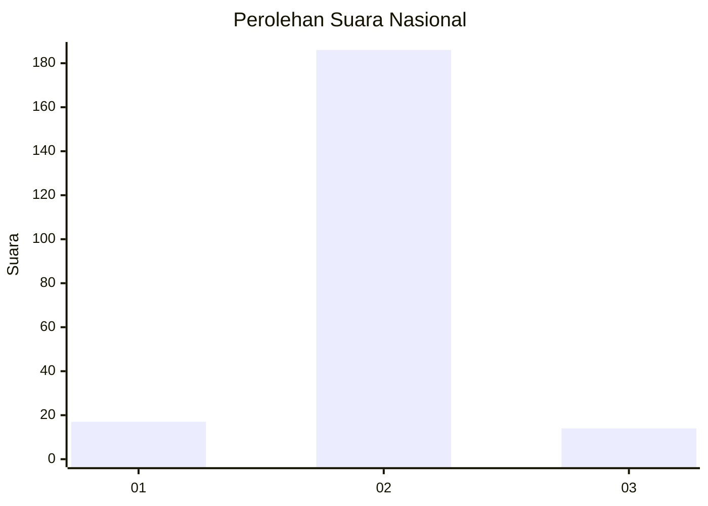
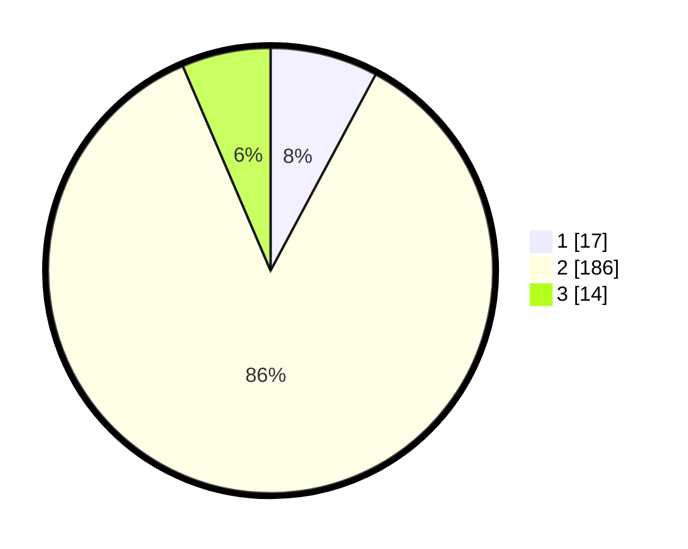

# Hasil

## Grafik

## Tabel

| No. | Nama Paslon    | Suara | Suara (raw) | Persentase |
|:--- |:-------------- | -----:| -----------:| ----------:|
| 1   | ANIES MUHAIMIN | 17    | [17][p-1]   | 7,83       |
| 2   | PRABOWO GIBRAN | 186   | [186][p-2]  | 85,71      |
| 3   | GANJAR MAHFUD  | 14    | [14][p-3]   | 6,45       |

[p-1]: https://github.com/gigit-pemilu/pemilu-2024/blob/main/pilpres/hitung-suara/sub/16-sumatera-selatan/sub/04-lahat/sub/09-merapi-barat/sub/2021-lebak-budi/sub/001-tps/sub/paslon-1.txt
[p-2]: https://github.com/gigit-pemilu/pemilu-2024/blob/main/pilpres/hitung-suara/sub/16-sumatera-selatan/sub/04-lahat/sub/09-merapi-barat/sub/2021-lebak-budi/sub/001-tps/sub/paslon-2.txt
[p-3]: https://github.com/gigit-pemilu/pemilu-2024/blob/main/pilpres/hitung-suara/sub/16-sumatera-selatan/sub/04-lahat/sub/09-merapi-barat/sub/2021-lebak-budi/sub/001-tps/sub/paslon-3.txt

## Foto C Plano

https://sirekap-obj-formc.kpu.go.id/bf4f/pemilu/ppwp/16/04/09/20/21/1604092021001-20240214-234006--36f91a1d-ef7f-4b4f-90b4-1cebfef1073a.jpg

https://sirekap-obj-formc.kpu.go.id/bf4f/pemilu/ppwp/16/04/09/20/21/1604092021001-20240214-233958--fb08b905-3db5-47f9-b442-b02eb5c7088c.jpg

https://sirekap-obj-formc.kpu.go.id/bf4f/pemilu/ppwp/16/04/09/20/21/1604092021001-20240214-234019--4917829e-df1b-4953-b1e2-cec55749e0aa.jpg

## Metadata

| Key        | Value               |
| ---------- | ------------------- |
| Time Stamp | 2024-02-15 20:30:46 |

