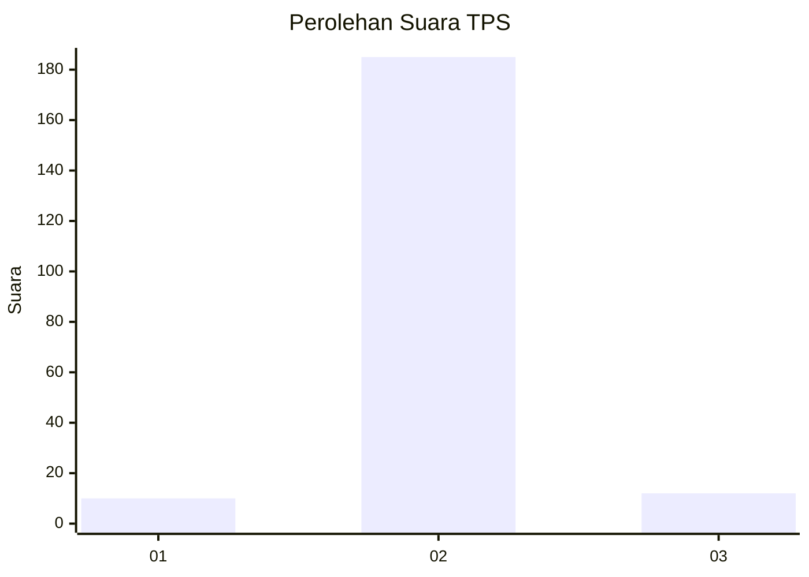
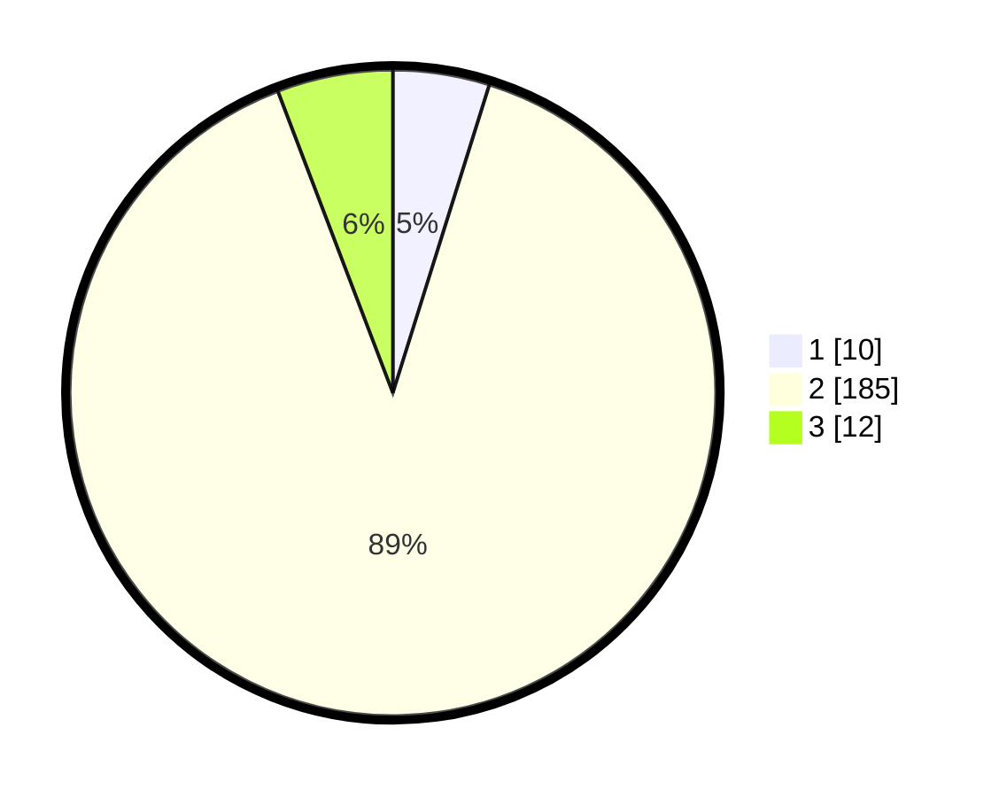

# Hasil

## Grafik

## Tabel

| No. | Nama Paslon    | Suara | Suara (raw) | Persentase |
|:--- |:-------------- | -----:| -----------:| ----------:|
| 1   | ANIES MUHAIMIN | 10    | [10][p-1]   | 4,83       |
| 2   | PRABOWO GIBRAN | 185   | [185][p-2]  | 89,37      |
| 3   | GANJAR MAHFUD  | 12    | [12][p-3]   | 5,80       |

[p-1]: https://github.com/gigit-pemilu/pemilu-2024-16-sumatera-selatan/blob/main/pilpres/hitung-suara/sub/16-sumatera-selatan/sub/04-lahat/sub/09-merapi-barat/sub/2021-lebak-budi/sub/002-tps/sub/paslon-1.txt
[p-2]: https://github.com/gigit-pemilu/pemilu-2024-16-sumatera-selatan/blob/main/pilpres/hitung-suara/sub/16-sumatera-selatan/sub/04-lahat/sub/09-merapi-barat/sub/2021-lebak-budi/sub/002-tps/sub/paslon-2.txt
[p-3]: https://github.com/gigit-pemilu/pemilu-2024-16-sumatera-selatan/blob/main/pilpres/hitung-suara/sub/16-sumatera-selatan/sub/04-lahat/sub/09-merapi-barat/sub/2021-lebak-budi/sub/002-tps/sub/paslon-3.txt

## Foto C Plano

https://sirekap-obj-formc.kpu.go.id/4aa9/pemilu/ppwp/16/04/09/20/21/1604092021002-20240214-192631--b675b653-3bd3-4311-9530-a73c21826f89.jpg

https://sirekap-obj-formc.kpu.go.id/4aa9/pemilu/ppwp/16/04/09/20/21/1604092021002-20240214-193807--a893a861-12ff-4854-9709-6246f4d73533.jpg

https://sirekap-obj-formc.kpu.go.id/4aa9/pemilu/ppwp/16/04/09/20/21/1604092021002-20240214-194021--69cf4772-39ee-4cdf-a7a7-36094b22897f.jpg

## Metadata

| Key        | Value               |
| ---------- | ------------------- |
| Time Stamp | 2024-02-15 15:00:29 |

