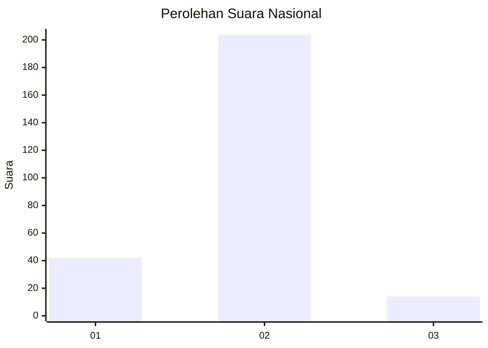
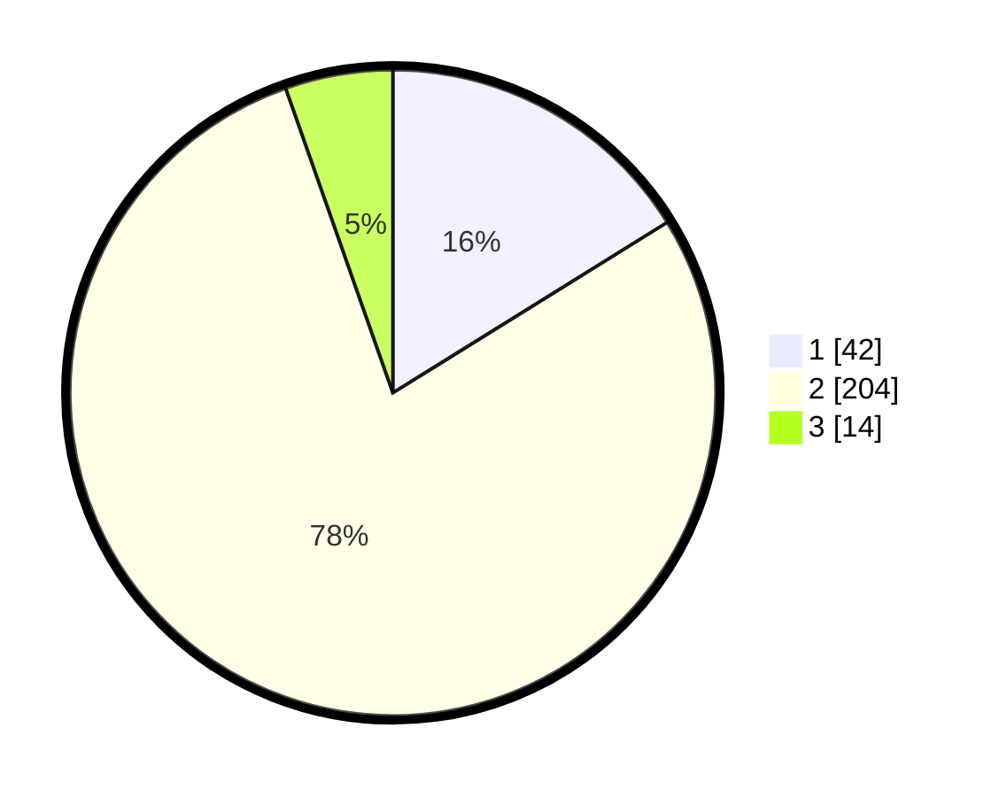

# Hasil

## Grafik

## Tabel

| No. | Nama Paslon    | Suara | Suara (raw) | Persentase |
|:--- |:-------------- | -----:| -----------:| ----------:|
| 1   | ANIES MUHAIMIN | 42    | [42][p-1]   | 16,15      |
| 2   | PRABOWO GIBRAN | 204   | [204][p-2]  | 78,46      |
| 3   | GANJAR MAHFUD  | 14    | [14][p-3]   | 5,38       |

[p-1]: https://github.com/gigit-pemilu/pemilu-2024/blob/main/pilpres/hitung-suara/sub/16-sumatera-selatan/sub/04-lahat/sub/10-lahat/sub/1041-pasar-lama/sub/008-tps/sub/paslon-1.txt
[p-2]: https://github.com/gigit-pemilu/pemilu-2024/blob/main/pilpres/hitung-suara/sub/16-sumatera-selatan/sub/04-lahat/sub/10-lahat/sub/1041-pasar-lama/sub/008-tps/sub/paslon-2.txt
[p-3]: https://github.com/gigit-pemilu/pemilu-2024/blob/main/pilpres/hitung-suara/sub/16-sumatera-selatan/sub/04-lahat/sub/10-lahat/sub/1041-pasar-lama/sub/008-tps/sub/paslon-3.txt

## Foto C Plano

https://sirekap-obj-formc.kpu.go.id/eccd/pemilu/ppwp/16/04/10/10/41/1604101041008-20240214-155216--922a094c-ac52-4b28-a060-4e56edfe794d.jpg

https://sirekap-obj-formc.kpu.go.id/eccd/pemilu/ppwp/16/04/10/10/41/1604101041008-20240214-155437--bfed8202-e65f-4422-a561-7f9c82c14151.jpg

https://sirekap-obj-formc.kpu.go.id/eccd/pemilu/ppwp/16/04/10/10/41/1604101041008-20240214-155529--9ae77d45-5005-461f-b18d-72f6bbb8165e.jpg

## Metadata

| Key        | Value               |
| ---------- | ------------------- |
| Time Stamp | 2024-02-15 00:41:44 |

