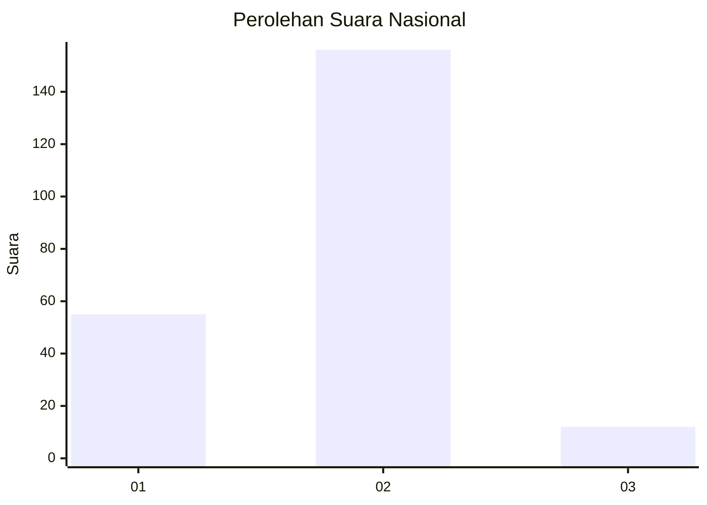
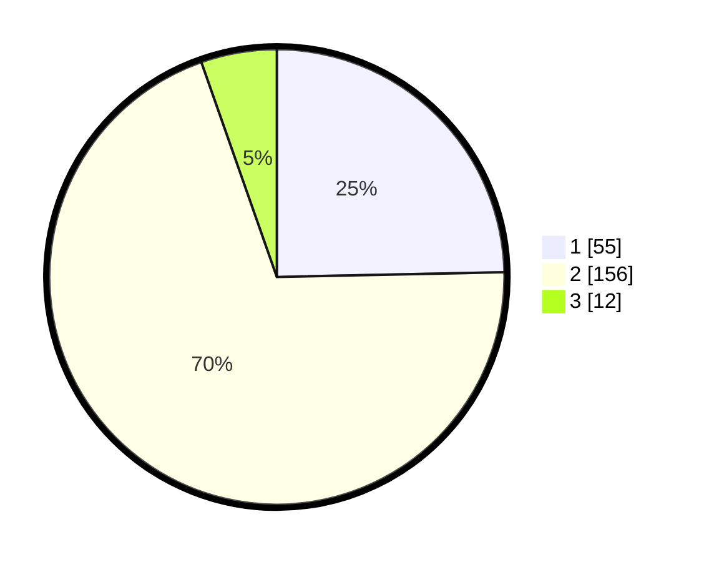

# Hasil

## Grafik

## Tabel

| No. | Nama Paslon    | Suara | Suara (raw) | Persentase |
|:--- |:-------------- | -----:| -----------:| ----------:|
| 1   | ANIES MUHAIMIN | 55    | [55][p-1]   | 24,66      |
| 2   | PRABOWO GIBRAN | 156   | [156][p-2]  | 69,96      |
| 3   | GANJAR MAHFUD  | 12    | [12][p-3]   | 5,38       |

[p-1]: https://github.com/gigit-pemilu/pemilu-2024/blob/main/pilpres/hitung-suara/sub/16-sumatera-selatan/sub/04-lahat/sub/10-lahat/sub/1042-pasar-bawah/sub/003-tps/sub/paslon-1.txt
[p-2]: https://github.com/gigit-pemilu/pemilu-2024/blob/main/pilpres/hitung-suara/sub/16-sumatera-selatan/sub/04-lahat/sub/10-lahat/sub/1042-pasar-bawah/sub/003-tps/sub/paslon-2.txt
[p-3]: https://github.com/gigit-pemilu/pemilu-2024/blob/main/pilpres/hitung-suara/sub/16-sumatera-selatan/sub/04-lahat/sub/10-lahat/sub/1042-pasar-bawah/sub/003-tps/sub/paslon-3.txt

## Foto C Plano

https://sirekap-obj-formc.kpu.go.id/65d2/pemilu/ppwp/16/04/10/10/42/1604101042003-20240214-201122--958112bd-9ab5-4fa0-ac5e-fe5668f8b86d.jpg

https://sirekap-obj-formc.kpu.go.id/65d2/pemilu/ppwp/16/04/10/10/42/1604101042003-20240214-201309--92efb138-ba5a-4054-ac7c-546dac7de11c.jpg

https://sirekap-obj-formc.kpu.go.id/65d2/pemilu/ppwp/16/04/10/10/42/1604101042003-20240214-201331--79938aeb-845a-4cde-913b-406a0c15d24d.jpg

## Metadata

| Key        | Value               |
| ---------- | ------------------- |
| Time Stamp | 2024-02-15 22:30:27 |

