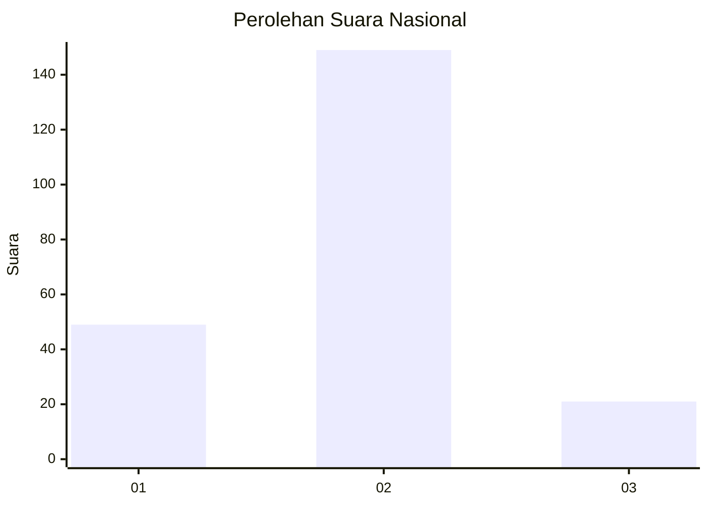

# Hasil

## Grafik

## Tabel

| No. | Nama Paslon    | Suara | Suara (raw) | Persentase |
|:--- |:-------------- | -----:| -----------:| ----------:|
| 1   | ANIES MUHAIMIN | 49    | [49][p-1]   | 22,37      |
| 2   | PRABOWO GIBRAN | 149   | [149][p-2]  | 68,04      |
| 3   | GANJAR MAHFUD  | 21    | [21][p-3]   | 9,59       |

[p-1]: https://github.com/gigit-pemilu/pemilu-2024/blob/main/pilpres/hitung-suara/sub/16-sumatera-selatan/sub/04-lahat/sub/10-lahat/sub/1043-rd-pjka/sub/005-tps/sub/paslon-1.txt
[p-2]: https://github.com/gigit-pemilu/pemilu-2024/blob/main/pilpres/hitung-suara/sub/16-sumatera-selatan/sub/04-lahat/sub/10-lahat/sub/1043-rd-pjka/sub/005-tps/sub/paslon-2.txt
[p-3]: https://github.com/gigit-pemilu/pemilu-2024/blob/main/pilpres/hitung-suara/sub/16-sumatera-selatan/sub/04-lahat/sub/10-lahat/sub/1043-rd-pjka/sub/005-tps/sub/paslon-3.txt

## Foto C Plano

https://sirekap-obj-formc.kpu.go.id/72e8/pemilu/ppwp/16/04/10/10/43/1604101043005-20240214-195114--0183da3b-6eb2-4180-982f-29594d7be7cd.jpg

https://sirekap-obj-formc.kpu.go.id/72e8/pemilu/ppwp/16/04/10/10/43/1604101043005-20240214-195128--372bc9e2-2f97-4b02-9834-ac362345670b.jpg

https://sirekap-obj-formc.kpu.go.id/72e8/pemilu/ppwp/16/04/10/10/43/1604101043005-20240214-195129--dfda87fb-2acc-4467-879a-bdf46ef3b306.jpg

## Metadata

| Key        | Value               |
| ---------- | ------------------- |
| Time Stamp | 2024-02-15 00:41:44 |

