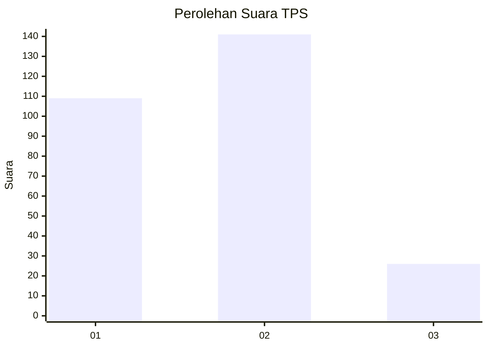
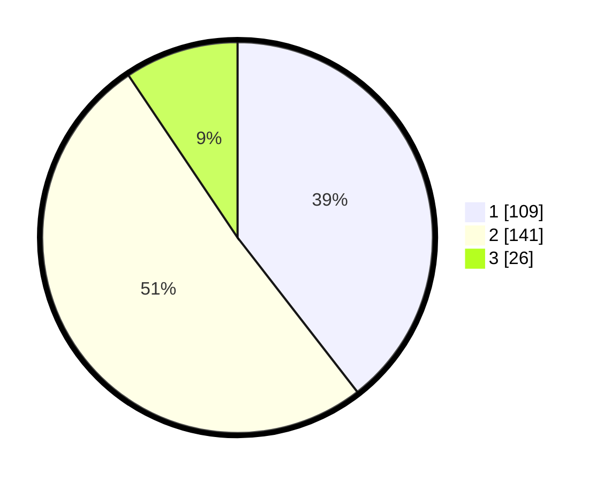

# Hasil

## Grafik

## Tabel

| No. | Nama Paslon    | Suara | Suara (raw) | Persentase |
|:--- |:-------------- | -----:| -----------:| ----------:|
| 1   | ANIES MUHAIMIN | 109   | [109][p-1]  | 39,49      |
| 2   | PRABOWO GIBRAN | 141   | [141][p-2]  | 51,09      |
| 3   | GANJAR MAHFUD  | 26    | [26][p-3]   | 9,42       |

[p-1]: https://github.com/gigit-pemilu/pemilu-2024-16-sumatera-selatan/blob/main/pilpres/hitung-suara/sub/16-sumatera-selatan/sub/04-lahat/sub/10-lahat/sub/1046-bandar-agung/sub/021-tps/sub/paslon-1.txt
[p-2]: https://github.com/gigit-pemilu/pemilu-2024-16-sumatera-selatan/blob/main/pilpres/hitung-suara/sub/16-sumatera-selatan/sub/04-lahat/sub/10-lahat/sub/1046-bandar-agung/sub/021-tps/sub/paslon-2.txt
[p-3]: https://github.com/gigit-pemilu/pemilu-2024-16-sumatera-selatan/blob/main/pilpres/hitung-suara/sub/16-sumatera-selatan/sub/04-lahat/sub/10-lahat/sub/1046-bandar-agung/sub/021-tps/sub/paslon-3.txt

## Foto C Plano

https://sirekap-obj-formc.kpu.go.id/44cf/pemilu/ppwp/16/04/10/10/46/1604101046021-20240214-232814--32423289-2d71-4224-a546-ff766c8537f4.jpg

https://sirekap-obj-formc.kpu.go.id/44cf/pemilu/ppwp/16/04/10/10/46/1604101046021-20240214-223157--d3049f32-b5a9-4654-b286-3c65eb5f2819.jpg

https://sirekap-obj-formc.kpu.go.id/44cf/pemilu/ppwp/16/04/10/10/46/1604101046021-20240214-223305--f6f54682-2ac3-4849-84ea-8843746275f1.jpg

## Metadata

| Key        | Value               |
| ---------- | ------------------- |
| Time Stamp | 2024-02-15 12:00:28 |

