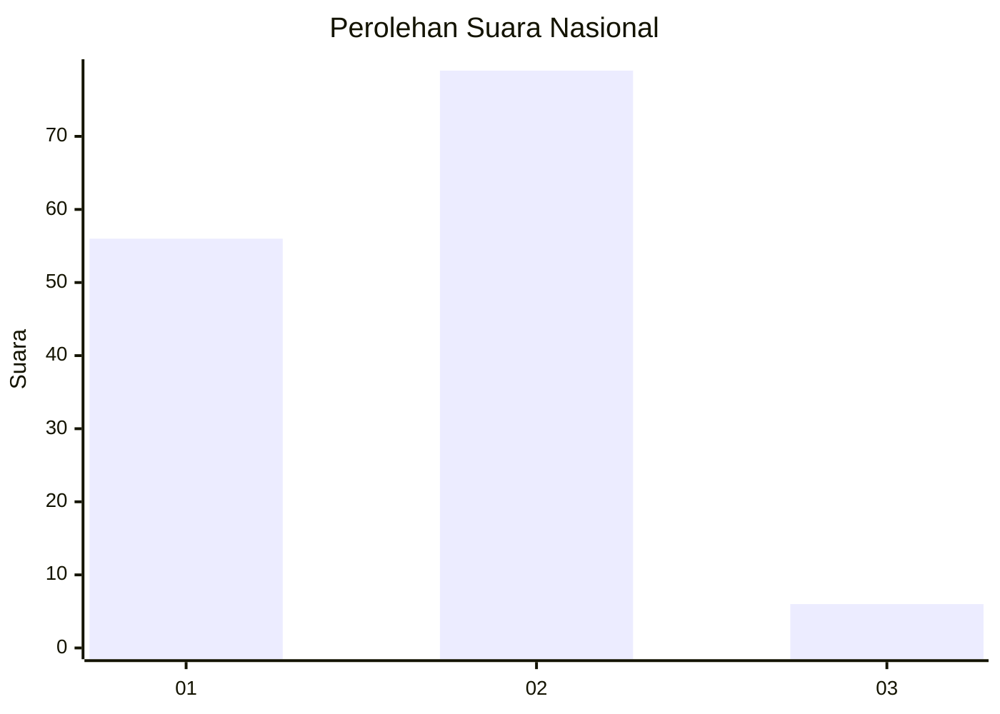
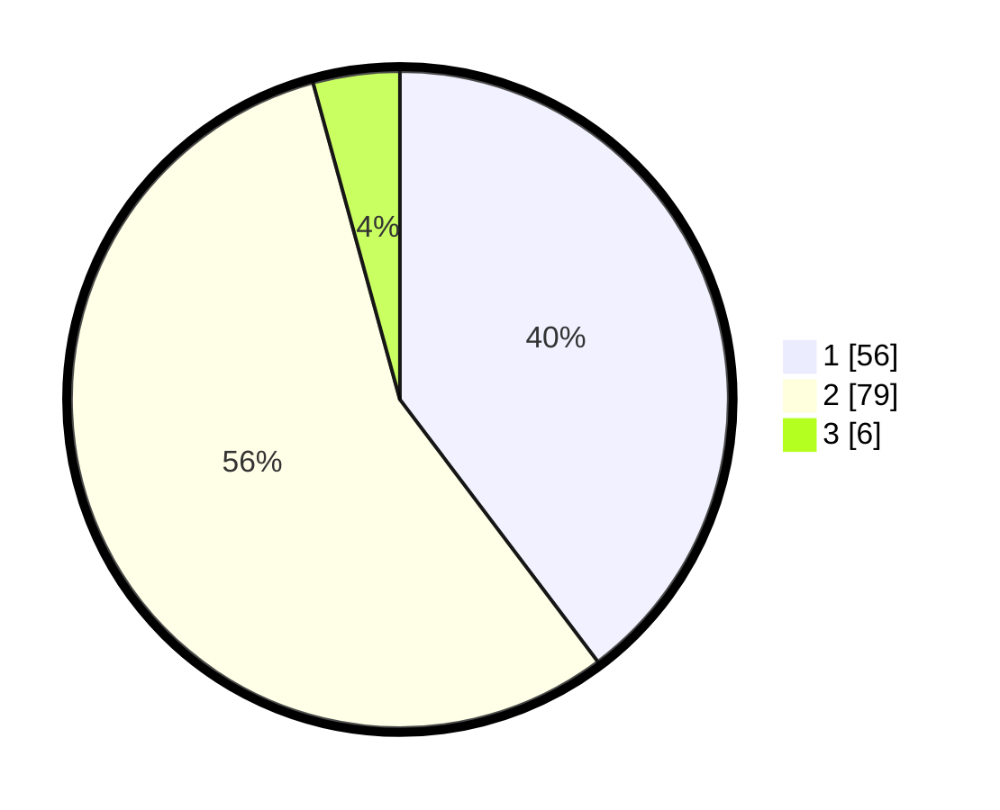

# Hasil

## Grafik

## Tabel

| No. | Nama Paslon    | Suara | Suara (raw) | Persentase |
|:--- |:-------------- | -----:| -----------:| ----------:|
| 1   | ANIES MUHAIMIN | 56    | [56][p-1]   | 39,72      |
| 2   | PRABOWO GIBRAN | 79    | [79][p-2]   | 56,03      |
| 3   | GANJAR MAHFUD  | 6     | [6][p-3]    | 4,26       |

[p-1]: https://github.com/gigit-pemilu/pemilu-2024/blob/main/pilpres/hitung-suara/sub/16-sumatera-selatan/sub/04-lahat/sub/10-lahat/sub/1051-kota-negara/sub/007-tps/sub/paslon-1.txt
[p-2]: https://github.com/gigit-pemilu/pemilu-2024/blob/main/pilpres/hitung-suara/sub/16-sumatera-selatan/sub/04-lahat/sub/10-lahat/sub/1051-kota-negara/sub/007-tps/sub/paslon-2.txt
[p-3]: https://github.com/gigit-pemilu/pemilu-2024/blob/main/pilpres/hitung-suara/sub/16-sumatera-selatan/sub/04-lahat/sub/10-lahat/sub/1051-kota-negara/sub/007-tps/sub/paslon-3.txt

## Foto C Plano

https://sirekap-obj-formc.kpu.go.id/1a2f/pemilu/ppwp/16/04/10/10/51/1604101051007-20240214-155805--d4a5e413-442b-45cc-b47d-8f4ac769a86c.jpg

https://sirekap-obj-formc.kpu.go.id/1a2f/pemilu/ppwp/16/04/10/10/51/1604101051007-20240214-155057--33235b52-3d94-41c2-b780-93654c8138dc.jpg

https://sirekap-obj-formc.kpu.go.id/1a2f/pemilu/ppwp/16/04/10/10/51/1604101051007-20240214-162227--56186b96-f419-481d-ae03-623dfe2c0b17.jpg

## Metadata

| Key        | Value               |
| ---------- | ------------------- |
| Time Stamp | 2024-02-15 12:00:28 |

## DATA PEMILIH TETAP

Jumlah pemilih dalam DPT: **246**.
 * L: **123**.
 * P: **116**.

## DATA PENGGUNA HAK PILIH

Jumlah pengguna hak pilih dalam DPT: **246**.
 * L: **123**.
 * P: **186**.

Jumlah pengguna hak pilih dalam DPTb: **820**.
 * L: **888**.
 * P: **220**.

Jumlah pengguna hak pilih dalam DPK: **7**.
 * L: **7**.
 * P: **3**.

Jumlah pengguna hak pilih: **246**.
 * L: **127**.
 * P: **119**.

## JUMLAH SUARA SAH DAN TIDAK SAH

JUMLAH SELURUH SUARA SAH: **241**.

JUMLAH SUARA TIDAK SAH: **5**.

JUMLAH SELURUH SUARA SAH DAN SUARA TIDAK SAH: **246**.

