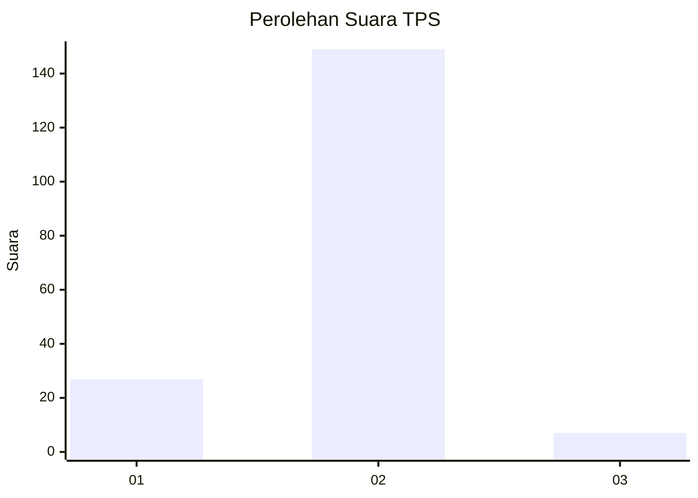
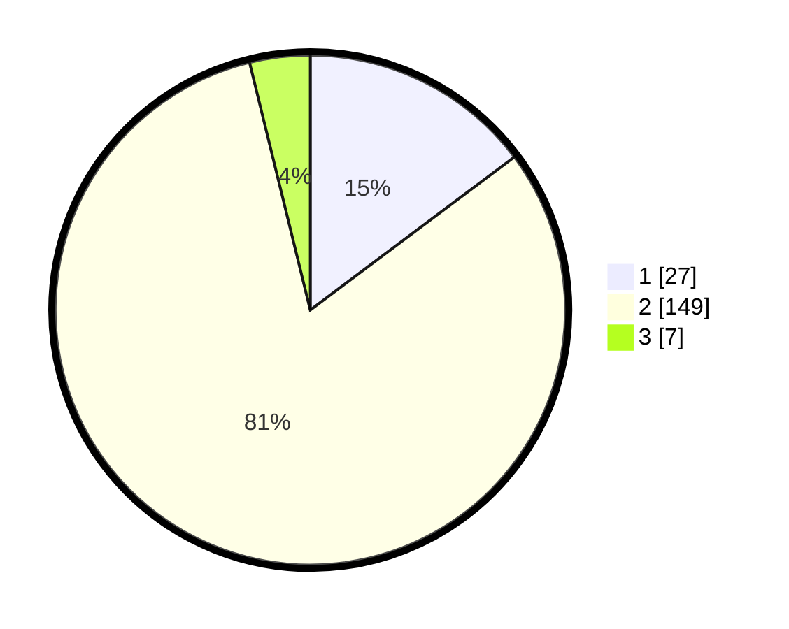

# Hasil

## Grafik

## Tabel

| No. | Nama Paslon    | Suara | Suara (raw) | Persentase |
|:--- |:-------------- | -----:| -----------:| ----------:|
| 1   | ANIES MUHAIMIN | 27    | [27][p-1]   | 14,75      |
| 2   | PRABOWO GIBRAN | 149   | [149][p-2]  | 81,42      |
| 3   | GANJAR MAHFUD  | 7     | [7][p-3]    | 3,83       |

[p-1]: https://github.com/gigit-pemilu/pemilu-2024-16-sumatera-selatan/blob/main/pilpres/hitung-suara/sub/16-sumatera-selatan/sub/04-lahat/sub/10-lahat/sub/1052-kota-jaya/sub/001-tps/sub/paslon-1.txt
[p-2]: https://github.com/gigit-pemilu/pemilu-2024-16-sumatera-selatan/blob/main/pilpres/hitung-suara/sub/16-sumatera-selatan/sub/04-lahat/sub/10-lahat/sub/1052-kota-jaya/sub/001-tps/sub/paslon-2.txt
[p-3]: https://github.com/gigit-pemilu/pemilu-2024-16-sumatera-selatan/blob/main/pilpres/hitung-suara/sub/16-sumatera-selatan/sub/04-lahat/sub/10-lahat/sub/1052-kota-jaya/sub/001-tps/sub/paslon-3.txt

## Foto C Plano

https://sirekap-obj-formc.kpu.go.id/1ebc/pemilu/ppwp/16/04/10/10/52/1604101052001-20240215-043614--41eb5cc9-49ef-4b0a-aac6-03229f37c9d9.jpg

https://sirekap-obj-formc.kpu.go.id/1ebc/pemilu/ppwp/16/04/10/10/52/1604101052001-20240215-043647--972d680a-99ef-4a18-b6a3-4bc107b630e4.jpg

https://sirekap-obj-formc.kpu.go.id/1ebc/pemilu/ppwp/16/04/10/10/52/1604101052001-20240215-043704--c4a0eb12-9f99-49df-8bc1-06fee4f03695.jpg

## Metadata

| Key        | Value               |
| ---------- | ------------------- |
| Time Stamp | 2024-02-15 20:00:44 |

