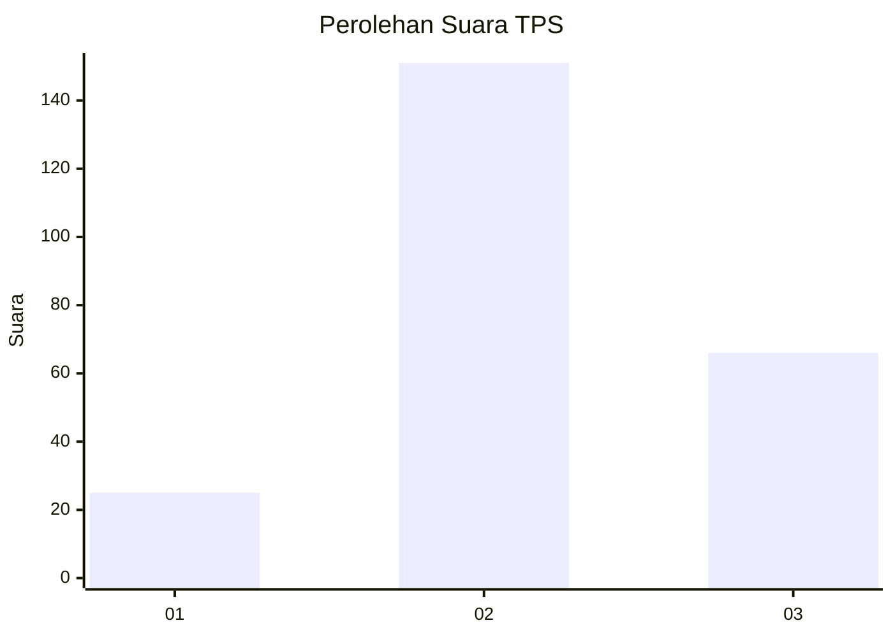
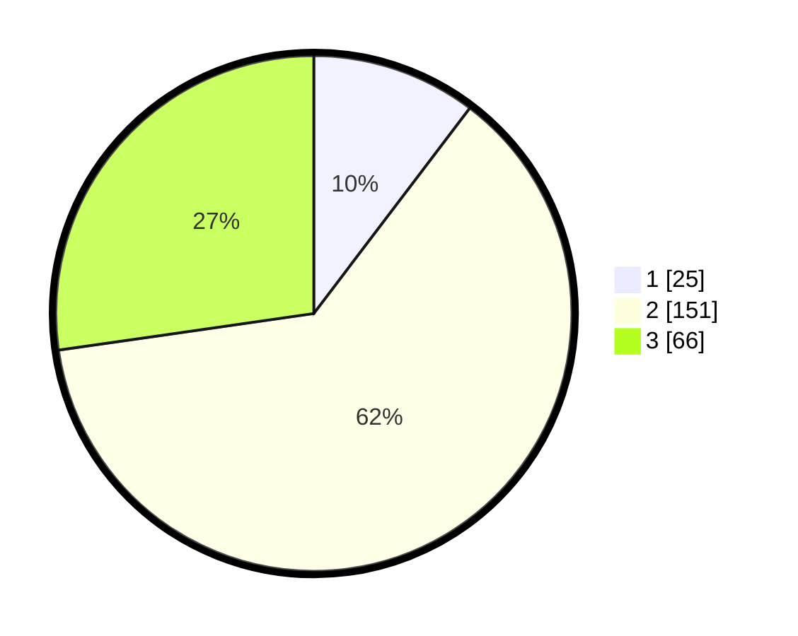

# Hasil

## Grafik

## Tabel

| No. | Nama Paslon    | Suara | Suara (raw) | Persentase |
|:--- |:-------------- | -----:| -----------:| ----------:|
| 1   | ANIES MUHAIMIN | 25    | [25][p-1]   | 10,33      |
| 2   | PRABOWO GIBRAN | 151   | [151][p-2]  | 62,40      |
| 3   | GANJAR MAHFUD  | 66    | [66][p-3]   | 27,27      |

[p-1]: https://github.com/gigit-pemilu/pemilu-2024-16-sumatera-selatan/blob/main/pilpres/hitung-suara/sub/16-sumatera-selatan/sub/04-lahat/sub/10-lahat/sub/1058-sari-bunga-mas/sub/008-tps/sub/paslon-1.txt
[p-2]: https://github.com/gigit-pemilu/pemilu-2024-16-sumatera-selatan/blob/main/pilpres/hitung-suara/sub/16-sumatera-selatan/sub/04-lahat/sub/10-lahat/sub/1058-sari-bunga-mas/sub/008-tps/sub/paslon-2.txt
[p-3]: https://github.com/gigit-pemilu/pemilu-2024-16-sumatera-selatan/blob/main/pilpres/hitung-suara/sub/16-sumatera-selatan/sub/04-lahat/sub/10-lahat/sub/1058-sari-bunga-mas/sub/008-tps/sub/paslon-3.txt

## Foto C Plano

https://sirekap-obj-formc.kpu.go.id/d1fd/pemilu/ppwp/16/04/10/10/58/1604101058008-20240214-175323--01bcd21c-0fc5-4cca-abf0-991d3436607f.jpg

https://sirekap-obj-formc.kpu.go.id/d1fd/pemilu/ppwp/16/04/10/10/58/1604101058008-20240214-175444--b9bf5a9b-8d13-4e78-a523-ae2b1bc2f20e.jpg

https://sirekap-obj-formc.kpu.go.id/d1fd/pemilu/ppwp/16/04/10/10/58/1604101058008-20240214-175444--d28aa73b-f4c6-4703-99af-ce8fd8bd1915.jpg

## Metadata

| Key        | Value               |
| ---------- | ------------------- |
| Time Stamp | 2024-02-15 12:00:28 |

