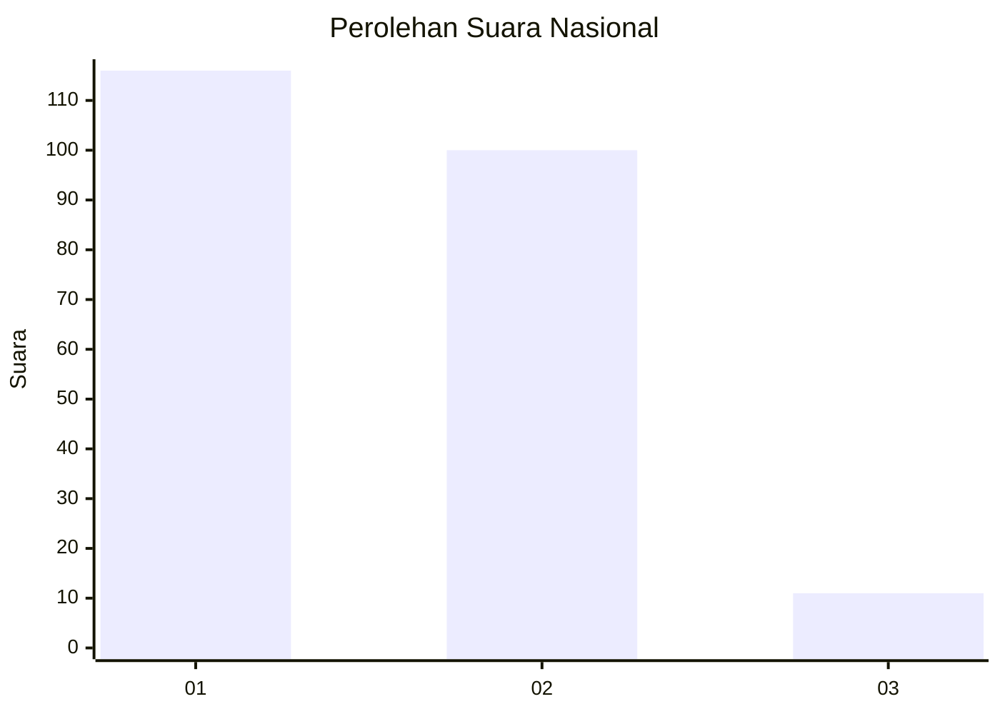
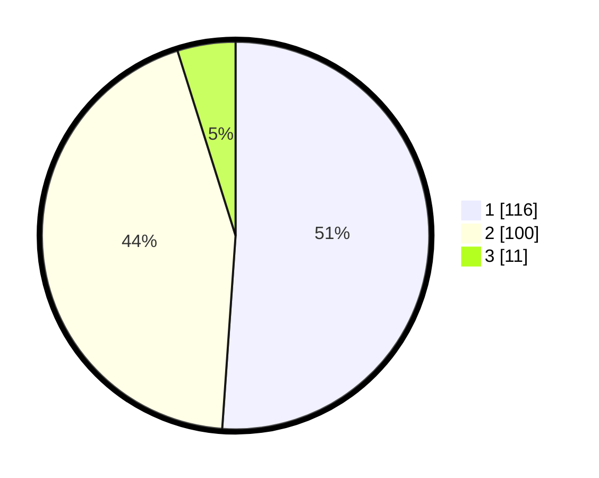

# Hasil

## Grafik

## Tabel

| No. | Nama Paslon    | Suara | Suara (raw) | Persentase |
|:--- |:-------------- | -----:| -----------:| ----------:|
| 1   | ANIES MUHAIMIN | 116   | [116][p-1]  | 51,10      |
| 2   | PRABOWO GIBRAN | 100   | [100][p-2]  | 44,05      |
| 3   | GANJAR MAHFUD  | 11    | [11][p-3]   | 4,85       |

[p-1]: https://github.com/gigit-pemilu/pemilu-2024/blob/main/pilpres/hitung-suara/sub/16-sumatera-selatan/sub/04-lahat/sub/10-lahat/sub/1059-bandar-jaya/sub/006-tps/sub/paslon-1.txt
[p-2]: https://github.com/gigit-pemilu/pemilu-2024/blob/main/pilpres/hitung-suara/sub/16-sumatera-selatan/sub/04-lahat/sub/10-lahat/sub/1059-bandar-jaya/sub/006-tps/sub/paslon-2.txt
[p-3]: https://github.com/gigit-pemilu/pemilu-2024/blob/main/pilpres/hitung-suara/sub/16-sumatera-selatan/sub/04-lahat/sub/10-lahat/sub/1059-bandar-jaya/sub/006-tps/sub/paslon-3.txt

## Foto C Plano

https://sirekap-obj-formc.kpu.go.id/5f08/pemilu/ppwp/16/04/10/10/59/1604101059006-20240215-024208--5fcaa6fd-15fe-4ad3-abfb-c5306754938b.jpg

https://sirekap-obj-formc.kpu.go.id/5f08/pemilu/ppwp/16/04/10/10/59/1604101059006-20240215-024614--749049bf-37ae-4a0a-ab5e-d243a91a5ebf.jpg

https://sirekap-obj-formc.kpu.go.id/5f08/pemilu/ppwp/16/04/10/10/59/1604101059006-20240215-024758--2c09ac73-d38a-405f-9540-43d884ac3adc.jpg

## Metadata

| Key        | Value               |
| ---------- | ------------------- |
| Time Stamp | 2024-02-24 22:31:28 |

