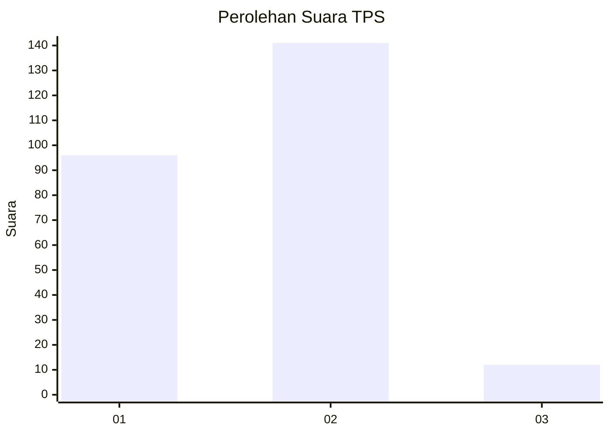
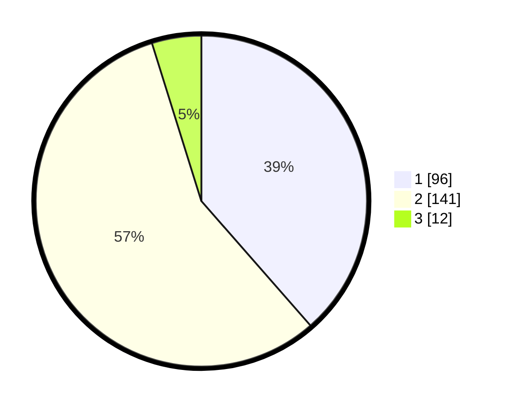

# Hasil

## Grafik

## Tabel

| No. | Nama Paslon    | Suara | Suara (raw) | Persentase |
|:--- |:-------------- | -----:| -----------:| ----------:|
| 1   | ANIES MUHAIMIN | 96    | [96][p-1]   | 38,55      |
| 2   | PRABOWO GIBRAN | 141   | [141][p-2]  | 56,63      |
| 3   | GANJAR MAHFUD  | 12    | [12][p-3]   | 4,82       |

[p-1]: https://github.com/gigit-pemilu/pemilu-2024-16-sumatera-selatan/blob/main/pilpres/hitung-suara/sub/16-sumatera-selatan/sub/04-lahat/sub/10-lahat/sub/1059-bandar-jaya/sub/010-tps/sub/paslon-1.txt
[p-2]: https://github.com/gigit-pemilu/pemilu-2024-16-sumatera-selatan/blob/main/pilpres/hitung-suara/sub/16-sumatera-selatan/sub/04-lahat/sub/10-lahat/sub/1059-bandar-jaya/sub/010-tps/sub/paslon-2.txt
[p-3]: https://github.com/gigit-pemilu/pemilu-2024-16-sumatera-selatan/blob/main/pilpres/hitung-suara/sub/16-sumatera-selatan/sub/04-lahat/sub/10-lahat/sub/1059-bandar-jaya/sub/010-tps/sub/paslon-3.txt

## Foto C Plano

https://sirekap-obj-formc.kpu.go.id/3df7/pemilu/ppwp/16/04/10/10/59/1604101059010-20240214-221728--e92c452d-5536-451b-99c8-a0c54b61a7ad.jpg

https://sirekap-obj-formc.kpu.go.id/3df7/pemilu/ppwp/16/04/10/10/59/1604101059010-20240214-221925--6bd5c5cd-bee4-48f4-8883-16e1d95e2cbd.jpg

https://sirekap-obj-formc.kpu.go.id/3df7/pemilu/ppwp/16/04/10/10/59/1604101059010-20240214-222138--14d6877c-13f6-44f8-b067-abd53d28a5af.jpg

## Metadata

| Key        | Value               |
| ---------- | ------------------- |
| Time Stamp | 2024-02-25 15:00:00 |

