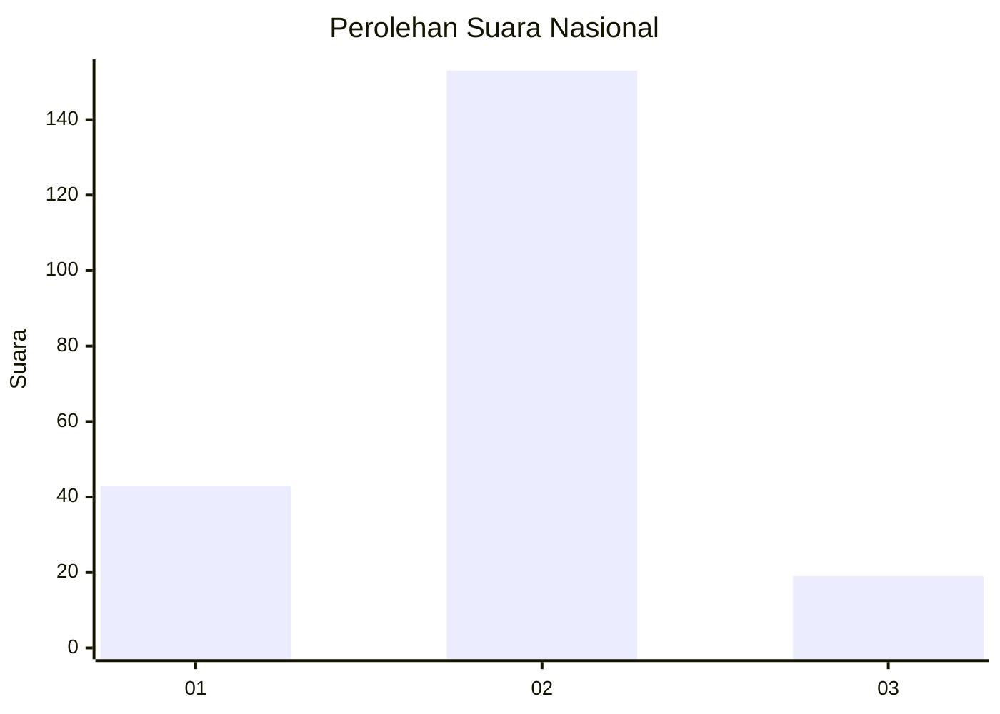

# Hasil

## Grafik

## Tabel

| No. | Nama Paslon    | Suara | Suara (raw) | Persentase |
|:--- |:-------------- | -----:| -----------:| ----------:|
| 1   | ANIES MUHAIMIN | 43    | [43][p-1]   | 20,00      |
| 2   | PRABOWO GIBRAN | 153   | [153][p-2]  | 71,16      |
| 3   | GANJAR MAHFUD  | 19    | [19][p-3]   | 8,84       |

[p-1]: https://github.com/gigit-pemilu/pemilu-2024/blob/main/pilpres/hitung-suara/sub/16-sumatera-selatan/sub/04-lahat/sub/10-lahat/sub/1060-talang-jawa-selatan/sub/003-tps/sub/paslon-1.txt
[p-2]: https://github.com/gigit-pemilu/pemilu-2024/blob/main/pilpres/hitung-suara/sub/16-sumatera-selatan/sub/04-lahat/sub/10-lahat/sub/1060-talang-jawa-selatan/sub/003-tps/sub/paslon-2.txt
[p-3]: https://github.com/gigit-pemilu/pemilu-2024/blob/main/pilpres/hitung-suara/sub/16-sumatera-selatan/sub/04-lahat/sub/10-lahat/sub/1060-talang-jawa-selatan/sub/003-tps/sub/paslon-3.txt

## Foto C Plano

https://sirekap-obj-formc.kpu.go.id/ac7e/pemilu/ppwp/16/04/10/10/60/1604101060003-20240215-001324--43f12c5d-4c90-4847-b6e2-07c271bf4ba1.jpg

https://sirekap-obj-formc.kpu.go.id/ac7e/pemilu/ppwp/16/04/10/10/60/1604101060003-20240214-232334--885fccc6-9194-428d-b830-fda4b3ff95fd.jpg

https://sirekap-obj-formc.kpu.go.id/ac7e/pemilu/ppwp/16/04/10/10/60/1604101060003-20240215-001728--3322a04d-ad54-4631-ab0a-d71623c74db3.jpg

## Metadata

| Key        | Value               |
| ---------- | ------------------- |
| Time Stamp | 2024-02-15 21:01:18 |

