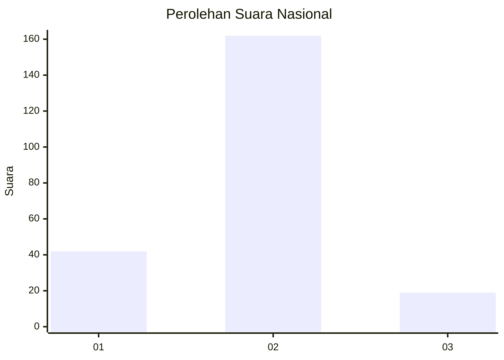
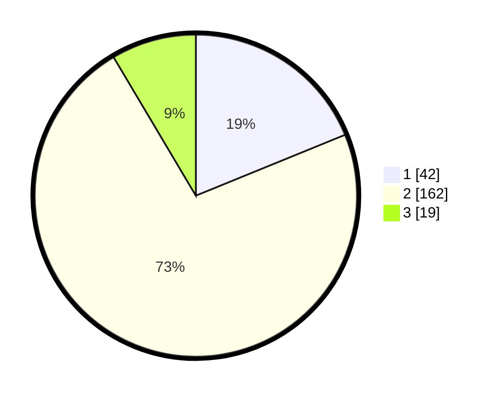

# Hasil

## Grafik

## Tabel

| No. | Nama Paslon    | Suara | Suara (raw) | Persentase |
|:--- |:-------------- | -----:| -----------:| ----------:|
| 1   | ANIES MUHAIMIN | 42    | [42][p-1]   | 18,83      |
| 2   | PRABOWO GIBRAN | 162   | [162][p-2]  | 72,65      |
| 3   | GANJAR MAHFUD  | 19    | [19][p-3]   | 8,52       |

[p-1]: https://github.com/gigit-pemilu/pemilu-2024/blob/main/pilpres/hitung-suara/sub/16-sumatera-selatan/sub/04-lahat/sub/10-lahat/sub/1061-talang-jawa-utara/sub/004-tps/sub/paslon-1.txt
[p-2]: https://github.com/gigit-pemilu/pemilu-2024/blob/main/pilpres/hitung-suara/sub/16-sumatera-selatan/sub/04-lahat/sub/10-lahat/sub/1061-talang-jawa-utara/sub/004-tps/sub/paslon-2.txt
[p-3]: https://github.com/gigit-pemilu/pemilu-2024/blob/main/pilpres/hitung-suara/sub/16-sumatera-selatan/sub/04-lahat/sub/10-lahat/sub/1061-talang-jawa-utara/sub/004-tps/sub/paslon-3.txt

## Foto C Plano

https://sirekap-obj-formc.kpu.go.id/d65a/pemilu/ppwp/16/04/10/10/61/1604101061004-20240214-155333--d4bbf425-a6e4-45b5-8dc2-b7aa73d39eef.jpg

https://sirekap-obj-formc.kpu.go.id/d65a/pemilu/ppwp/16/04/10/10/61/1604101061004-20240214-155548--475c28e9-fca9-4e6f-bc9f-3937165e0505.jpg

https://sirekap-obj-formc.kpu.go.id/d65a/pemilu/ppwp/16/04/10/10/61/1604101061004-20240214-155657--d9f6ec2e-939d-4b81-a46f-b2a4167252f3.jpg

## Metadata

| Key        | Value               |
| ---------- | ------------------- |
| Time Stamp | 2024-02-14 21:46:01 |

