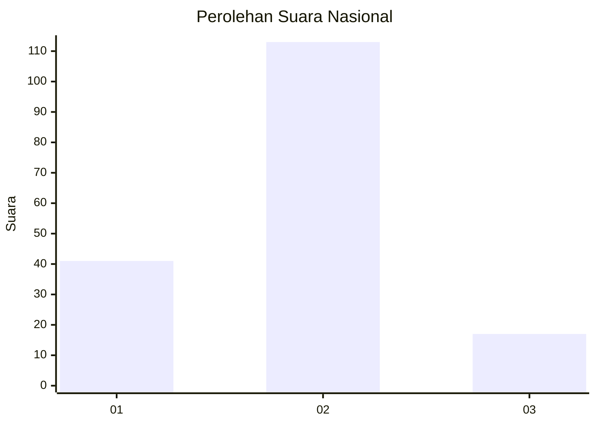

# Hasil

## Grafik

## Tabel

| No. | Nama Paslon    | Suara | Suara (raw) | Persentase |
|:--- |:-------------- | -----:| -----------:| ----------:|
| 1   | ANIES MUHAIMIN | 41    | [41][p-1]   | 23,98      |
| 2   | PRABOWO GIBRAN | 113   | [113][p-2]  | 66,08      |
| 3   | GANJAR MAHFUD  | 17    | [17][p-3]   | 9,94       |

[p-1]: https://github.com/gigit-pemilu/pemilu-2024/blob/main/pilpres/hitung-suara/sub/16-sumatera-selatan/sub/04-lahat/sub/10-lahat/sub/1061-talang-jawa-utara/sub/008-tps/sub/paslon-1.txt
[p-2]: https://github.com/gigit-pemilu/pemilu-2024/blob/main/pilpres/hitung-suara/sub/16-sumatera-selatan/sub/04-lahat/sub/10-lahat/sub/1061-talang-jawa-utara/sub/008-tps/sub/paslon-2.txt
[p-3]: https://github.com/gigit-pemilu/pemilu-2024/blob/main/pilpres/hitung-suara/sub/16-sumatera-selatan/sub/04-lahat/sub/10-lahat/sub/1061-talang-jawa-utara/sub/008-tps/sub/paslon-3.txt

## Foto C Plano

https://sirekap-obj-formc.kpu.go.id/2e2f/pemilu/ppwp/16/04/10/10/61/1604101061008-20240215-100235--e72b0643-8a25-4824-92b2-fcc405318c35.jpg

https://sirekap-obj-formc.kpu.go.id/2e2f/pemilu/ppwp/16/04/10/10/61/1604101061008-20240215-100429--6605c7cd-f4f4-460e-9f05-99a13311acc6.jpg

https://sirekap-obj-formc.kpu.go.id/2e2f/pemilu/ppwp/16/04/10/10/61/1604101061008-20240215-100705--5a2c13d0-8f85-4b66-a003-cdc5d078550b.jpg

## Metadata

| Key        | Value               |
| ---------- | ------------------- |
| Time Stamp | 2024-02-15 20:00:44 |

