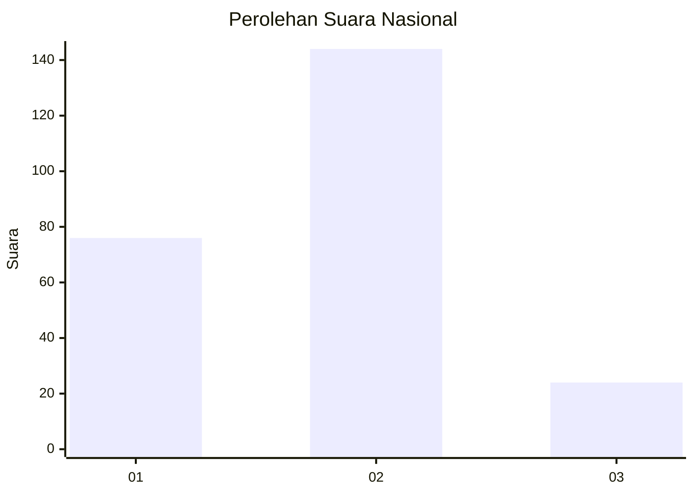
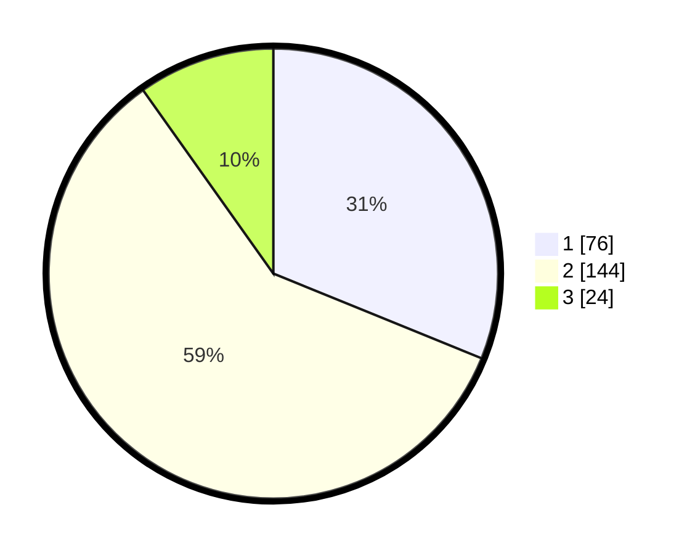

# Hasil

## Grafik

## Tabel

| No. | Nama Paslon    | Suara | Suara (raw) | Persentase |
|:--- |:-------------- | -----:| -----------:| ----------:|
| 1   | ANIES MUHAIMIN | 76    | [76][p-1]   | 31,15      |
| 2   | PRABOWO GIBRAN | 144   | [144][p-2]  | 59,02      |
| 3   | GANJAR MAHFUD  | 24    | [24][p-3]   | 9,84       |

[p-1]: https://github.com/gigit-pemilu/pemilu-2024/blob/main/pilpres/hitung-suara/sub/16-sumatera-selatan/sub/04-lahat/sub/10-lahat/sub/1061-talang-jawa-utara/sub/012-tps/sub/paslon-1.txt
[p-2]: https://github.com/gigit-pemilu/pemilu-2024/blob/main/pilpres/hitung-suara/sub/16-sumatera-selatan/sub/04-lahat/sub/10-lahat/sub/1061-talang-jawa-utara/sub/012-tps/sub/paslon-2.txt
[p-3]: https://github.com/gigit-pemilu/pemilu-2024/blob/main/pilpres/hitung-suara/sub/16-sumatera-selatan/sub/04-lahat/sub/10-lahat/sub/1061-talang-jawa-utara/sub/012-tps/sub/paslon-3.txt

## Foto C Plano

https://sirekap-obj-formc.kpu.go.id/6437/pemilu/ppwp/16/04/10/10/61/1604101061012-20240214-213159--d3735fc7-c6e7-43e4-bb8f-a78fc8365a09.jpg

https://sirekap-obj-formc.kpu.go.id/6437/pemilu/ppwp/16/04/10/10/61/1604101061012-20240214-213741--32218a58-0c95-4581-80fa-8981d459b0cb.jpg

https://sirekap-obj-formc.kpu.go.id/6437/pemilu/ppwp/16/04/10/10/61/1604101061012-20240214-214202--4666f2f4-5652-44f0-ba6a-a6e6336dfe80.jpg

## Metadata

| Key        | Value               |
| ---------- | ------------------- |
| Time Stamp | 2024-02-15 12:00:28 |

