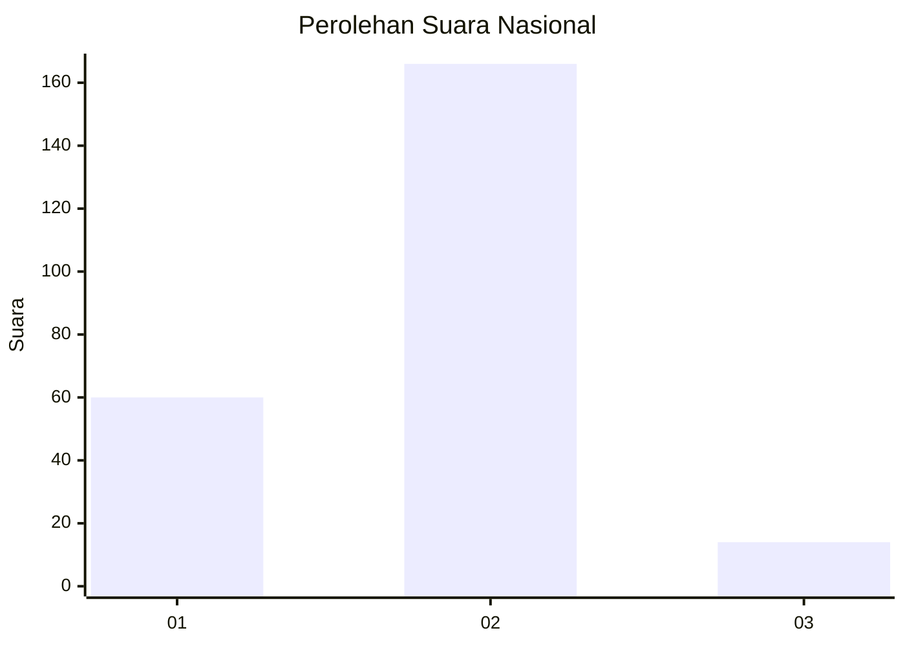

# Hasil

## Grafik

## Tabel

| No. | Nama Paslon    | Suara | Suara (raw) | Persentase |
|:--- |:-------------- | -----:| -----------:| ----------:|
| 1   | ANIES MUHAIMIN | 60    | [60][p-1]   | 25,00      |
| 2   | PRABOWO GIBRAN | 166   | [166][p-2]  | 69,17      |
| 3   | GANJAR MAHFUD  | 14    | [14][p-3]   | 5,83       |

[p-1]: https://github.com/gigit-pemilu/pemilu-2024/blob/main/pilpres/hitung-suara/sub/16-sumatera-selatan/sub/04-lahat/sub/10-lahat/sub/2027-selawi/sub/001-tps/sub/paslon-1.txt
[p-2]: https://github.com/gigit-pemilu/pemilu-2024/blob/main/pilpres/hitung-suara/sub/16-sumatera-selatan/sub/04-lahat/sub/10-lahat/sub/2027-selawi/sub/001-tps/sub/paslon-2.txt
[p-3]: https://github.com/gigit-pemilu/pemilu-2024/blob/main/pilpres/hitung-suara/sub/16-sumatera-selatan/sub/04-lahat/sub/10-lahat/sub/2027-selawi/sub/001-tps/sub/paslon-3.txt

## Foto C Plano

https://sirekap-obj-formc.kpu.go.id/f7a9/pemilu/ppwp/16/04/10/20/27/1604102027001-20240215-012706--478ec9ae-9a6d-437f-9dd4-5c0addeb1e2a.jpg

https://sirekap-obj-formc.kpu.go.id/f7a9/pemilu/ppwp/16/04/10/20/27/1604102027001-20240215-012846--84cea010-b7b5-4279-9129-a1ae26cf7808.jpg

https://sirekap-obj-formc.kpu.go.id/f7a9/pemilu/ppwp/16/04/10/20/27/1604102027001-20240215-012950--d35202f3-2819-4a8e-8fff-ffe7e13824d2.jpg

## Metadata

| Key        | Value               |
| ---------- | ------------------- |
| Time Stamp | 2024-02-15 20:00:44 |

