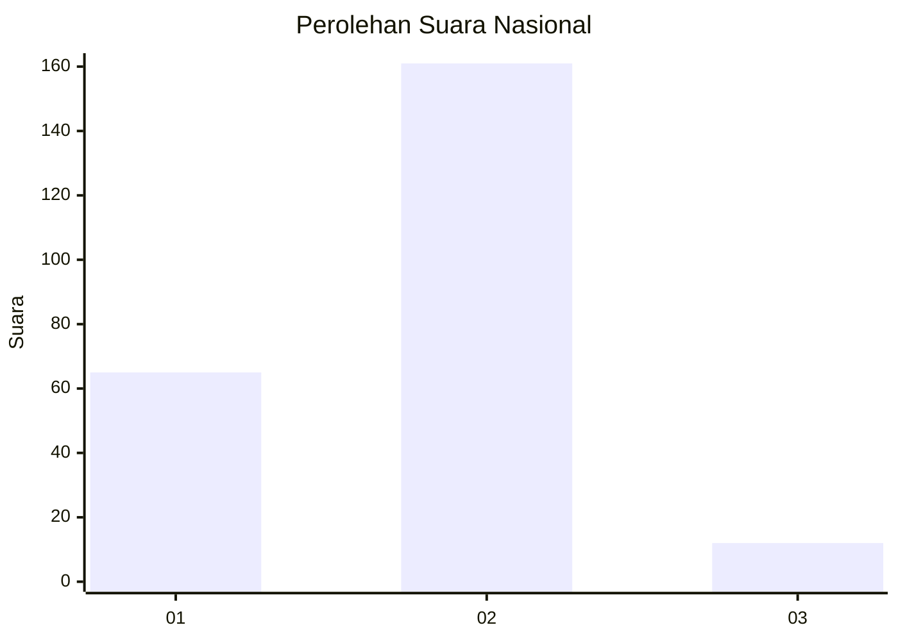
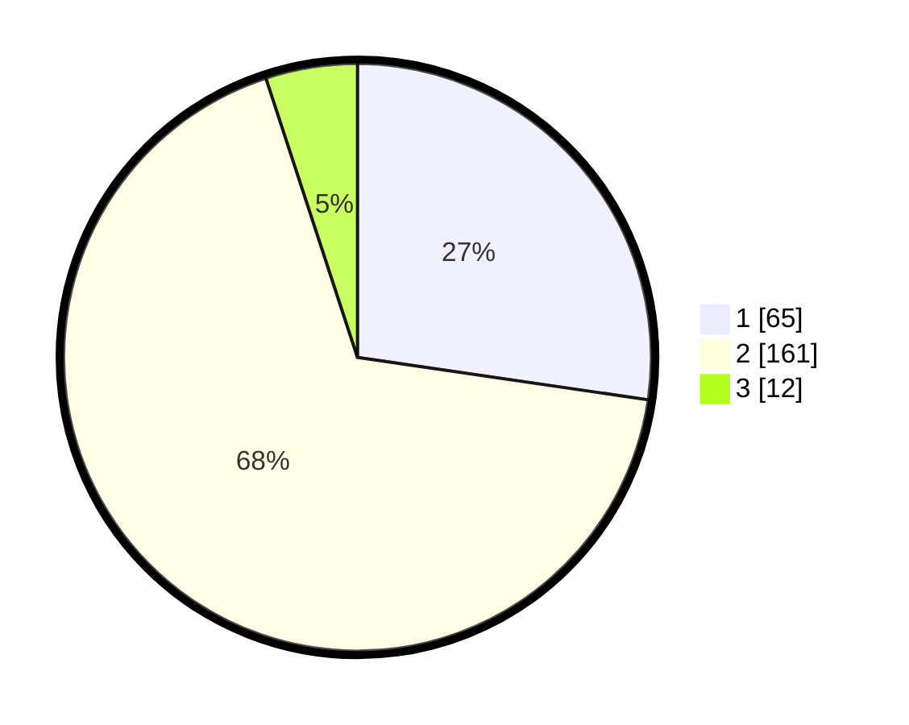

# Hasil

## Grafik

## Tabel

| No. | Nama Paslon    | Suara | Suara (raw) | Persentase |
|:--- |:-------------- | -----:| -----------:| ----------:|
| 1   | ANIES MUHAIMIN | 65    | [65][p-1]   | 27,31      |
| 2   | PRABOWO GIBRAN | 161   | [161][p-2]  | 67,65      |
| 3   | GANJAR MAHFUD  | 12    | [12][p-3]   | 5,04       |

[p-1]: https://github.com/gigit-pemilu/pemilu-2024/blob/main/pilpres/hitung-suara/sub/16-sumatera-selatan/sub/04-lahat/sub/10-lahat/sub/2027-selawi/sub/003-tps/sub/paslon-1.txt
[p-2]: https://github.com/gigit-pemilu/pemilu-2024/blob/main/pilpres/hitung-suara/sub/16-sumatera-selatan/sub/04-lahat/sub/10-lahat/sub/2027-selawi/sub/003-tps/sub/paslon-2.txt
[p-3]: https://github.com/gigit-pemilu/pemilu-2024/blob/main/pilpres/hitung-suara/sub/16-sumatera-selatan/sub/04-lahat/sub/10-lahat/sub/2027-selawi/sub/003-tps/sub/paslon-3.txt

## Foto C Plano

https://sirekap-obj-formc.kpu.go.id/6ad1/pemilu/ppwp/16/04/10/20/27/1604102027003-20240214-184614--7f78d5a0-1140-4e13-abe4-cdb013f8e64d.jpg

https://sirekap-obj-formc.kpu.go.id/6ad1/pemilu/ppwp/16/04/10/20/27/1604102027003-20240214-184511--2852c0f5-2484-443e-a32e-bc1bb9b13b7f.jpg

https://sirekap-obj-formc.kpu.go.id/6ad1/pemilu/ppwp/16/04/10/20/27/1604102027003-20240214-184420--b4f31513-6ad8-45e6-b452-dbc8a16f7c28.jpg

## Metadata

| Key        | Value               |
| ---------- | ------------------- |
| Time Stamp | 2024-02-15 12:00:28 |

