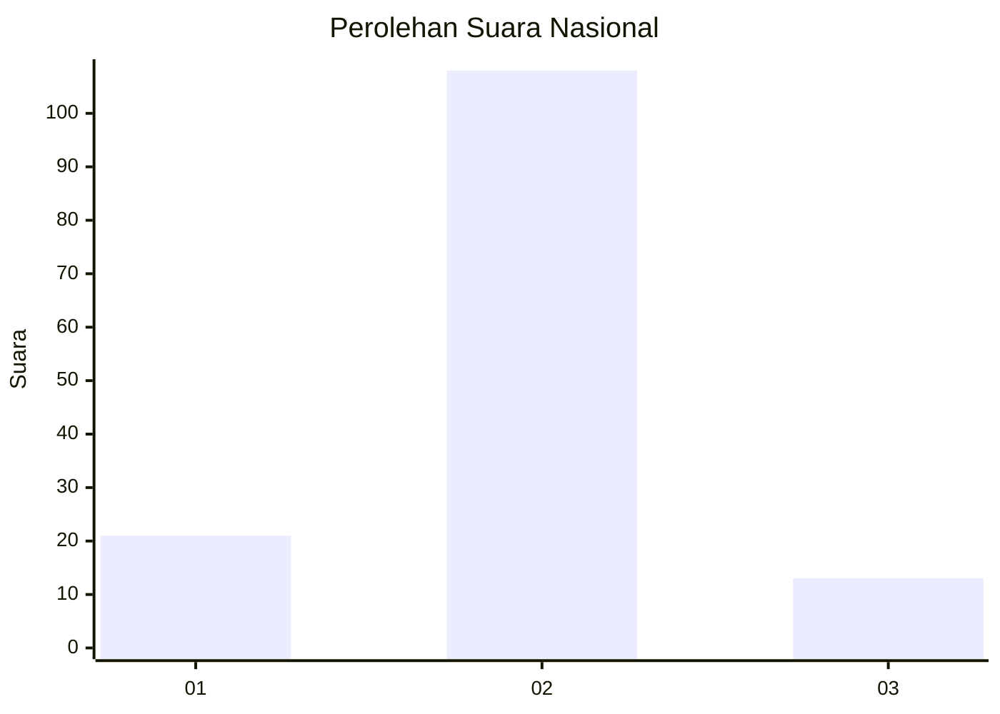
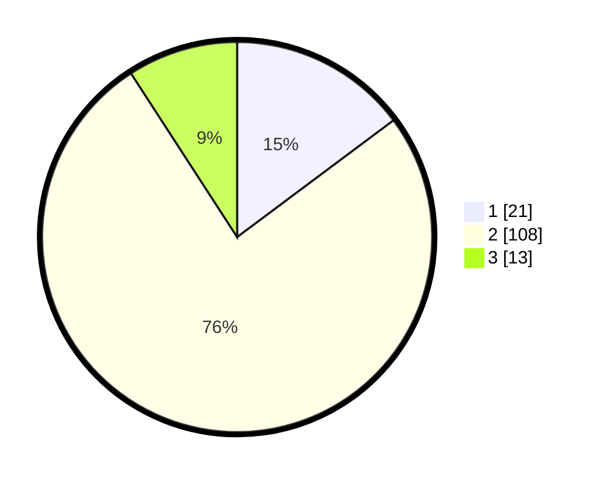

# Hasil

## Grafik

## Tabel

| No. | Nama Paslon    | Suara | Suara (raw) | Persentase |
|:--- |:-------------- | -----:| -----------:| ----------:|
| 1   | ANIES MUHAIMIN | 21    | [21][p-1]   | 14,79      |
| 2   | PRABOWO GIBRAN | 108   | [108][p-2]  | 76,06      |
| 3   | GANJAR MAHFUD  | 13    | [13][p-3]   | 9,15       |

[p-1]: https://github.com/gigit-pemilu/pemilu-2024/blob/main/pilpres/hitung-suara/sub/16-sumatera-selatan/sub/04-lahat/sub/10-lahat/sub/2030-sukanegara/sub/005-tps/sub/paslon-1.txt
[p-2]: https://github.com/gigit-pemilu/pemilu-2024/blob/main/pilpres/hitung-suara/sub/16-sumatera-selatan/sub/04-lahat/sub/10-lahat/sub/2030-sukanegara/sub/005-tps/sub/paslon-2.txt
[p-3]: https://github.com/gigit-pemilu/pemilu-2024/blob/main/pilpres/hitung-suara/sub/16-sumatera-selatan/sub/04-lahat/sub/10-lahat/sub/2030-sukanegara/sub/005-tps/sub/paslon-3.txt

## Foto C Plano

https://sirekap-obj-formc.kpu.go.id/b9e3/pemilu/ppwp/16/04/10/20/30/1604102030005-20240214-194410--34ac63c5-2b35-4bd1-9988-22f9fa3bcf26.jpg

https://sirekap-obj-formc.kpu.go.id/b9e3/pemilu/ppwp/16/04/10/20/30/1604102030005-20240214-194915--e5b43437-f283-48c9-b9bd-ec174b05eac2.jpg

https://sirekap-obj-formc.kpu.go.id/b9e3/pemilu/ppwp/16/04/10/20/30/1604102030005-20240215-042321--733cf170-85a6-49ef-8131-9041ad91ba47.jpg

## Metadata

| Key        | Value               |
| ---------- | ------------------- |
| Time Stamp | 2024-02-15 15:00:29 |

