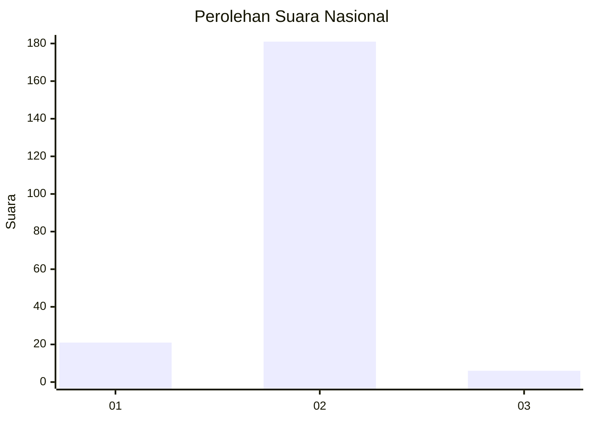
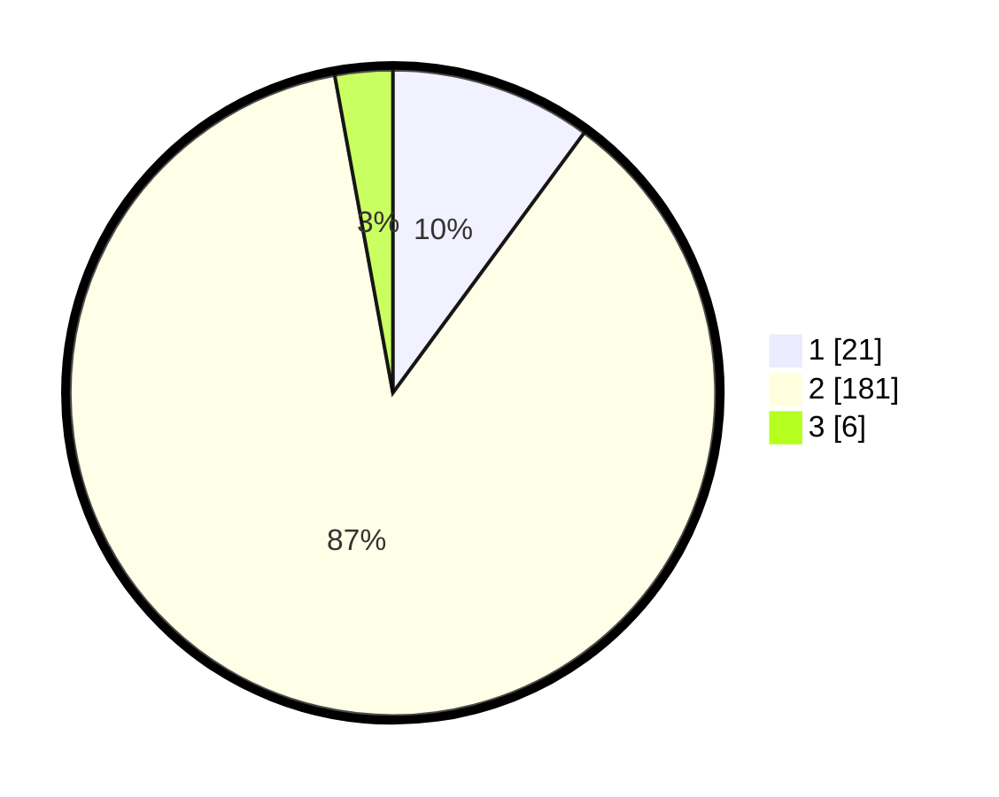

# Hasil

## Grafik

## Tabel

| No. | Nama Paslon    | Suara | Suara (raw) | Persentase |
|:--- |:-------------- | -----:| -----------:| ----------:|
| 1   | ANIES MUHAIMIN | 21    | [21][p-1]   | 10,10      |
| 2   | PRABOWO GIBRAN | 181   | [181][p-2]  | 87,02      |
| 3   | GANJAR MAHFUD  | 6     | [6][p-3]    | 2,88       |

[p-1]: https://github.com/gigit-pemilu/pemilu-2024/blob/main/pilpres/hitung-suara/sub/16-sumatera-selatan/sub/04-lahat/sub/10-lahat/sub/2035-keban/sub/002-tps/sub/paslon-1.txt
[p-2]: https://github.com/gigit-pemilu/pemilu-2024/blob/main/pilpres/hitung-suara/sub/16-sumatera-selatan/sub/04-lahat/sub/10-lahat/sub/2035-keban/sub/002-tps/sub/paslon-2.txt
[p-3]: https://github.com/gigit-pemilu/pemilu-2024/blob/main/pilpres/hitung-suara/sub/16-sumatera-selatan/sub/04-lahat/sub/10-lahat/sub/2035-keban/sub/002-tps/sub/paslon-3.txt

## Foto C Plano

https://sirekap-obj-formc.kpu.go.id/14c9/pemilu/ppwp/16/04/10/20/35/1604102035002-20240214-205013--05ce9e59-b5af-4f69-807b-ee0adec65752.jpg

https://sirekap-obj-formc.kpu.go.id/14c9/pemilu/ppwp/16/04/10/20/35/1604102035002-20240214-205302--a4b787a1-0812-4885-a718-9dd5ef2173bd.jpg

https://sirekap-obj-formc.kpu.go.id/14c9/pemilu/ppwp/16/04/10/20/35/1604102035002-20240214-205845--e1cdaad0-2bdf-49cb-bec4-1fb9791887f3.jpg

## Metadata

| Key        | Value               |
| ---------- | ------------------- |
| Time Stamp | 2024-02-15 12:00:28 |

