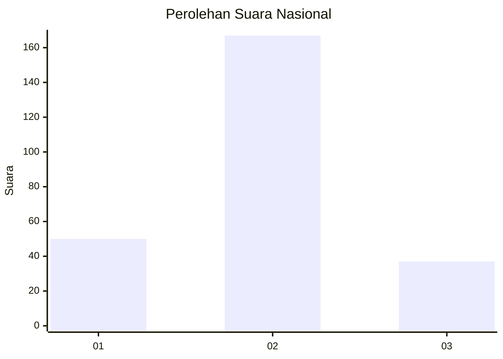
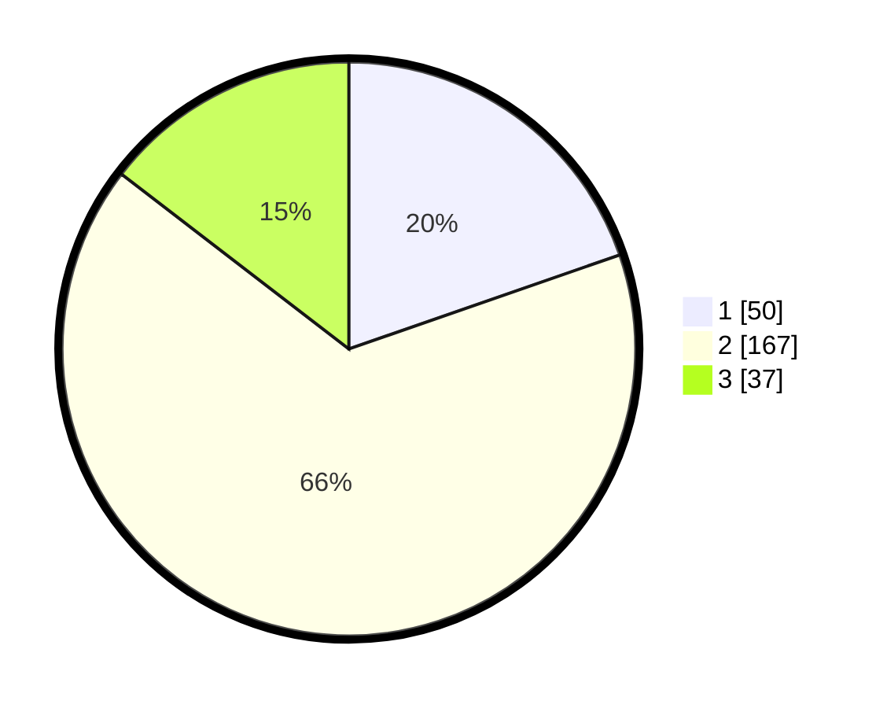

# Hasil

## Grafik

## Tabel

| No. | Nama Paslon    | Suara | Suara (raw) | Persentase |
|:--- |:-------------- | -----:| -----------:| ----------:|
| 1   | ANIES MUHAIMIN | 50    | [50][p-1]   | 19,69      |
| 2   | PRABOWO GIBRAN | 167   | [167][p-2]  | 65,75      |
| 3   | GANJAR MAHFUD  | 37    | [37][p-3]   | 14,57      |

[p-1]: https://github.com/gigit-pemilu/pemilu-2024/blob/main/pilpres/hitung-suara/sub/16-sumatera-selatan/sub/04-lahat/sub/10-lahat/sub/2036-pagar-sari/sub/001-tps/sub/paslon-1.txt
[p-2]: https://github.com/gigit-pemilu/pemilu-2024/blob/main/pilpres/hitung-suara/sub/16-sumatera-selatan/sub/04-lahat/sub/10-lahat/sub/2036-pagar-sari/sub/001-tps/sub/paslon-2.txt
[p-3]: https://github.com/gigit-pemilu/pemilu-2024/blob/main/pilpres/hitung-suara/sub/16-sumatera-selatan/sub/04-lahat/sub/10-lahat/sub/2036-pagar-sari/sub/001-tps/sub/paslon-3.txt

## Foto C Plano

https://sirekap-obj-formc.kpu.go.id/c0e7/pemilu/ppwp/16/04/10/20/36/1604102036001-20240215-024007--893edda6-b821-4cc3-b7a1-e6e234ef711e.jpg

https://sirekap-obj-formc.kpu.go.id/c0e7/pemilu/ppwp/16/04/10/20/36/1604102036001-20240215-024107--de3e5186-28a9-4cbd-a556-549b9db46c9a.jpg

https://sirekap-obj-formc.kpu.go.id/c0e7/pemilu/ppwp/16/04/10/20/36/1604102036001-20240215-024153--9390bddf-81ec-4d06-870c-caa49a26a350.jpg

## Metadata

| Key        | Value               |
| ---------- | ------------------- |
| Time Stamp | 2024-02-15 20:00:44 |

