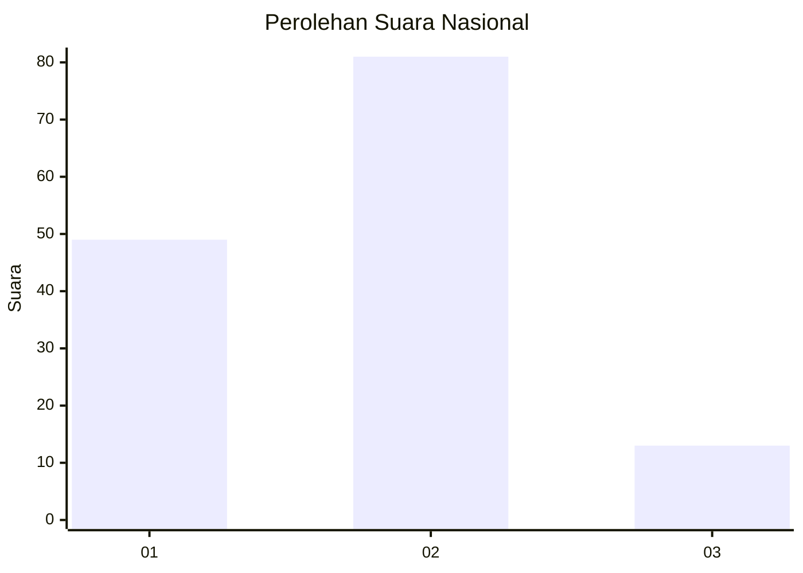
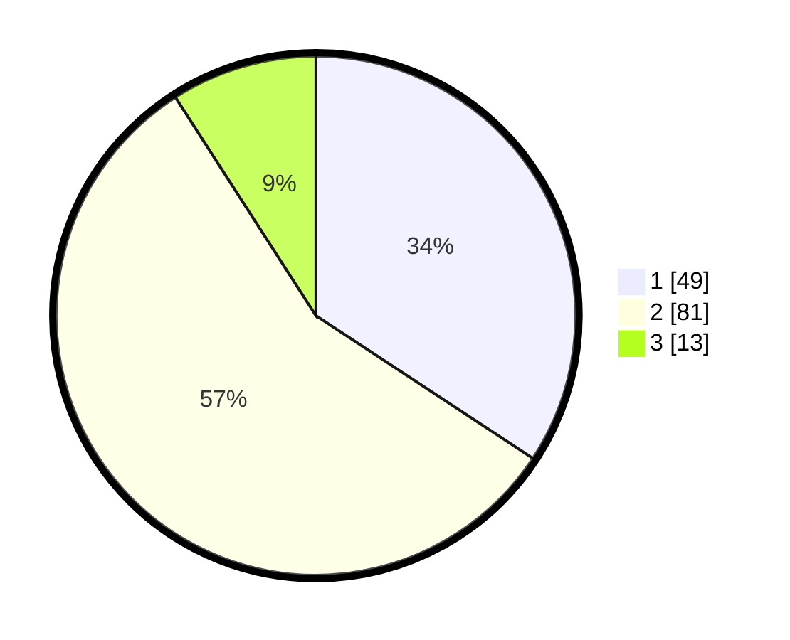

# Hasil

## Grafik

## Tabel

| No. | Nama Paslon    | Suara | Suara (raw) | Persentase |
|:--- |:-------------- | -----:| -----------:| ----------:|
| 1   | ANIES MUHAIMIN | 49    | [49][p-1]   | 34,27      |
| 2   | PRABOWO GIBRAN | 81    | [81][p-2]   | 56,64      |
| 3   | GANJAR MAHFUD  | 13    | [13][p-3]   | 9,09       |

[p-1]: https://github.com/gigit-pemilu/pemilu-2024/blob/main/pilpres/hitung-suara/sub/16-sumatera-selatan/sub/04-lahat/sub/10-lahat/sub/2036-pagar-sari/sub/004-tps/sub/paslon-1.txt
[p-2]: https://github.com/gigit-pemilu/pemilu-2024/blob/main/pilpres/hitung-suara/sub/16-sumatera-selatan/sub/04-lahat/sub/10-lahat/sub/2036-pagar-sari/sub/004-tps/sub/paslon-2.txt
[p-3]: https://github.com/gigit-pemilu/pemilu-2024/blob/main/pilpres/hitung-suara/sub/16-sumatera-selatan/sub/04-lahat/sub/10-lahat/sub/2036-pagar-sari/sub/004-tps/sub/paslon-3.txt

## Foto C Plano

https://sirekap-obj-formc.kpu.go.id/92b7/pemilu/ppwp/16/04/10/20/36/1604102036004-20240215-001552--49e23395-b8e8-4204-898b-10c25dda0e09.jpg

https://sirekap-obj-formc.kpu.go.id/92b7/pemilu/ppwp/16/04/10/20/36/1604102036004-20240215-001825--fc2baab5-4b2f-4716-a16f-19970940b1cf.jpg

https://sirekap-obj-formc.kpu.go.id/92b7/pemilu/ppwp/16/04/10/20/36/1604102036004-20240215-002005--72bce3ce-38db-4315-81d6-ba3b09205095.jpg

## Metadata

| Key        | Value               |
| ---------- | ------------------- |
| Time Stamp | 2024-02-15 20:00:44 |

