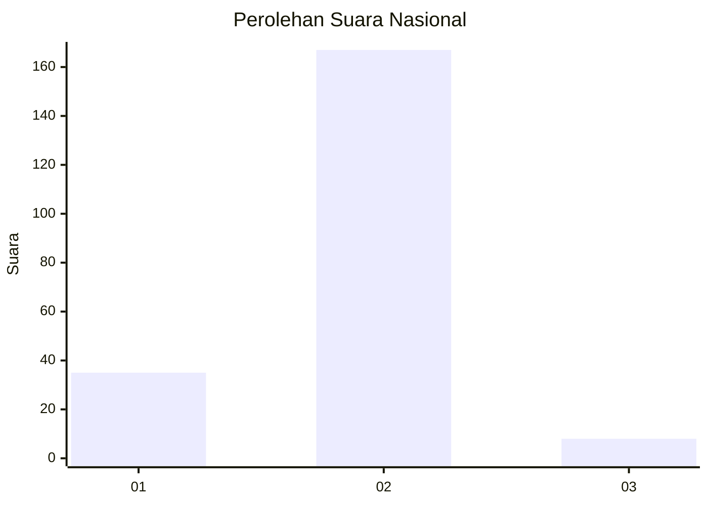
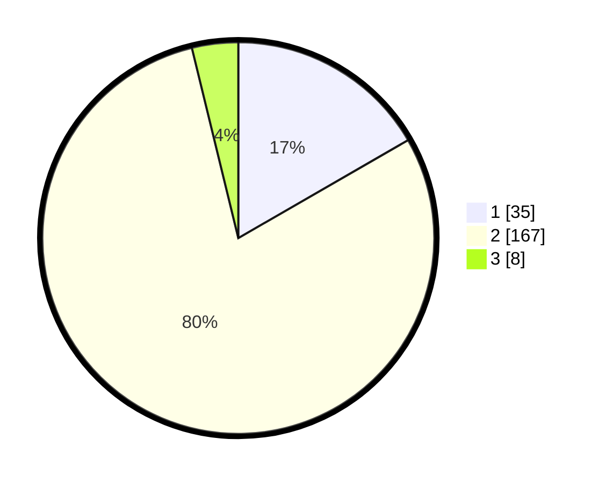

# Hasil

## Grafik

## Tabel

| No. | Nama Paslon    | Suara | Suara (raw) | Persentase |
|:--- |:-------------- | -----:| -----------:| ----------:|
| 1   | ANIES MUHAIMIN | 35    | [35][p-1]   | 16,67      |
| 2   | PRABOWO GIBRAN | 167   | [167][p-2]  | 79,52      |
| 3   | GANJAR MAHFUD  | 8     | [8][p-3]    | 3,81       |

[p-1]: https://github.com/gigit-pemilu/pemilu-2024/blob/main/pilpres/hitung-suara/sub/16-sumatera-selatan/sub/04-lahat/sub/10-lahat/sub/2039-pagar-negara/sub/005-tps/sub/paslon-1.txt
[p-2]: https://github.com/gigit-pemilu/pemilu-2024/blob/main/pilpres/hitung-suara/sub/16-sumatera-selatan/sub/04-lahat/sub/10-lahat/sub/2039-pagar-negara/sub/005-tps/sub/paslon-2.txt
[p-3]: https://github.com/gigit-pemilu/pemilu-2024/blob/main/pilpres/hitung-suara/sub/16-sumatera-selatan/sub/04-lahat/sub/10-lahat/sub/2039-pagar-negara/sub/005-tps/sub/paslon-3.txt

## Foto C Plano

https://sirekap-obj-formc.kpu.go.id/58fb/pemilu/ppwp/16/04/10/20/39/1604102039005-20240214-222801--f09027c4-cef7-4f2b-9ae5-598bc38be015.jpg

https://sirekap-obj-formc.kpu.go.id/58fb/pemilu/ppwp/16/04/10/20/39/1604102039005-20240214-202041--b16b3698-2c6c-42f4-b5f3-927e751b1025.jpg

https://sirekap-obj-formc.kpu.go.id/58fb/pemilu/ppwp/16/04/10/20/39/1604102039005-20240214-202318--96246e01-c0d8-4eea-bcce-49639f831b51.jpg

## Metadata

| Key        | Value               |
| ---------- | ------------------- |
| Time Stamp | 2024-02-15 15:00:29 |

