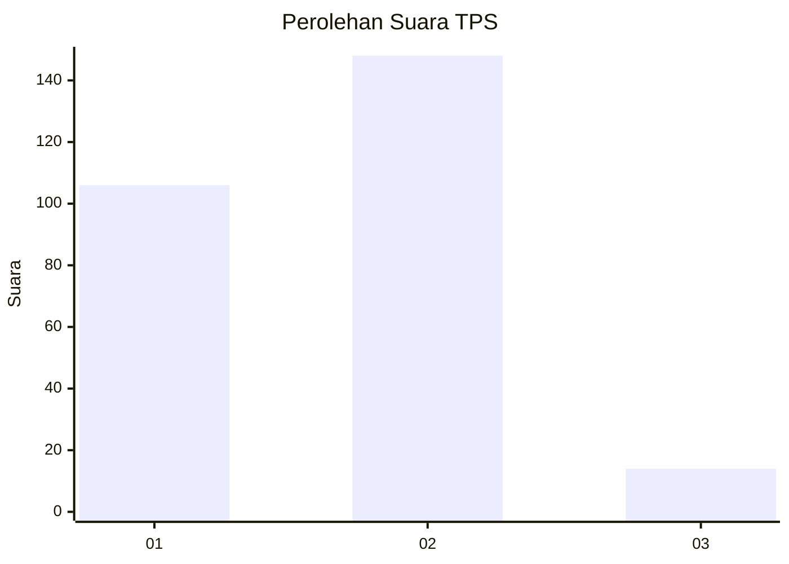
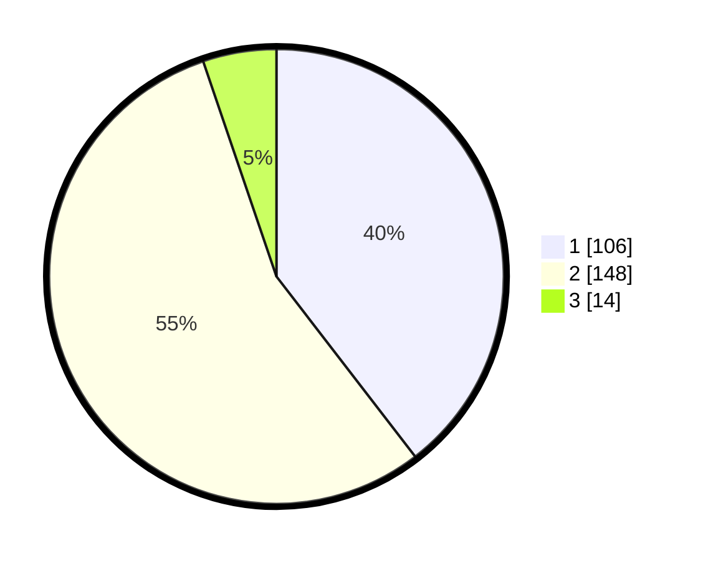

# Hasil

## Grafik

## Tabel

| No. | Nama Paslon    | Suara | Suara (raw) | Persentase |
|:--- |:-------------- | -----:| -----------:| ----------:|
| 1   | ANIES MUHAIMIN | 106   | [106][p-1]  | 39,55      |
| 2   | PRABOWO GIBRAN | 148   | [148][p-2]  | 55,22      |
| 3   | GANJAR MAHFUD  | 14    | [14][p-3]   | 5,22       |

[p-1]: https://github.com/gigit-pemilu/pemilu-2024-16-sumatera-selatan/blob/main/pilpres/hitung-suara/sub/16-sumatera-selatan/sub/04-lahat/sub/10-lahat/sub/2050-manggul/sub/015-tps/sub/paslon-1.txt
[p-2]: https://github.com/gigit-pemilu/pemilu-2024-16-sumatera-selatan/blob/main/pilpres/hitung-suara/sub/16-sumatera-selatan/sub/04-lahat/sub/10-lahat/sub/2050-manggul/sub/015-tps/sub/paslon-2.txt
[p-3]: https://github.com/gigit-pemilu/pemilu-2024-16-sumatera-selatan/blob/main/pilpres/hitung-suara/sub/16-sumatera-selatan/sub/04-lahat/sub/10-lahat/sub/2050-manggul/sub/015-tps/sub/paslon-3.txt

## Foto C Plano

https://sirekap-obj-formc.kpu.go.id/84ae/pemilu/ppwp/16/04/10/20/50/1604102050015-20240214-220141--8b221d00-afa7-46a4-9e9e-e1b66b4e56cb.jpg

https://sirekap-obj-formc.kpu.go.id/84ae/pemilu/ppwp/16/04/10/20/50/1604102050015-20240214-220343--36642859-6254-4cac-b311-316b9323e176.jpg

https://sirekap-obj-formc.kpu.go.id/84ae/pemilu/ppwp/16/04/10/20/50/1604102050015-20240214-220525--adacc8b6-59fa-4cc3-bf5f-6fabb17c190f.jpg

## Metadata

| Key        | Value               |
| ---------- | ------------------- |
| Time Stamp | 2024-02-15 20:00:44 |

