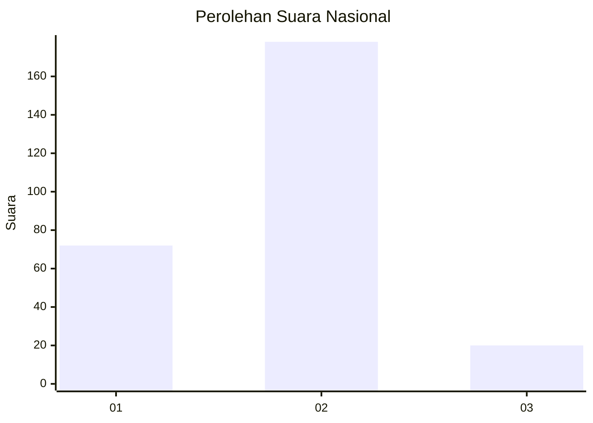
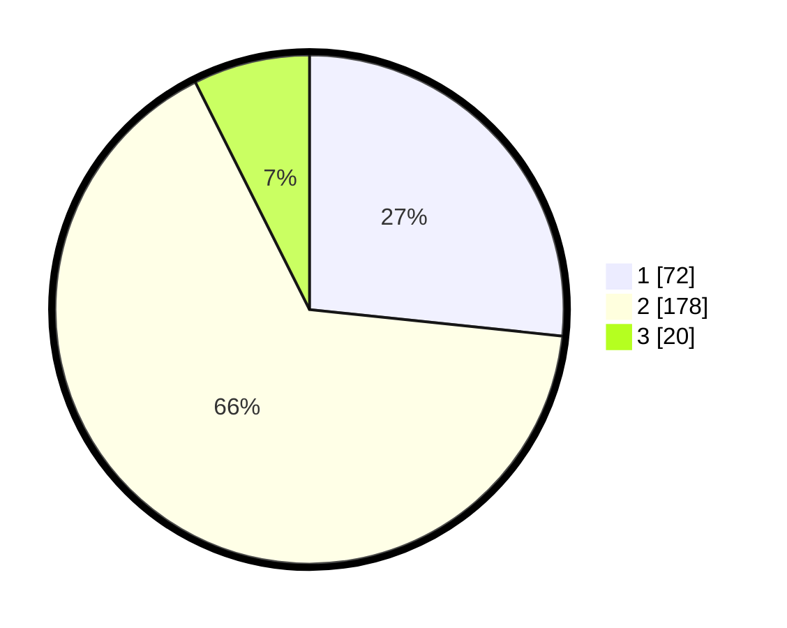

# Hasil

## Grafik

## Tabel

| No. | Nama Paslon    | Suara | Suara (raw) | Persentase |
|:--- |:-------------- | -----:| -----------:| ----------:|
| 1   | ANIES MUHAIMIN | 72    | [72][p-1]   | 26,67      |
| 2   | PRABOWO GIBRAN | 178   | [178][p-2]  | 65,93      |
| 3   | GANJAR MAHFUD  | 20    | [20][p-3]   | 7,41       |

[p-1]: https://github.com/gigit-pemilu/pemilu-2024/blob/main/pilpres/hitung-suara/sub/16-sumatera-selatan/sub/04-lahat/sub/12-pajar-bulan/sub/2028-benua-raja/sub/001-tps/sub/paslon-1.txt
[p-2]: https://github.com/gigit-pemilu/pemilu-2024/blob/main/pilpres/hitung-suara/sub/16-sumatera-selatan/sub/04-lahat/sub/12-pajar-bulan/sub/2028-benua-raja/sub/001-tps/sub/paslon-2.txt
[p-3]: https://github.com/gigit-pemilu/pemilu-2024/blob/main/pilpres/hitung-suara/sub/16-sumatera-selatan/sub/04-lahat/sub/12-pajar-bulan/sub/2028-benua-raja/sub/001-tps/sub/paslon-3.txt

## Foto C Plano

https://sirekap-obj-formc.kpu.go.id/4965/pemilu/ppwp/16/04/12/20/28/1604122028001-20240221-135114--cb5ed0a4-e84a-434b-925e-714a2cce938a.jpg

https://sirekap-obj-formc.kpu.go.id/4965/pemilu/ppwp/16/04/12/20/28/1604122028001-20240221-135248--f6970ebf-081a-4891-8a42-c838ddb42067.jpg

https://sirekap-obj-formc.kpu.go.id/4965/pemilu/ppwp/16/04/12/20/28/1604122028001-20240221-140208--47317bb3-c7a4-49da-be2b-952a34824cc7.jpg

## Metadata

| Key        | Value               |
| ---------- | ------------------- |
| Time Stamp | 2024-02-21 15:00:00 |

