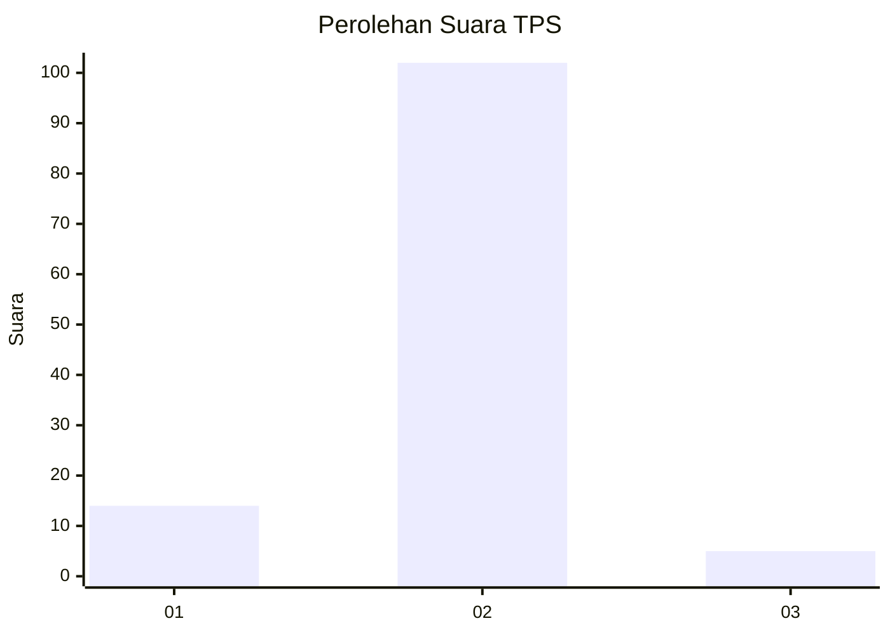
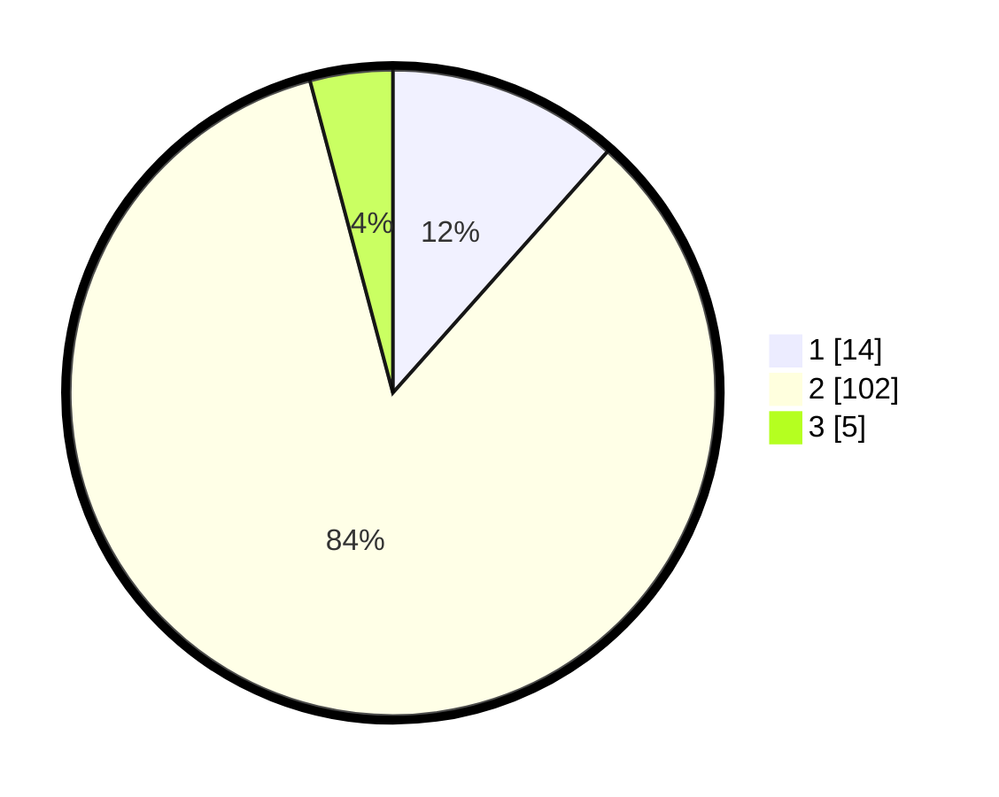

# Hasil

## Grafik

## Tabel

| No. | Nama Paslon    | Suara | Suara (raw) | Persentase |
|:--- |:-------------- | -----:| -----------:| ----------:|
| 1   | ANIES MUHAIMIN | 14    | [14][p-1]   | 11,57      |
| 2   | PRABOWO GIBRAN | 102   | [102][p-2]  | 84,30      |
| 3   | GANJAR MAHFUD  | 5     | [5][p-3]    | 4,13       |

[p-1]: https://github.com/gigit-pemilu/pemilu-2024-16-sumatera-selatan/blob/main/pilpres/hitung-suara/sub/16-sumatera-selatan/sub/04-lahat/sub/15-mulak-ulu/sub/2008-sukananti/sub/002-tps/sub/paslon-1.txt
[p-2]: https://github.com/gigit-pemilu/pemilu-2024-16-sumatera-selatan/blob/main/pilpres/hitung-suara/sub/16-sumatera-selatan/sub/04-lahat/sub/15-mulak-ulu/sub/2008-sukananti/sub/002-tps/sub/paslon-2.txt
[p-3]: https://github.com/gigit-pemilu/pemilu-2024-16-sumatera-selatan/blob/main/pilpres/hitung-suara/sub/16-sumatera-selatan/sub/04-lahat/sub/15-mulak-ulu/sub/2008-sukananti/sub/002-tps/sub/paslon-3.txt

## Foto C Plano

https://sirekap-obj-formc.kpu.go.id/8bc3/pemilu/ppwp/16/04/15/20/08/1604152008002-20240214-224558--8cd5c3e3-148a-4787-a62e-55367513a96b.jpg

https://sirekap-obj-formc.kpu.go.id/8bc3/pemilu/ppwp/16/04/15/20/08/1604152008002-20240218-070433--1094caa3-831c-454b-af71-c36a5dd70eae.jpg

https://sirekap-obj-formc.kpu.go.id/8bc3/pemilu/ppwp/16/04/15/20/08/1604152008002-20240218-070433--583d3197-3926-4c9f-8892-94e8e7466dc5.jpg

## Metadata

| Key        | Value               |
| ---------- | ------------------- |
| Time Stamp | 2024-02-19 06:16:00 |

