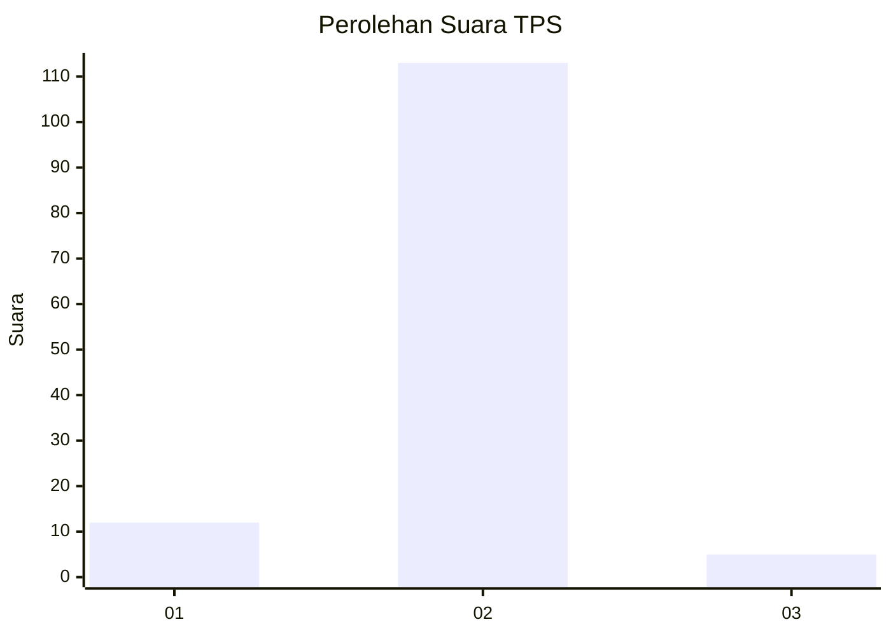
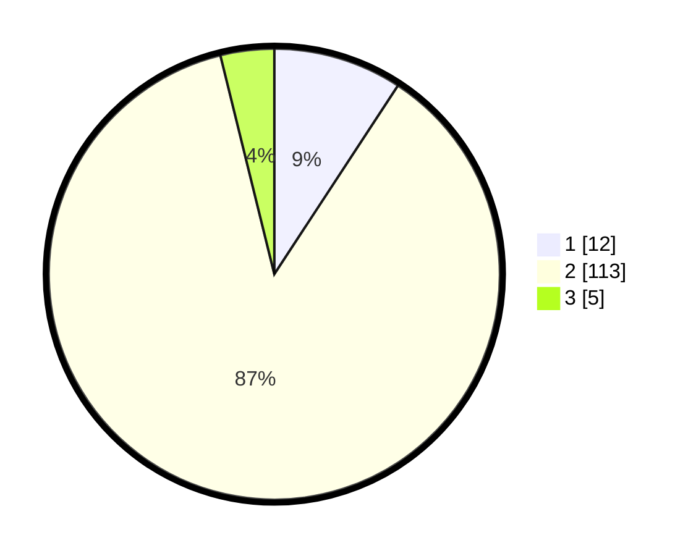

# Hasil

## Grafik

## Tabel

| No. | Nama Paslon    | Suara | Suara (raw) | Persentase |
|:--- |:-------------- | -----:| -----------:| ----------:|
| 1   | ANIES MUHAIMIN | 12    | [12][p-1]   | 9,23       |
| 2   | PRABOWO GIBRAN | 113   | [113][p-2]  | 86,92      |
| 3   | GANJAR MAHFUD  | 5     | [5][p-3]    | 3,85       |

[p-1]: https://github.com/gigit-pemilu/pemilu-2024-16-sumatera-selatan/blob/main/pilpres/hitung-suara/sub/16-sumatera-selatan/sub/04-lahat/sub/15-mulak-ulu/sub/2009-karang-lebak/sub/002-tps/sub/paslon-1.txt
[p-2]: https://github.com/gigit-pemilu/pemilu-2024-16-sumatera-selatan/blob/main/pilpres/hitung-suara/sub/16-sumatera-selatan/sub/04-lahat/sub/15-mulak-ulu/sub/2009-karang-lebak/sub/002-tps/sub/paslon-2.txt
[p-3]: https://github.com/gigit-pemilu/pemilu-2024-16-sumatera-selatan/blob/main/pilpres/hitung-suara/sub/16-sumatera-selatan/sub/04-lahat/sub/15-mulak-ulu/sub/2009-karang-lebak/sub/002-tps/sub/paslon-3.txt

## Foto C Plano

https://sirekap-obj-formc.kpu.go.id/fdc1/pemilu/ppwp/16/04/15/20/09/1604152009002-20240214-141018--f503a363-4c70-4c48-b162-53ef384f76b0.jpg

https://sirekap-obj-formc.kpu.go.id/fdc1/pemilu/ppwp/16/04/15/20/09/1604152009002-20240214-141053--0808dc22-f18c-4861-82cc-2640cc724bb9.jpg

https://sirekap-obj-formc.kpu.go.id/fdc1/pemilu/ppwp/16/04/15/20/09/1604152009002-20240214-141155--15f8c4a0-f736-4489-a299-4d79bdd80928.jpg

## Metadata

| Key        | Value               |
| ---------- | ------------------- |
| Time Stamp | 2024-02-15 12:00:28 |

