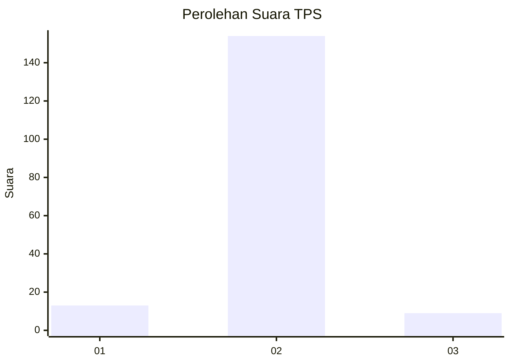
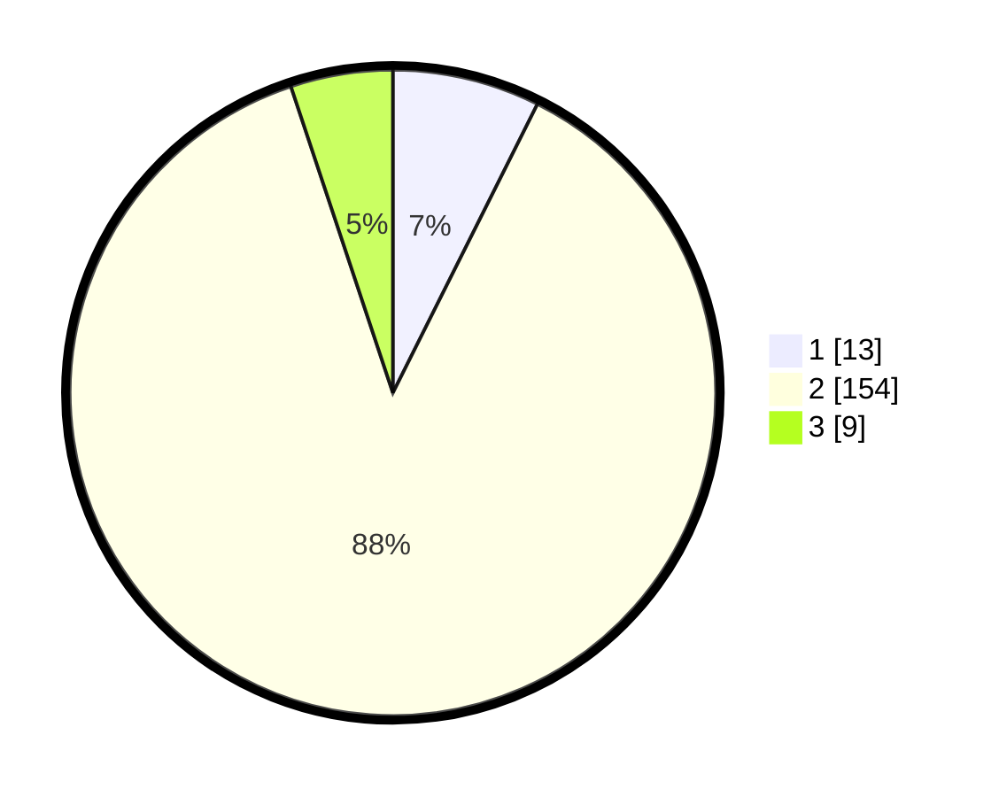

# Hasil

## Grafik

## Tabel

| No. | Nama Paslon    | Suara | Suara (raw) | Persentase |
|:--- |:-------------- | -----:| -----------:| ----------:|
| 1   | ANIES MUHAIMIN | 13    | [13][p-1]   | 7,39       |
| 2   | PRABOWO GIBRAN | 154   | [154][p-2]  | 87,50      |
| 3   | GANJAR MAHFUD  | 9     | [9][p-3]    | 5,11       |

[p-1]: https://github.com/gigit-pemilu/pemilu-2024-16-sumatera-selatan/blob/main/pilpres/hitung-suara/sub/16-sumatera-selatan/sub/04-lahat/sub/16-kikim-selatan/sub/2012-karang-cahaya/sub/001-tps/sub/paslon-1.txt
[p-2]: https://github.com/gigit-pemilu/pemilu-2024-16-sumatera-selatan/blob/main/pilpres/hitung-suara/sub/16-sumatera-selatan/sub/04-lahat/sub/16-kikim-selatan/sub/2012-karang-cahaya/sub/001-tps/sub/paslon-2.txt
[p-3]: https://github.com/gigit-pemilu/pemilu-2024-16-sumatera-selatan/blob/main/pilpres/hitung-suara/sub/16-sumatera-selatan/sub/04-lahat/sub/16-kikim-selatan/sub/2012-karang-cahaya/sub/001-tps/sub/paslon-3.txt

## Foto C Plano

https://sirekap-obj-formc.kpu.go.id/ee9e/pemilu/ppwp/16/04/16/20/12/1604162012001-20240220-105252--70002421-3bc7-4ece-ad33-2f789a3ea186.jpg

https://sirekap-obj-formc.kpu.go.id/ee9e/pemilu/ppwp/16/04/16/20/12/1604162012001-20240220-105431--b9eb297c-6bc1-4491-9582-55251d155340.jpg

https://sirekap-obj-formc.kpu.go.id/ee9e/pemilu/ppwp/16/04/16/20/12/1604162012001-20240220-105610--6378428c-b780-4c52-b052-0c9e9bd4e970.jpg

## Metadata

| Key        | Value               |
| ---------- | ------------------- |
| Time Stamp | 2024-02-25 15:00:00 |

