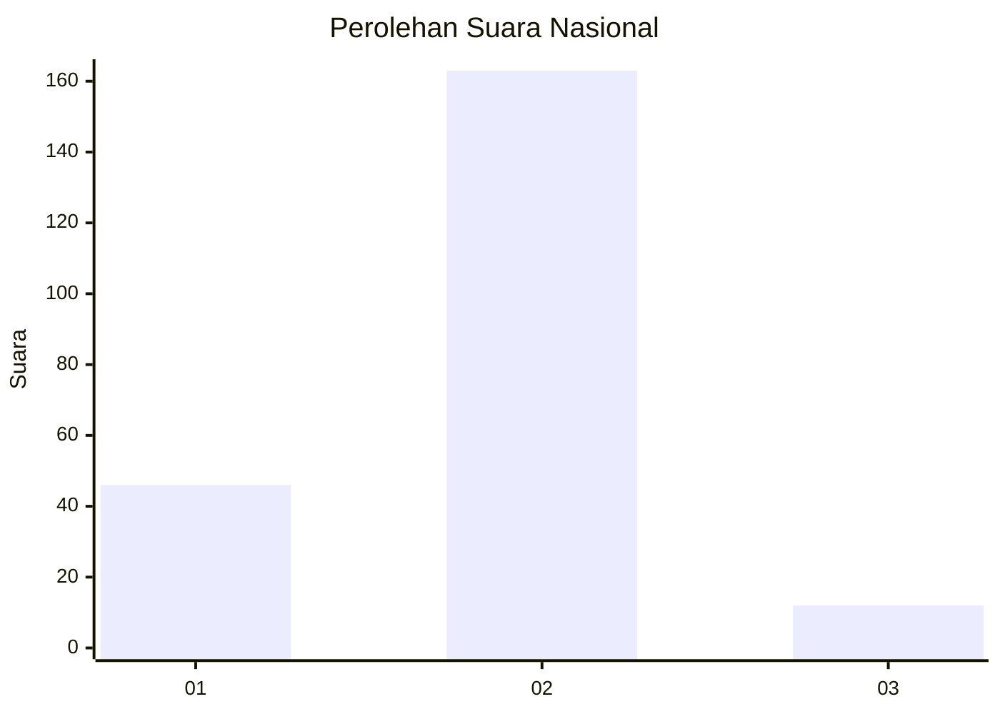

# Hasil

## Grafik

## Tabel

| No. | Nama Paslon    | Suara | Suara (raw) | Persentase |
|:--- |:-------------- | -----:| -----------:| ----------:|
| 1   | ANIES MUHAIMIN | 46    | [46][p-1]   | 20,81      |
| 2   | PRABOWO GIBRAN | 163   | [163][p-2]  | 73,76      |
| 3   | GANJAR MAHFUD  | 12    | [12][p-3]   | 5,43       |

[p-1]: https://github.com/gigit-pemilu/pemilu-2024/blob/main/pilpres/hitung-suara/sub/16-sumatera-selatan/sub/04-lahat/sub/17-kikim-timur/sub/2001-bunga-mas/sub/001-tps/sub/paslon-1.txt
[p-2]: https://github.com/gigit-pemilu/pemilu-2024/blob/main/pilpres/hitung-suara/sub/16-sumatera-selatan/sub/04-lahat/sub/17-kikim-timur/sub/2001-bunga-mas/sub/001-tps/sub/paslon-2.txt
[p-3]: https://github.com/gigit-pemilu/pemilu-2024/blob/main/pilpres/hitung-suara/sub/16-sumatera-selatan/sub/04-lahat/sub/17-kikim-timur/sub/2001-bunga-mas/sub/001-tps/sub/paslon-3.txt

## Foto C Plano

https://sirekap-obj-formc.kpu.go.id/90fe/pemilu/ppwp/16/04/17/20/01/1604172001001-20240215-041409--e9aec39c-4f6e-4cda-8353-eea9468f5aa5.jpg

https://sirekap-obj-formc.kpu.go.id/90fe/pemilu/ppwp/16/04/17/20/01/1604172001001-20240215-041246--6ab0d86c-8732-41ec-bc48-7aa79b22001c.jpg

https://sirekap-obj-formc.kpu.go.id/90fe/pemilu/ppwp/16/04/17/20/01/1604172001001-20240215-041614--a3ab3842-0127-48ba-a662-a22df7eb1e57.jpg

## Metadata

| Key        | Value               |
| ---------- | ------------------- |
| Time Stamp | 2024-02-15 18:00:26 |

