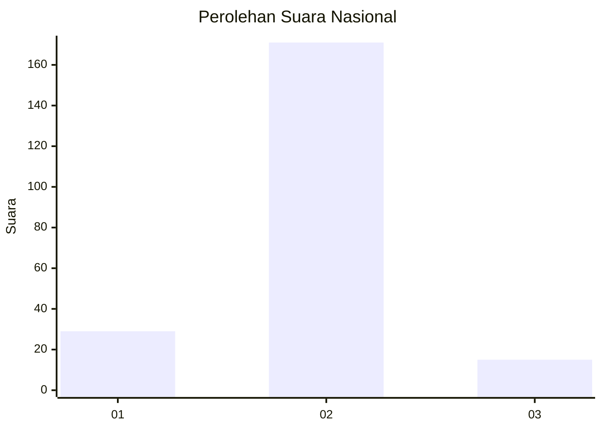
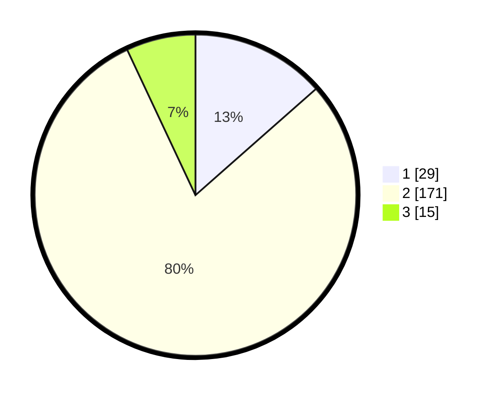

# Hasil

## Grafik

## Tabel

| No. | Nama Paslon    | Suara | Suara (raw) | Persentase |
|:--- |:-------------- | -----:| -----------:| ----------:|
| 1   | ANIES MUHAIMIN | 29    | [29][p-1]   | 13,49      |
| 2   | PRABOWO GIBRAN | 171   | [171][p-2]  | 79,53      |
| 3   | GANJAR MAHFUD  | 15    | [15][p-3]   | 6,98       |

[p-1]: https://github.com/gigit-pemilu/pemilu-2024/blob/main/pilpres/hitung-suara/sub/16-sumatera-selatan/sub/04-lahat/sub/17-kikim-timur/sub/2001-bunga-mas/sub/003-tps/sub/paslon-1.txt
[p-2]: https://github.com/gigit-pemilu/pemilu-2024/blob/main/pilpres/hitung-suara/sub/16-sumatera-selatan/sub/04-lahat/sub/17-kikim-timur/sub/2001-bunga-mas/sub/003-tps/sub/paslon-2.txt
[p-3]: https://github.com/gigit-pemilu/pemilu-2024/blob/main/pilpres/hitung-suara/sub/16-sumatera-selatan/sub/04-lahat/sub/17-kikim-timur/sub/2001-bunga-mas/sub/003-tps/sub/paslon-3.txt

## Foto C Plano

https://sirekap-obj-formc.kpu.go.id/3bc6/pemilu/ppwp/16/04/17/20/01/1604172001003-20240216-201416--ae9791c2-4a37-4f47-9e4d-08715c293943.jpg

https://sirekap-obj-formc.kpu.go.id/3bc6/pemilu/ppwp/16/04/17/20/01/1604172001003-20240216-104947--69ecc40e-4ece-4d8f-b09c-fce66271fcc3.jpg

https://sirekap-obj-formc.kpu.go.id/3bc6/pemilu/ppwp/16/04/17/20/01/1604172001003-20240215-060441--c603dafa-3770-4ec3-b22b-15ac1b7a8ed2.jpg

## Metadata

| Key        | Value               |
| ---------- | ------------------- |
| Time Stamp | 2024-02-16 21:01:00 |

