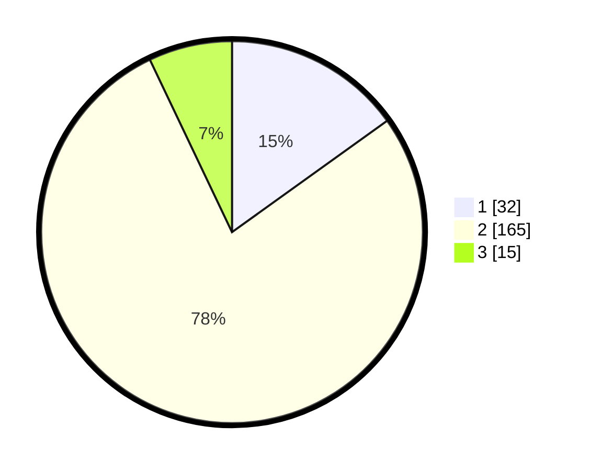

# Hasil

## Grafik

## Tabel

| No. | Nama Paslon    | Suara | Suara (raw) | Persentase |
|:--- |:-------------- | -----:| -----------:| ----------:|
| 1   | ANIES MUHAIMIN | 32    | [32][p-1]   | 15,09      |
| 2   | PRABOWO GIBRAN | 165   | [165][p-2]  | 77,83      |
| 3   | GANJAR MAHFUD  | 15    | [15][p-3]   | 7,08       |

[p-1]: https://github.com/gigit-pemilu/pemilu-2024/blob/main/pilpres/hitung-suara/sub/16-sumatera-selatan/sub/04-lahat/sub/17-kikim-timur/sub/2001-bunga-mas/sub/005-tps/sub/paslon-1.txt
[p-2]: https://github.com/gigit-pemilu/pemilu-2024/blob/main/pilpres/hitung-suara/sub/16-sumatera-selatan/sub/04-lahat/sub/17-kikim-timur/sub/2001-bunga-mas/sub/005-tps/sub/paslon-2.txt
[p-3]: https://github.com/gigit-pemilu/pemilu-2024/blob/main/pilpres/hitung-suara/sub/16-sumatera-selatan/sub/04-lahat/sub/17-kikim-timur/sub/2001-bunga-mas/sub/005-tps/sub/paslon-3.txt

## Foto C Plano

https://sirekap-obj-formc.kpu.go.id/c6cb/pemilu/ppwp/16/04/17/20/01/1604172001005-20240215-010255--d6e7a842-2c01-4c5f-82b5-ec08f2877df7.jpg

https://sirekap-obj-formc.kpu.go.id/c6cb/pemilu/ppwp/16/04/17/20/01/1604172001005-20240215-010730--5b150f0b-f0c6-41d3-9246-6e89e4993985.jpg

https://sirekap-obj-formc.kpu.go.id/c6cb/pemilu/ppwp/16/04/17/20/01/1604172001005-20240215-010904--79d4f478-9964-48ce-a2ac-4c2402d65795.jpg

## Metadata

| Key        | Value               |
| ---------- | ------------------- |
| Time Stamp | 2024-02-15 15:00:29 |

