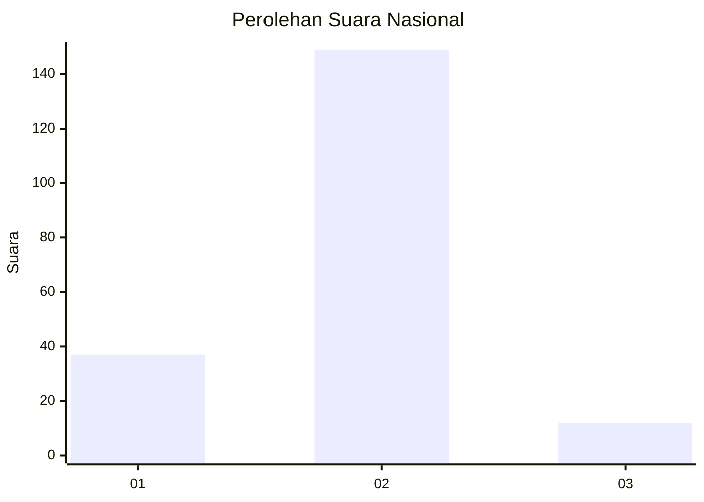
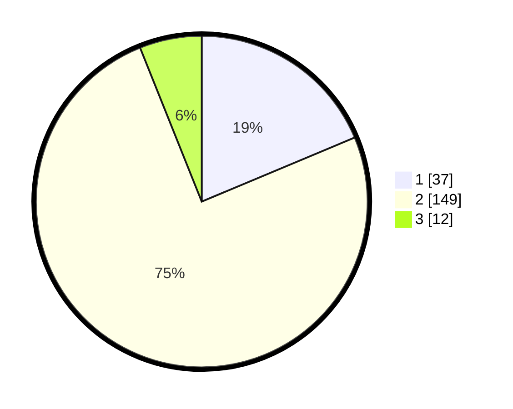

# Hasil

## Grafik

## Tabel

| No. | Nama Paslon    | Suara | Suara (raw) | Persentase |
|:--- |:-------------- | -----:| -----------:| ----------:|
| 1   | ANIES MUHAIMIN | 37    | [37][p-1]   | 18,69      |
| 2   | PRABOWO GIBRAN | 149   | [149][p-2]  | 75,25      |
| 3   | GANJAR MAHFUD  | 12    | [12][p-3]   | 6,06       |

[p-1]: https://github.com/gigit-pemilu/pemilu-2024/blob/main/pilpres/hitung-suara/sub/16-sumatera-selatan/sub/04-lahat/sub/17-kikim-timur/sub/2001-bunga-mas/sub/006-tps/sub/paslon-1.txt
[p-2]: https://github.com/gigit-pemilu/pemilu-2024/blob/main/pilpres/hitung-suara/sub/16-sumatera-selatan/sub/04-lahat/sub/17-kikim-timur/sub/2001-bunga-mas/sub/006-tps/sub/paslon-2.txt
[p-3]: https://github.com/gigit-pemilu/pemilu-2024/blob/main/pilpres/hitung-suara/sub/16-sumatera-selatan/sub/04-lahat/sub/17-kikim-timur/sub/2001-bunga-mas/sub/006-tps/sub/paslon-3.txt

## Foto C Plano

https://sirekap-obj-formc.kpu.go.id/2ae9/pemilu/ppwp/16/04/17/20/01/1604172001006-20240215-041504--ba06b5f0-ad1c-4179-a579-5fcf06e3d58f.jpg

https://sirekap-obj-formc.kpu.go.id/2ae9/pemilu/ppwp/16/04/17/20/01/1604172001006-20240216-201802--768d1ed8-633a-424a-b13f-aaf1439c0ed9.jpg

https://sirekap-obj-formc.kpu.go.id/2ae9/pemilu/ppwp/16/04/17/20/01/1604172001006-20240216-201925--79111ac8-191d-43dc-a284-ebc0bd712b61.jpg

## Metadata

| Key        | Value               |
| ---------- | ------------------- |
| Time Stamp | 2024-02-25 23:00:00 |

